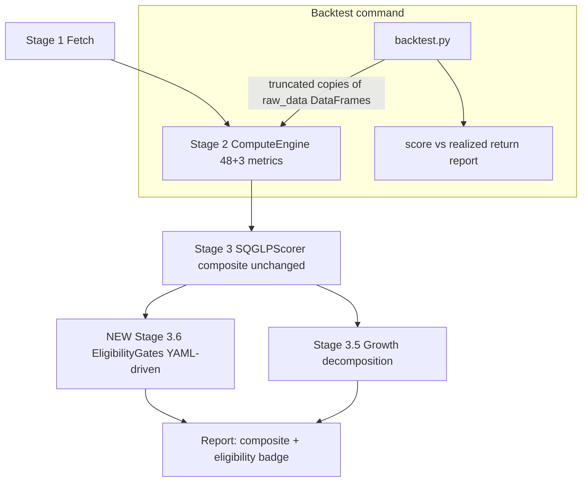

# SQGLP Framework Refinements - Plan

## Goal Capsule

- **Objective:** Make the boundless100x pipeline answer the 100x question honestly — add a gated 100x-eligibility verdict alongside the quality composite, a walk-forward self-check backtest, ROIIC/reinvestment metrics, and fix the growth machinery and two live report bugs.
- **Authority:** This plan's Product Contract governs behavior; Key Technical Decisions govern mechanism; repo conventions in `CLAUDE.md` govern style. Where the plan conflicts with observed code reality, surface it rather than guessing.
- **Stop conditions:** Stop and surface if (a) Screener-fetched data lacks a column a new metric needs across all reference tickers, (b) the backtest reveals the scoring pipeline cannot run on truncated history without deeper engine changes than U9 anticipates, or (c) any change would alter the composite scores of existing reports through channels other than the intended ones (new metrics entering elements, CAGR corrections) — the composite formula itself is out of scope.
- **Execution profile:** Code implementation with unit tests per unit; network-dependent paths tested against already-fetched `boundless100x/data_fetcher/raw_data/` fixtures, never live scraping in tests.
- **Tail ownership:** Implementer owns commit hygiene and a final smoke run of `python -m boundless100x compute CDSL` plus report generation.

---

## Product Contract

### Summary

Two-score output (additive SQGLP composite unchanged, plus a multiplicative 100x-eligibility gate verdict), a historical self-check backtest over already-fetched data, ROIIC and reinvestment-rate metrics, growth-machinery correctness fixes, sector-context wiring, softened young-company penalty, and the two live bugs: the report-generation `AttributeError` and the quadrant label mismatch.

### Problem Frame

The pipeline scores companies with an additive weighted composite, but the 100x evidence base it encodes (MOSL 2014/Dec-2025 studies) describes jointly necessary conditions — a company failing size or price cannot 100x regardless of quality. Real outputs show the failure: CDSL scores 6.31 composite with Size 2.96 and Price 3.35. Separately, the system has never been validated against past data, several growth computations are wrong (3yr and 5yr CAGRs identical; price-lever bucket unreachable), the sector evidence file is never loaded, and report generation crashes for every ticker since the peer-comparison removal (`result.comparison` read in `boundless100x/output/report_generator.py`).

### Requirements

**Scoring refinements**

- R1. The pipeline produces two outputs per company: the existing 0–10 additive composite (formula unchanged) and a 100x-eligibility verdict computed from hard gates on size, price sanity, and reinvestment runway, with per-gate pass/fail detail.
- R2. Incremental ROCE (ROIIC) and reinvestment-rate metrics are computed from fetched financials and contribute to element scoring.
- R3. Sector tailwind classification from `boundless100x/data_fetcher/sector_context.yaml` influences both quantitative scoring and LLM prompt context.
- R4. Companies with short history (< 5 years) that are small are flagged rather than score-penalized; the flag is visible to the LLM and report.

**Validation**

- R5. A backtest command scores each qualifying ticker in `raw_data/` using only the first half of its fetched history and reports the correlation between those scores and the subsequent realized price return, per ticker and in aggregate — together with the metric exclusions, ticker skips, and sample limitations that bound how far the result can be trusted.

**Correctness fixes**

- R6. Growth machinery computes what it claims: 3yr and 5yr CAGRs differ when the data differs, CAGR endpoints are smoothed against single-year distortion, the price-lever `moderate_pricing` bucket is reachable, and macro constants (inflation, G-Sec yield, discount rate) come from config, not literals.
- R7. Report generation completes without error for a current `AnalysisResult` (no `result.comparison` reads; dead peer-era code removed).
- R8. The report's quadrant labels use the same vocabulary `compute_qg_quadrant` emits, so `true_wealth_creator` and `wealth_destroyer` render with correct label, sentiment, and description.

### Scope Boundaries

- Composite weights and per-metric thresholds stay as-is. Recalibration is follow-up work; the backtest (R5) is a diagnostic smoke test over a small survivorship-selected universe, not sufficient calibration evidence on its own.
- No new data sources; the backtest and all new metrics use only already-fetched artifacts.
- LLM prompt restructuring beyond adding sector/flag context is out of scope.

**Deferred to Follow-Up Work**

- Threshold/weight recalibration informed by backtest results.
- Re-rating headroom metric (entry multiple vs. quality-justified multiple).
- Fixing the financials-fetch cache bypass in `boundless100x/data_fetcher/fetch_financials.py` (known issue, separate concern).
- CLAUDE.md/Build Plan doc-drift cleanup (44-vs-48 metrics, stale phases).

---

## Planning Contract

### Key Technical Decisions

- KTD1. **Eligibility as a post-scoring layer, not composite surgery.** (session-settled: user-approved — chosen over reweighting/multiplying the composite: additive weights cannot encode conjunctive conditions, and keeping the composite stable preserves comparability with existing reports.) A new `boundless100x/compute_engine/eligibility.py` consumes the metrics dict + scores dict after Stage 3 and returns `{eligible: bool, gates: {gate_id: {passed, value, threshold, reason}}}`. Stored on `AnalysisResult` as a new field.
- KTD2. **Gates defined in YAML, mirroring the metric-registry pattern.** A `gates:` section in `boundless100x/compute_engine/metrics/registry.yaml` names each gate, its source metric id, comparator, and threshold — adding/tuning a gate is a YAML edit, consistent with the repo's registry-over-code centerpiece. Initial gates: market cap ceiling, trailing-PEG ceiling with a reverse-DCF overpriced veto, and ROIIC floor (depends on R2).
- KTD3. **Backtest is walk-forward on existing artifacts, honest about its limits.** (session-settled: user-approved — chosen over point-in-time data acquisition: no new sources allowed, and fetched 10yr financials + price history already support first-half-score vs. second-half-return.) A `boundless100x/compute_engine/backtest.py` truncates each ticker's financial DataFrames to the first half, runs the existing `ComputeEngine`/`SQGLPScorer` on the truncated copy, and compares against realized CAGR from `price_volume.csv` over the remaining period. **Look-ahead leakage is the central correctness risk** — any input that is not truncatable carries today's state into a historical score. Two exclusion rules, both reported in the output:
  - Price-dependent metrics (P/E, PEG, DCF margin) use the price as of the truncation date when available in `price_volume.csv`, else the metric is excluded — never silently approximated with today's price.
  - Metrics sourced from non-truncatable inputs are excluded outright: `metadata.json`-derived market cap and its size flags, shareholding-derived metrics (which read the latest quarter), and analyst coverage. These do not live in the financial DataFrames, so a company that already re-rated would otherwise score its Size element on today's post-re-rating market cap — manufacturing a spurious negative score-vs-return correlation in exactly the evidence the backtest exists to produce. Element weights renormalize as the scorer already does for missing metrics. Gate-verdict reporting excludes the size gate for the same reason.
- KTD3b. **The backtest reports its own limitations alongside its numbers.** The JSON and printed table carry a limitations block: qualifying-ticker count, the shared score/return window dates, a survivorship-selection caveat (the universe is user-chosen tickers, not a point-in-time screen), and a note that scores-then run on truncated histories carrying short-history penalties a real analysis at that date would not have had. Without this, a rank correlation over ~10 tickers sharing one macro window reads as calibration authority.
- KTD4. **ROIIC = ΔNOPAT / Δcapital-employed over a rolling window; reinvestment rate = retained capital deployed / NOPAT.** Capital employed derives from `balance_sheet.csv` columns already fetched (`equity_capital + reserves + borrowings`). Both land in `builtin/profitability.py` beside the existing ROCE functions and register in `quality_business.yaml`, following the existing MetricResult/flags contract.
- KTD5. **Endpoint smoothing: CAGR endpoints become 2-year averages when the series is long enough (≥6 points), single values otherwise.** Applied inside the shared helpers so `compute_cagr` and `_compute_cagr_from_series` both benefit; metadata records which mode was used so reports and the LLM can see it.
- KTD6. **Macro constants move to a `macro:` block in `boundless100x/config.yaml`** (inflation_pct, gsec_yield_pct, discount_rate, terminal_growth) threaded through metric `params` — chosen over live-fetching macro data: config keeps runs reproducible and the values change slowly.
- KTD7. **Sector context loads once and flows two ways.** A small loader in the compute engine reads `sector_context.yaml`; a new categorical `sector_tailwind` metric (longevity element, modest weight) scores strong/moderate/non-consideration from the Screener/Trendlyne sector in `metadata.json`; the same classification string is appended to LLM context via `boundless100x/llm_layer/checklist.py`.
- KTD8. **Young-company softening is conditional, not global, and uses its own threshold.** Metrics that currently emit `insufficient_history`-style penalties keep them, but when market cap is below a dedicated `history_waiver_mcap` threshold the scorer treats the metric as missing (renormalized) instead of scored-low, and a `short_history_smallcap` flag surfaces to LLM and report. Chosen over removing the penalty everywhere: for large companies short data genuinely is a red flag. `history_waiver_mcap` is defined in the gate YAML but is **not** the eligibility size ceiling — it defaults to ₹5,000 Cr, the codebase's existing small-cap boundary in `boundless100x/compute_engine/metrics/builtin/size.py`. Reusing the ₹30,000 Cr eligibility ceiling would waive short-history red flags for companies the codebase itself flags as large caps; the two thresholds answer different questions ("could this still 100x?" vs. "is thin history excusable?").

### Assumptions

Un-validated bets from the pre-authorized scoping skip — correct here or during review:

- Initial gate thresholds: market cap < ₹30,000 Cr (matches the `hidden_gems_100x` preset), trailing PEG < 2.0 OR forward PEG < 1.5, no `reverse_dcf_overpriced` flag, ROIIC > 15%. Separately, `history_waiver_mcap` defaults to ₹5,000 Cr per KTD8. These are starting points, expected to be tuned after the backtest.
- Backtest universe = directories under `boundless100x/data_fetcher/raw_data/` containing both `financials.csv` and `price_volume.csv`, with ≥ 8 years of financials and price history covering the second half. Directories lacking those CSVs — the numeric BSE-code folders holding only annual reports — are excluded from enumeration entirely and never enter the skip list, which is reserved for genuine tickers failing the history or price-coverage filters.
- `sector_tailwind` enters longevity at weight 0.05 with existing weights renormalizing naturally (scorer already normalizes by present weight).
- ROIIC weight 0.10 and reinvestment rate 0.05 inside quality_business.
- The eligibility verdict displays in the report executive summary and CLI score table but does not enter Pass 2 LLM context in this iteration.

### High-Level Technical Design

The backtest reuses the production engine on truncated inputs rather than reimplementing scoring — any future metric automatically becomes backtestable.

---

## Implementation Units

### U1. Fix report-generation crash and remove peer-era dead code

- **Goal:** `ReportGenerator.generate()` completes for a current `AnalysisResult`.
- **Requirements:** R7
- **Dependencies:** none
- **Files:** `boundless100x/output/report_generator.py`, `boundless100x/service.py`, `tests/test_report_generator.py` (new)
- **Approach:**
  - Remove `_build_sector_context` (line ~1266) and its call in `generate()` (~line 353), `_peer_radar_chart` (~1697), and the uncalled `_radar_chart`/`_shareholding_chart` if confirmed unreferenced.
  - Update the stale `service.py` class docstring advertising `result.peers`.
- **Test scenarios:**
  - Generating a report from a minimal synthetic `AnalysisResult` (metrics + scores dicts, no LLM output) writes HTML/MD/JSON without raising.
  - No remaining references to `result.comparison` anywhere in `boundless100x/` (assert via source scan in test or verify step).
- **Verification:** Report generates for CDSL from existing raw_data without `AttributeError`.

### U2. Align quadrant vocabulary between compute and report

- **Goal:** `true_wealth_creator` and `wealth_destroyer` render with correct label, sentiment, and description.
- **Requirements:** R8
- **Dependencies:** none
- **Files:** `boundless100x/output/report_generator.py` (QUADRANT_LABELS ~line 795), `tests/test_report_generator.py`
- **Approach:** Re-key `QUADRANT_LABELS` to the four values `compute_qg_quadrant` emits (`boundless100x/compute_engine/metrics/builtin/composite.py:50-56`); keep a title-case fallback for unknowns.
- **Test scenarios:**
  - Each of the four emitted quadrant values maps to a non-neutral sentiment and non-empty description.
  - `wealth_destroyer` specifically renders negative sentiment (the bug's worst case).
- **Verification:** Executive summary block for a synthetic wealth-destroyer input shows the warning styling.

### U3. Fix CAGR machinery: years bug and endpoint smoothing

- **Goal:** 3yr and 5yr CAGRs differ when data differs; single-year endpoints no longer distort growth.
- **Requirements:** R6
- **Dependencies:** none
- **Files:** `boundless100x/compute_engine/metrics/builtin/growth.py`, `tests/test_growth_cagr.py` (new)
- **Approach:**
  - `_compute_cagr_from_series` (line ~399) currently ignores `years` — slice to the last `years+1` points before computing.
  - Implement KTD5 endpoint smoothing in the shared helper; record `endpoint_mode` in metric metadata.
  - Audit `compute_cagr` (line ~14) for the same slicing behavior and unify both paths on one helper.
- **Execution note:** Start with a failing test reproducing the CDSL symptom (3yr == 5yr on a 10-year series with differing sub-period growth).
- **Test scenarios:**
  - 10-year synthetic series with 30% early growth and 10% late growth: 3yr CAGR ≈ 10%, 5yr ≠ 3yr.
  - Series shorter than requested years: falls back to available span and flags it (existing behavior preserved).
  - Endpoint smoothing: a one-year spike at the end moves smoothed CAGR less than unsmoothed.
  - Bank/NBFC path via `_ensure_operating_profit` still computes (regression guard).
- **Verification:** Regenerated `growth_decomposition.json` for CDSL shows distinct 3yr/5yr PAT CAGRs.

### U4. Config-driven macro constants and price-lever fix

- **Goal:** Inflation, G-Sec yield, and discount/terminal rates come from `config.yaml`; `moderate_pricing` is reachable.
- **Requirements:** R6
- **Dependencies:** none
- **Files:** `boundless100x/config.yaml`, `boundless100x/compute_engine/metrics/builtin/growth.py` (compute_price_lever ~line 299), `boundless100x/compute_engine/metrics/builtin/valuation.py` (earnings-yield spread, DCF params), `boundless100x/compute_engine/metrics/elements/price.yaml`, `tests/test_price_lever.py` (new)
- **Approach:**
  - Add `macro:` block per KTD6; thread values through metric `params` in element YAML (the registry already supports `params`), defaulting to current literals for backward compatibility.
  - Rewrite `compute_price_lever` classification so the branch structure distinguishes strong/moderate/discounting on the deflated-growth spread — the current `revenue_cagr > real_volume_growth + 3` comparison is constant-true; classify on `real_volume_growth` bands instead.
- **Test scenarios:**
  - A revenue CAGR that should classify `moderate_pricing` does (the previously unreachable bucket).
  - Changing `macro.inflation_pct` in config changes the classification boundary.
  - `earnings_yield_vs_gsec` responds to `macro.gsec_yield_pct`.
  - DCF metrics still produce identical values with default config (no behavior change at defaults).
- **Verification:** All four price-lever buckets reachable in tests; existing reports' DCF values unchanged at default config.

### U5. ROIIC and reinvestment-rate metrics

- **Goal:** The two strongest known compounding-durability predictors enter quality_business scoring.
- **Requirements:** R2
- **Dependencies:** U4 (config plumbing pattern)
- **Files:** `boundless100x/compute_engine/metrics/builtin/profitability.py`, `boundless100x/compute_engine/metrics/elements/quality_business.yaml`, `tests/test_roiic.py` (new)
- **Approach:** Per KTD4 — rolling 5yr window, MAD-outlier guard reused from `_helpers.py` where NOPAT deltas are noisy; emit flags (`high_roiic_compounder`, `capital_returned_not_reinvested`, `negative_incremental_returns`). Follow the `MetricResult` contract and existing ROCE function shape in the same file.
- **Test scenarios:**
  - Steady compounder fixture (NOPAT and capital both growing, ΔNOPAT/Δcapital ≈ 25%): ROIIC ≈ 25%, no flags.
  - Capital doubling with flat NOPAT: near-zero ROIIC, `negative_incremental_returns` boundary behavior at exactly 0.
  - Shrinking capital base (buybacks/debt paydown) with growing NOPAT: metric handles negative denominator without division blowup, emits sensible flag.
  - Missing `borrowings` column: metric errors gracefully into `MetricResult(error=...)`, engine continues.
- **Verification:** `python -m boundless100x compute CDSL` shows both metrics with values and they appear in `scores.json` details (metric count 48 → 50, plus U6's = 51).

### U6. Wire sector context into scoring and LLM prompts

- **Goal:** The MOSL sector-tailwind evidence actually influences output.
- **Requirements:** R3
- **Dependencies:** none
- **Files:** `boundless100x/compute_engine/sector.py` (new loader), `boundless100x/compute_engine/metrics/builtin/longevity.py`, `boundless100x/compute_engine/metrics/elements/longevity.yaml`, `boundless100x/llm_layer/checklist.py`, `boundless100x/service.py`, `tests/test_sector_context.py` (new)
- **Approach:** Per KTD7. Sector string comes from `metadata.json` (Screener, with Trendlyne fallback already merged by `suite.py`). Matching is case-insensitive substring against the YAML lists; unmatched sectors classify `unknown` (categorical score 5, neutral). `checklist.py` gains a `build_sector_context` formatter; `service.py` passes it into Pass 1's existing `sector_context` parameter (currently always defaulted to "").
- **Test scenarios:**
  - "Capital Market" sector → strong_tailwind; "Oil & Gas" → non_consideration; unmapped sector → unknown/neutral.
  - Missing sector in metadata → metric returns gracefully, no crash.
  - Prompt formatter output contains the classification and the B2C/leadership context lines.
- **Verification:** CDSL (Capital Market) scores the tailwind metric high; Pass 1 prompt (log/dry-run) contains the sector block.

### U7. Eligibility gate layer and two-score surfacing

- **Goal:** Every analysis yields composite + 100x-eligibility verdict with per-gate detail, visible in CLI and report.
- **Requirements:** R1
- **Dependencies:** U5 (ROIIC gate input)
- **Files:** `boundless100x/compute_engine/eligibility.py` (new), `boundless100x/compute_engine/metrics/registry.yaml`, `boundless100x/service.py`, `boundless100x/cli.py`, `boundless100x/output/report_generator.py`, `boundless100x/output/templates/sqglp_report.html.j2`, `boundless100x/output/templates/sqglp_report.md.j2`, `tests/test_eligibility.py` (new)
- **Approach:**
  - Per KTD1/KTD2: YAML `gates:` section (metric id, comparator, threshold, plus flag-veto support for `reverse_dcf_overpriced`); evaluator returns structured verdict; missing gate inputs produce `indeterminate`, never a silent pass.
  - Service runs it as Stage 3.6; `AnalysisResult` gains an `eligibility` field; `eligibility.json` exported with the other report JSONs.
  - Report executive summary gets a badge (eligible / not eligible / indeterminate) with failed-gate reasons; CLI `_print_scores` adds a verdict line.
- **Test scenarios:**
  - All gates pass → eligible with per-gate detail.
  - Large-cap failing only the size gate → not eligible, reason names the size gate (the CDSL case).
  - `reverse_dcf_overpriced` flag present → price gate fails even when PEG passes.
  - Missing ROIIC metric → verdict indeterminate, not eligible-by-default.
  - Gate thresholds read from YAML (changing YAML changes outcome without code edit).
- **Verification:** CDSL run shows composite ≈ unchanged and `not eligible (size)`; report badge renders in HTML.

### U8. Soften young-company penalty for small caps

- **Goal:** Short history on a small company informs rather than punishes.
- **Requirements:** R4
- **Dependencies:** U7 (gate YAML is where `history_waiver_mcap` is declared; the value itself is independent of the eligibility ceiling)
- **Files:** `boundless100x/compute_engine/scorer.py`, `boundless100x/compute_engine/engine.py` (locate where insufficient-history penalties/flags originate), `boundless100x/compute_engine/metrics/registry.yaml` (`history_waiver_mcap`), affected `builtin/*.py` metric functions, `tests/test_scorer_young_company.py` (new)
- **Approach:** Per KTD8. First map exactly where `insufficient_history` flags translate into low scores (metric-level defaults vs. scorer's 0.0 for non-numeric values); then make the scorer treat flagged-short-history metrics as missing (weight-renormalized) when market cap is below `history_waiver_mcap` (₹5,000 Cr default — distinct from the ₹30,000 Cr eligibility ceiling), emitting `short_history_smallcap`. The mapping step is deliberate — current penalty paths are diffuse and must be enumerated before changing.
- **Test scenarios:**
  - Small company (below `history_waiver_mcap`), 4yr history: composite computed from present metrics, `short_history_smallcap` flag present, no zero-scored history metrics.
  - Mid-cap above the waiver threshold but below the eligibility ceiling (e.g. ₹28,000 Cr), 4yr history: existing penalty behavior unchanged — the waiver must not fire off the eligibility threshold.
  - Large company, 4yr history: existing penalty behavior unchanged.
  - Boundary at `history_waiver_mcap`: behavior switches at the documented edge.
- **Verification:** A truncated-history synthetic run shows renormalized element scores rather than dragged-down ones.

### U9. Walk-forward backtest command

- **Goal:** The framework becomes falsifiable: score-then vs. return-since, per ticker and aggregate.
- **Requirements:** R5
- **Dependencies:** U3, U4 (growth/macro fixes must land first or the backtest validates wrong math); U7 optional (if present, also report gate verdicts vs. returns)
- **Files:** `boundless100x/compute_engine/backtest.py` (new), `boundless100x/cli.py` (new `backtest` command), `tests/test_backtest.py` (new)
- **Approach:** Per KTD3 and KTD3b:
  - Enumerate candidates: directories under `raw_data/` containing both `financials.csv` and `price_volume.csv`. Directories without them (numeric BSE-code annual-report folders) are not candidates and never appear in the skip list.
  - For each candidate, load financial CSVs, truncate to first half of years, deep-copy into the engine's expected `data` dict shape, run `ComputeEngine.run_all` + `SQGLPScorer.score`.
  - Apply the leakage exclusions from KTD3: metadata-sourced (market cap and size flags), shareholding-derived, and analyst-coverage metrics are excluded from scoring; price-dependent metrics use the nearest `price_volume.csv` close ≤ truncation date, else are excluded. Every exclusion is listed in the output.
  - Realized return = CAGR of adjusted close from truncation date to latest in `price_volume.csv`; skip tickers whose price history doesn't cover the window and report them as skipped (no silent drops).
  - Output to `output/backtests/{DATE}/backtest.json` + printed table: per-ticker row (score-then, element scores, realized CAGR), Spearman rank correlation of composite vs. return and of each element vs. return, the KTD3b limitations block, the exclusion list, and the skip list. When U7 has landed, also report per-ticker eligibility verdicts against realized returns — excluding the size gate, which cannot be evaluated without leakage.
- **Execution note:** This unit is analysis infrastructure — prioritize honest reporting of exclusions and skips over coverage breadth.
- **Test scenarios:**
  - Synthetic ticker fixture (constructed CSVs in a tmp raw_data dir): truncation produces first-half-only DataFrames; engine runs; realized CAGR matches hand-computed value.
  - Ticker with < 8 years: excluded and listed as skipped.
  - Directory containing only `annual_reports/` and no CSVs: not enumerated at all, and absent from the skip list.
  - Leakage guard: market-cap, shareholding, and analyst-coverage metrics are absent from backtest scores, and each appears in the exclusion list; changing today's `metadata.json` market cap leaves every backtest score unchanged.
  - Price history starting after truncation date: price-dependent metrics excluded, exclusion listed, run completes.
  - Correlation computed correctly on a known small fixture (e.g., 3 tickers with hand-ranked scores/returns).
  - Output carries the limitations block with a non-zero qualifying-ticker count and the score/return window dates.
- **Verification:** `python -m boundless100x backtest` runs over the qualifying subset of `raw_data/` — expect roughly 10 of 31 directories, since the 14 numeric BSE-code folders are not candidates and short-history or late-listing tickers (IRCTC, IXIGO, TBOTEK, KFINTECH) are expected skips, and ASTRAL currently has no `price_volume.csv`. Acceptance is that every exclusion and skip is listed explicitly and the limitations block is present — not a target ticker count.

---

## Verification Contract

| Check | Command | Applies to |
|---|---|---|
| Unit tests | `venv/bin/python -m pytest tests/ -k "not fetch_financials"` | all units |
| Live smoke (existing data, no network) | `venv/bin/python -m boundless100x compute CDSL` | U1–U8 |
| Report generation | full `analyze CDSL --no-llm` run; open generated HTML | U1, U2, U7 |
| Backtest run | `venv/bin/python -m boundless100x backtest` | U9 |

Notes: `pytest` may need adding to `requirements.txt` (only one ad-hoc test file exists today). The existing `tests/test_fetch_financials.py` is a live-network test — keep it excluded from the default run. New tests must use synthetic DataFrames or copies of committed fixtures, never live scraping.

## Definition of Done

- All nine units implemented with their test scenarios passing.
- `analyze` → report pipeline completes end-to-end for CDSL, IRCTC, RAIN from existing raw_data (no network needed for compute/report stages).
- Composite scores for existing tickers change only via the intended channels (new metrics entering elements, CAGR corrections) — no unexplained score movement; a before/after diff of `scores.json` for CDSL is reviewed and explainable.
- Backtest output exists for the qualifying raw_data universe, with metric exclusions, ticker skips, and the limitations block explicitly present — and no non-truncatable input (market cap, shareholding, analyst coverage) feeding a historical score.
- No dead code from abandoned approaches left in the diff; no remaining `result.comparison` references.
- CLAUDE.md updated only where this work changes it (new `backtest` command, metric count, eligibility field) — broader doc-drift cleanup stays deferred.
