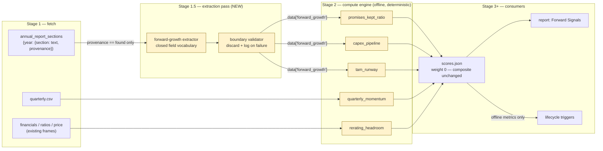

# Phase 2 Engine Enhancements - Plan

## Goal Capsule

- **Objective:** Add *forward* evidence and *delta* signal to a system that
  currently measures only backward and only at a point in time — score
  trajectory, re-rating headroom, a forward-growth module extracted from
  annual reports, and a deployment-pace modulator — without moving a single
  composite score.
- **Authority:** v05 §7.1, §7.2, §7.3, §11 and §12 Phase 2 govern behavior;
  §13 Non-Goals binds absolutely ("No changes to SQGLP elements, weights,
  thresholds, or gate logic in any phase"); this plan's Key Technical
  Decisions govern mechanism; `CLAUDE.md` governs style. Where the plan
  conflicts with observed code reality, surface it rather than guessing —
  Phases 0 and 1 each corrected the roadmap this way and the corrections were
  the valuable part.
- **Stop conditions:** Stop and surface if (a) any change moves a composite,
  element score, coverage ratio, or eligibility verdict for an unchanged
  ticker — this phase is additive-only by contract; (b) an LLM-extracted
  sub-metric cannot be made to read indeterminate on `fallback` provenance,
  since mining a chairman's letter for guidance it does not contain is worse
  than having no metric; or (c) the extraction pass cannot be built without
  the compute engine importing from `llm_layer/`, which would invert the
  dependency direction and break the backtest.
- **Execution profile:** Code with unit tests per unit, on synthetic frames
  per `tests/conftest.py` — never `raw_data/`, never live scraping. The
  extraction pass is tested against recorded response fixtures, not live API
  calls.
- **Tail ownership:** Implementer owns commit hygiene and the end-of-phase
  validation: a before/after `scores.json` diff on a cached ticker proving
  the composite is byte-identical, plus the found/indeterminate split for the
  forward-growth sub-metrics across the fetched corpus.

---

## Product Contract

### Summary

Four additive capabilities: momentum diffs computed over the append-only score
history Phase 0 began accumulating; a re-rating-headroom metric comparing
today's multiple against one justified by the company's own RoCE, growth and
longevity; a forward-growth module whose three text-derived sub-metrics come
from a new LLM extraction pass and whose fourth is computed offline from the
quarterly series; and a deployment-pace modulator that tightens buy-zone entry
when the equity risk premium is compressed. Every new metric enters at zero
weight and is surfaced in its own report section, so none of it touches the
SQGLP composite.

### Problem Frame

The engine answers "how good is this company, today, on ten years of
history" — and nothing else. Growth carries 25% of the composite but is
measured entirely backward (CAGR, streaks), so a company whose growth is
decelerating *right now* scores identically to one accelerating. Valuation is
treated only as a risk (percentile, reverse-DCF veto), never constructively —
there is no measure of how much re-rating room a company has, which is the
actual accelerator the roadmap is built around. And a score is a photograph:
the pipeline has recorded history since Phase 0 but nothing reads it, so
improving fundamentals — the thing that precedes re-rating — are invisible.

Phase 0 built the data (quarterly series, multi-year annual-report sections,
score history) and Phase 1 built the layer that consumes decisions. Nothing
yet turns that data into forward signal.

### Requirements

- R1. Momentum over score history: per-ticker deltas in composite and element
  scores, computed only within a single scoring regime, with the interval each
  figure spans stated explicitly.
- R2. A re-rating-headroom metric expressing today's multiple against a
  quality-justified multiple derived from the company's **own** fundamentals
  (RoCE, growth, longevity) — never a sector-relative anchor (v05 §14.5).
- R3. A forward-growth module of four sub-metrics: promises-kept ratio, capex
  pipeline, TAM runway, and quarterly momentum.
- R4. The three text-derived sub-metrics are produced by an LLM extraction
  pass whose output is validated at the boundary against a closed vocabulary;
  anything unparseable or out-of-vocabulary is discarded with its reason
  recorded, never stored as a value a consumer will trust.
- R5. A sub-metric whose required annual-report section carried `fallback`
  provenance evaluates **indeterminate**, never a value (v05 §7.2).
- R6. A deployment-pace modulator that tightens buy-zone entry thresholds when
  the earnings-yield-over-G-Sec spread is compressed, and records that it did
  so. It modulates entry pace only: it never fires, suppresses, or overrides a
  kill-switch or an eligibility gate (v05 §11).
- R7. **No composite, element score, coverage ratio, or eligibility verdict
  changes for any ticker.** New metrics carry zero weight and are excluded
  from element scoring, the composite, and the coverage denominator.
- R8. The new signals are visible to the reader in their own report section,
  presented so that nothing implies they contributed to the SQGLP score — and
  each renders with its **direction of goodness and interpretation band**, so
  a bare number can be read as favourable or not without recomputing it. Zero
  weight means these metrics never receive a score, so without a declared band
  the section would ship numbers rather than signal.

### Scope Boundaries

- **No SQGLP scoring changes** — weights, thresholds, element membership for
  scoring purposes, and gate logic are untouched (v05 §13).
- **No synthetic backfill.** Owner-confirmed: the registry-hash change resets
  the momentum baseline and momentum accumulates fresh from here. The
  backtest's truncation machinery is not used to manufacture history.
- **No trigger-threshold calibration** — starting values only; evidence comes
  from the Phase 4 simulator (v05 §12 Phase 5).
- **No fast lane, no portfolio layer, no reinvestment queue** — Phase 3.
- **No new data sources** (v05 §13). Extraction reads annual reports already
  fetched; momentum reads history already recorded.
- **Threshold tightening only, no tranche step-down.** §11 names two pace
  levers; tranche sizing depends on the portfolio layer (§8.1, §14.2) and
  lands with Phase 3. This phase modulates buy-zone entry thresholds only.
- **Quarterly momentum reads the results series only.** §7.2 also names
  latest-quarter shareholding as an input; shareholding-derived momentum stays
  with the Phase 1 checkpoint path that already reads it.
- **No lifecycle trigger consumes a Phase 2 metric.** Deferred until the
  found/indeterminate yield is measured — and note that `advance` re-scores
  with `use_llm=False`, so the three extraction-derived sub-metrics are
  structurally unavailable on the lifecycle path until extraction output is
  cached across runs. Declaring a trigger on them now would read indeterminate
  forever, the exact silent failure `validate_triggers` exists to prevent.

#### Deferred to Follow-Up Work

- **`indeterminate` escalation policy.** Phase 1 deferred "a trigger
  indeterminate for several consecutive runs deserves attention rather than
  silence" to Phase 2. It stays deferred: answering it needs trajectory data
  showing how often it actually happens, and this phase is what starts
  producing that data. Revisit once several quarters of history exist.
- **Feeding TAM runway into Longevity's CAP proxy** (v05 §7.2 suggests it).
  That would change a scored metric's inputs, which R7 forbids. Revisit when
  SQGLP recalibration is opened as its own workstream.
- **Consensus-estimate feeds** as a forward-growth input — a new data source,
  explicitly out of scope until after Phase 3.

---

## Planning Contract

### Key Technical Decisions

- **KTD1 — New metrics enter at zero weight, and forward-growth gets an
  element outside `element_weights`.** §12 says headroom "lands in the price
  element" while §13 forbids changing SQGLP scoring; those reconcile only at
  zero weight. The scorer's display-only path (`scorer.py`, the `weight == 0`
  branch) `continue`s before weighted accumulation, so such a metric
  contributes nothing to the element mean, the composite, or the coverage
  denominator — an errored one cannot even depress coverage. Headroom goes
  into `price.yaml` at weight 0.0 as §12 asks; the four forward-growth
  sub-metrics go into a new `elements/forward_growth.yaml` whose element name
  is **absent from `element_weights`**, mirroring how `composite` already sits
  outside the scored set. Belt and braces: zero weight makes them non-scoring,
  and an unweighted element makes them structurally incapable of scoring.
- **KTD2 — LLM extraction is a separate pass writing into `data`, never a
  metric that calls the LLM.** `compute_engine/` imports nothing from
  `llm_layer/` and no metric has ever made a network call; the seam is the
  `data` dict, exactly as `annual_report_sections` already demonstrates. This
  is not stylistic. The backtest re-runs **every** registered metric inside a
  per-ticker loop — a metric that called an API would issue one call per
  ticker per backtest with no rate limiting, and worse, would read *today's*
  annual-report text against *truncated* financials, which is precisely the
  look-ahead leak the backtest exists to prevent.
- **KTD3 — Extraction output is validated at the boundary against a closed
  vocabulary.** `_parse_json_response` performs no schema validation of any
  kind, so a malformed, truncated, or older response arrives unchecked. The
  recorder mirrors `checkpoints.record_from_pass2`: every field type-checked,
  every field name matched against a declared set, anything failing discarded
  with its reason logged rather than stored. Phase 1 learned the prompt half
  too — "asked for an id without a menu, a model invents plausible ones" — so
  the extraction prompt carries the closed field list.
- **KTD4 — Provenance gates extraction *and* is carried per section through to
  consumption.** A section whose provenance is `fallback` is never sent to the
  extractor — cheaper, and no tokens spent on a chairman's letter that cannot
  answer the question.
  **Gating the input is necessary but not sufficient (review finding, P0).**
  Provenance is tagged per *section* while a report year usually has a mix:
  measured across the 29 section sidecars in the fetched corpus, **16 years
  carry mixed provenance and 10 have `mdna: fallback` alongside another
  `found` section**. Extraction therefore still runs for those years, and
  output keyed only by year would let a promises-kept reading be built from a
  chairman's letter while MD&A was never read — exactly Stop condition (b).
  So every extracted entry carries **the section it came from**, and every
  text-derived sub-metric declares **the section it requires** and reads
  indeterminate when that section's provenance for the year is `fallback`,
  regardless of what other sections that year yielded.
- **KTD5 — Momentum refuses to diff across regimes and derives its cadence
  from row dates.** History rows carry `config_hash`; two rows under different
  hashes were produced by different rulers and are not comparable — the diff
  groups by hash and never spans a boundary. Interval comes from the actual
  dates, and every figure states the span it covers, so a wide gap can never
  read as quarterly-fresh momentum. Owner-confirmed: the baseline resets when
  this phase's metrics change the hash, and the diff reports insufficient
  history honestly rather than emitting a misleading zero.
- **KTD6 — Any new metric either emits no `raw_series` or documents its
  units, and none joins `SERIES_SAFE_METRICS`.** Phase 1's trap: `roiic`
  returns capital employed beside a percentage, `pe_vs_historical` returns P/E
  multiples beside a percentile, and a `persist_years` rule on either compares
  incompatible units and silently never fires. Headroom is the same shape of
  hazard — a ratio value with a multiples series behind it. Emitting no series
  is the default; a series requires a unit note in the docstring and does not
  earn allowlist membership in this phase.
  **The same open-contract hazard applies to flags (review finding).** The
  report attributes any unrecognised flag to the composite
  (`report_generator`'s `FLAG_ELEMENT_MAP.get(flag, "composite")`), and
  `checklist.build_flags_context` feeds every metric's flags to both LLM
  passes unfiltered. A new metric's flag would therefore render as an SQGLP
  signal and could move Pass 2's `suggested_action` on an otherwise unchanged
  ticker — R7's four listed quantities would all still hold. So every flag a
  Phase 2 metric emits is registered against the forward-signals section, and
  R7's non-regression check extends to the rendered flag list.
- **KTD7 — The pace modulator reads an owner-set macro value, not the
  `earnings_yield_vs_gsec` metric, and adjusts trigger thresholds by
  injection.**
  **Correcting the roadmap (review finding, P0).** v05 §11 says to wire
  `earnings_yield_vs_gsec` as the pace input, but that metric is
  **per-company**: `compute_earnings_yield_spread` reads
  `data["metadata"]["Stock P/E"]` — that one ticker's multiple — against the
  macro G-Sec yield. Using it would tighten entry when the *company* is
  expensive, which is the inverse of the modulator's purpose and a second
  per-name valuation test on a buy-zone trigger that already tests valuation.
  No index-level multiple exists in the pipeline, and adding a feed for one is
  a new data source §13 forbids. The pace input is therefore an owner-set
  market reading in `config.yaml`, maintained alongside `macro.gsec_yield_pct`
  — the same owner-parameter treatment §14.1–.3 gives sleeve split and tranche
  sizing. It lives outside the `macro:` block that feeds the registry hash, so
  editing it does not fragment score history.
  Mechanism unchanged: `TriggerEvaluator` accepts an injected trigger dict and
  `advance()` an injected evaluator, so the modulator derives a
  threshold-tightened copy of the buy-zone trigger and passes it in. Adding a
  spread *condition* to the trigger instead would make macro a gate — a
  company blocked from entry by the market's valuation rather than its own,
  which §11 forbids. A run-level input also keeps the single-evaluator seam
  valid: `advance()` builds one evaluator before the ticker loop, which a
  per-company reading could not have supplied.
  Modulation applies only to entry (`→ probe`, already owner-confirmed) and is
  recorded in the proposal evidence so a tightened threshold is never invisible.

### Session-settled decisions

Three forks were put to the owner at planning time and closed. They are
recorded here as settled input, not open questions.

- **Momentum baseline resets rather than being backfilled**
  *(session-settled: user-directed — chosen over regenerating comparable
  history from cached data via the backtest's truncation machinery: accepts
  that momentum produces nothing usable for several quarters in exchange for
  a simpler phase and no synthetic rows in the log.)* Governs KTD5 and the
  no-synthetic-backfill scope boundary.
  **Disclosure added at review:** the reset is recurring, not one-time. The
  registry hash covers weights, thresholds, gates and metric definitions, so
  Phase 3's lane gates and Phase 5's calibration each restart the baseline
  again — momentum's first genuinely long series is realistically post-Phase-5.
  Declining synthetic rows also forgoes the regenerability v05 §7.1 describes:
  organic rows are frozen under their old hash, whereas synthetic points could
  have been re-scored under each new regime.
- **The full forward-growth module ships in this phase**
  *(session-settled: user-directed — chosen over shipping only the
  deterministic quarterly-momentum sub-metric, and over running extraction as
  a separate opt-in command: accepts one extra LLM call per analysis to
  address what the roadmap calls the biggest conceptual weakness.)* Governs
  R3, R4 and units U4–U5.
- **New signals get their own report section**
  *(session-settled: user-directed — chosen over leaving them visible only to
  Pass 2 and the lifecycle triggers.)* Governs R8 and U7.

### Assumptions

- A1. **Per report-year**, `mdna` provenance is `found` on 12 of 20 real
  reports (~60%). **Per ticker, for the multi-year sub-metrics the rate is far
  lower**: only **3 of 20** BSE codes carry ≥2 report-years with `mdna: found`,
  so `promises_kept_ratio` can produce a value for roughly 15% of tickers and
  reads indeterminate for the rest. That is the provenance contract working,
  not a defect — but the found/indeterminate sweep must be read against ~15%,
  not ~60%, or a correctly-working phase will look like a failure.
- A2. The backtest will auto-exclude **U5's four forward-growth sub-metrics**,
  because `_truncate` never loads `quarterly` or `annual_report_sections`;
  excluded metrics are already reported in its exclusion list.
  `rerating_headroom` is **not** excluded — it reads only truncatable frames
  (financials, ratios, price) and will compute inside the backtest. That is
  harmless: at zero weight it enters neither the correlations nor the coverage
  floor.
- A3. Momentum has no usable history the day this phase lands (A2 of the
  owner decision). Its first useful output is several runs away.
- A4. No organically eligible ticker exists in the fetched corpus (Phase 1
  finding). Validation that needs a post-qualification state will again seed
  states in a scratch store so triggers evaluate real metrics.
- A5. Only **5 of 20** BSE codes currently retain ≥2 annual reports at all
  (Phase 0's `max_reports: 3` applies from its landing forward, not
  retroactively). Refetching is the prerequisite for wider promises-kept
  coverage; until then the sub-metric reads indeterminate for most tickers.

### Risks

| Risk | Why it matters here | Mitigation |
|---|---|---|
| A new metric silently moves the composite | R7 is the phase's hardest constraint, and the scorer's divisor is the sum of weights that *actually scored* — so a weighted metric re-weights every sibling. A drift here corrupts every stored score and every comparison against them | Zero weight plus an unweighted element (KTD1); a per-unit non-regression test on U3 and U5; an empirical before/after `scores.json` diff in the Verification Contract |
| Extraction produces confident nonsense | The upstream parser validates nothing, and a chairman's letter will happily yield plausible "guidance" that was never guidance | Provenance gates the input (KTD4) so bad text never reaches the model; boundary validation discards what fails (KTD3); every entry retains its verbatim source sentence for audit |
| LLM cost rises per analysis | One extra call on every `analyze` run, against a phase whose value is unproven until history accumulates | Config-driven char budget mirroring `pass1_ar_char_budget`; no call at all when a ticker has no `found` sections; the pass is skippable with the existing `--no-llm` path |
| Momentum reads as flat rather than absent | The common case at landing is *no usable history* (A3). A zero delta and an unknown delta look identical in a table and mean opposite things | Insufficient-history is a distinct outcome, tested against a genuine zero delta (U2) |
| Macro leaks into per-name decisions | A pace modulator that tightened exits or gates would let market valuation override company evidence — explicitly forbidden by §11 | Modulation applies to entry thresholds by injection only (KTD7); U6 tests assert kill-switches and gates are identical under a compressed spread |
| Phase lands with no live signal | The day-one yield compounds four assumptions in the same direction: no momentum history (A3), promises-kept available on ~3 of 20 tickers (A1/A5), and no organically eligible ticker for the modulator to slow (A4). Every stated check could pass while the phase produces almost nothing actionable | The found/indeterminate sweep carries a **minimum-yield bar** set before the sweep runs: `rerating_headroom` and `quarterly_momentum` must produce values on a stated majority of the corpus, and at least one text-derived sub-metric must produce a value on at least one ticker. Below that, the phase is not done |
| Backtest sample silently shrinks | A weighted metric that errors drops rows below the coverage floor, quietly reducing the backtest's usable N | Zero weight keeps the new metrics out of the coverage denominator entirely; A2 expects them in the exclusion list, and the Verification Contract checks the backtest still runs |

### High-Level Technical Design

**The extraction seam.** The load-bearing shape of this phase is that LLM work
happens *upstream* of the compute engine and reaches it only as data:



`watchlist advance` re-scores with `use_llm=False`, so the extraction pass
never runs on the lifecycle path — only `quarterly_momentum` and
`rerating_headroom` are reachable by triggers, and this phase declares no
trigger on either (see Scope Boundaries).

Sections whose provenance is `fallback` never enter the extractor, so their
sub-metrics have no input and read indeterminate — R5 holds structurally.

**Momentum regime partitioning.** History rows are comparable only within a
`config_hash`. The diff walks each regime independently and never bridges:

```
history:  [h=715…] [h=715…] [h=715…] │ [h=9a2…] [h=9a2…]
           Jun-06    Jul-14    Aug-06 │  Aug-20    Sep-30
              └────────┴─────────┘    │     └────────┘
              momentum, 61d span      │  momentum, 41d span
                                      │
                          regime boundary — never diffed across
                          (this phase's new metrics move the hash)
```

---

## Implementation Units

### U1. Test fixture builders for the new data shapes

- **Goal:** Give every later unit synthetic inputs that mirror production
  column names, so no Phase 2 test reaches for `raw_data/`.
- **Requirements:** enables R1–R6.
- **Dependencies:** none.
- **Files:** `tests/conftest.py`
- **Approach:** add builders mirroring the real fetched schemas —
  1. `make_quarterly(periods, **overrides)` with the exact columns the Phase 0
     parser writes (`quarter, revenue, expenses, operating_profit, opm_pct,
     other_income, interest, depreciation, pbt, tax_pct, pat, eps`).
  2. `make_ar_sections(years, provenance)` producing the
     `{year: {section: {text, provenance, start_page}}}` shape, able to emit
     both `found` and `fallback` so provenance tests are cheap.
  3. `make_history_rows(...)` producing score-history rows across one or more
     `config_hash` values and arbitrary dates.
  4. `adj_close` on `make_price`, which today emits `close` only.
- Wire the new keys into `make_data` so a default `data` dict carries them.
- **Patterns to follow:** the existing builders' docstring convention and the
  module docstring's rule about mirroring real column names.
- **Test scenarios:**
  - `make_quarterly` output contains every column `checkpoint_vocabulary.yaml`
    references under `source: quarterly` (`revenue`, `opm_pct`,
    `operating_profit`, `pat`, `eps`), so a vocabulary entry cannot silently
    drift from the fixture.
  - `make_ar_sections(provenance="fallback")` yields sections whose provenance
    is uniformly `fallback`; `"found"` yields the converse.
  - `make_history_rows` spanning two `config_hash` values produces rows that
    `load_history` returns without collapsing.
  - `make_price` still emits `close` unchanged for existing callers, and
    `adj_close` when asked.
- **Verification:** the existing suite passes untouched — these are additive
  builders, and no existing test's fixture output changes.

### U2. Score trajectory momentum

- **Goal:** Turn the append-only history into per-ticker momentum, honestly
  labelled.
- **Requirements:** R1.
- **Dependencies:** U1.
- **Files:** `boundless100x/trajectory.py` (new), `boundless100x/service.py`,
  `tests/test_trajectory.py` (new)
- **Approach:** a reader over `score_history.load_history` that
  1. partitions rows by `config_hash` and never diffs across a boundary
     (KTD5), and separately never mixes `synthetic: true` rows with organic
     ones in a single figure;
  2. computes composite and per-element deltas between consecutive rows within
     a regime;
  3. derives the interval from the actual row dates and returns it alongside
     every figure, so the caller cannot present an annual gap as quarterly
     momentum;
  4. returns an explicit insufficient-history outcome — not zero, not `None`
     silently — when a regime holds fewer than two rows. Momentum has no
     usable history the day this lands (A3), so this is the *common* path at
     first and must read as "not enough history yet", never as "flat".
- Keep this out of `score_history.py`: that module's contract is append and
  read: adding interpretation there muddies an append-only store with a
  consumer.
- **Wire it to the result.** Add a `momentum` field to `AnalysisResult` and
  populate it at a new Stage 4.7 in `service.analyze()`, reading through
  `self.history_path`. Without this the module has no caller and the report
  has nothing to render. Routing through the service also preserves the
  per-caller history redirect that the test-isolation fixture depends on —
  having `ReportGenerator` read history directly would bypass it.
- **Patterns to follow:** `score_history.load_history`'s existing
  regime-preserving dedupe; the indeterminate-vs-value discipline used
  throughout `lifecycle/`.
- **Test scenarios:**
  - Two rows in one regime produce a composite delta and an element delta
    matching hand-computed values.
  - Rows spanning two `config_hash` values produce **two** momentum series,
    never one bridging figure.
  - A regime with one row reports insufficient-history, and that outcome is
    distinguishable from a genuine zero delta between two equal scores.
  - The reported interval equals the actual day gap between the rows used —
    a 365-day gap is labelled as such, not assumed quarterly.
  - Synthetic and organic rows in the same regime are not silently averaged
    into one figure.
  - An empty history reads as insufficient rather than raising.
  - An element present in the later row but absent in the earlier one yields
    no delta for that element rather than treating the absence as zero.
- **Verification:** momentum figures reproduce from stored rows without
  re-scoring; the composite of any ticker is untouched (this unit adds no
  metric).

### U3. Re-rating headroom metric

- **Goal:** Measure constructively what valuation metrics currently only veto:
  how much multiple expansion the company's own fundamentals would justify.
- **Requirements:** R2, R7.
- **Dependencies:** U1.
- **Files:** `boundless100x/compute_engine/metrics/builtin/valuation.py`,
  `boundless100x/compute_engine/metrics/elements/price.yaml`,
  `tests/test_rerating_headroom.py` (new)
- **Approach:** a quality-justified multiple built from **own-fundamentals
  bands** (v05 §14.5 — never sector-relative, which would reintroduce the peer
  comparison v04 deliberately removed): map the company's RoCE, growth rate,
  and longevity/consistency readings onto a justified-multiple band declared in
  the metric's YAML `params`, then express headroom as the relationship between
  that justified multiple and the multiple actually being paid. Register at
  **`weight: 0.0`** in `price.yaml` (KTD1). Record `price_basis` in metadata,
  matching the existing convention that valuation metrics use raw close against
  as-reported EPS. Emit **no `raw_series`** (KTD6) — a series of multiples
  behind a ratio value is exactly the unit mismatch that trapped Phase 1.
- **Technical design** *(directional, not specification)*: the band mapping
  belongs in YAML `params` rather than in code, so tuning it is a config edit
  matching the metric-registry pattern — and so Phase 5 can calibrate it
  without a code change.
- **Patterns to follow:** `compute_pe_percentile`'s construction of a
  historical band from each year-end close over that year's EPS — and its
  docstring, which documents why the naive alternative is wrong;
  `_get_annual_rows` for windowing.
- **Test scenarios:**
  - A high-RoCE, high-growth, consistent company trading below its justified
    multiple yields positive headroom.
  - The same company trading above it yields negative headroom.
  - A low-quality company gets a *lower* justified multiple, so an identical
    traded multiple produces less headroom than the high-quality case — the
    band responds to fundamentals, not just to price.
  - Missing RoCE, missing growth, or missing price each yield
    `MetricResult(error=...)`, never a default multiple.
  - Negative or zero earnings yield an error rather than a nonsensical ratio.
  - The metric emits no `raw_series`.
  - **Non-regression:** scoring a fixture before and after this metric is
    registered leaves `composite`, every element score, and
    `coverage["composite"]` identical.
- **Verification:** the metric appears in `scores["details"]` with
  `"weight": 0` and `"score": None`; the composite for a cached ticker is
  byte-identical to its pre-change value.

### U4. Forward-growth extraction pass

- **Goal:** Get guidance, capex, and TAM statements out of annual-report prose
  and into structured data the compute engine can read offline.
- **Requirements:** R3, R4, R5.
- **Dependencies:** U1.
- **Files:** `boundless100x/llm_layer/prompts/forward_growth_extraction.txt`
  (new), `boundless100x/llm_layer/orchestrator.py`,
  `boundless100x/llm_layer/forward_growth.py` (new — the boundary validator),
  `boundless100x/config.yaml`, `boundless100x/service.py` (Stage 1.5 call
  site), `tests/test_forward_growth_extraction.py` (new)
- **Approach:**
  1. A prompt that receives only `found`-provenance sections (KTD4) and asks
     for a closed set of fields per report year — guidance statements with
     their metric and target, announced capex/capacity with commissioning
     dates, and addressable-market statements — each with the verbatim source
     sentence so a reader can audit the extraction, **and the section it came
     from** (KTD4), since a year's sections rarely share one provenance.
  2. A validator in `forward_growth.py` mirroring
     `checkpoints.record_from_pass2`: type-check every field, match names
     against the declared set, discard anything failing with its reason
     logged. It must tolerate a string where a list belongs, a partial object,
     a null entry, and the key being absent entirely — `_parse_json_response`
     validates nothing (KTD3).
  3. Config: model and char budget alongside the existing
     `pass1_ar_char_budget` precedent.
  4. Output lands in `data["forward_growth"]`, keyed by year, each entry
     carrying its source section.
  5. **Call site is `service.analyze()` as a new Stage 1.5**, between Stage 1's
     fetch and Stage 2's compute, gated on the same `use_llm and self._llm`
     condition Stage 4 uses. `DataFetcherSuite.fetch_all()` takes no `use_llm`
     argument, so wiring the pass there would fire a paid call on every
     `--no-llm` run — including `screen`'s per-candidate `analyze_quick` and
     every `watchlist advance` — defeating the cost mitigation this plan
     claims.
  6. **Cache validated output in a per-ticker sidecar** keyed by report year,
     mirroring the `.sections.json` cache in
     `download_annual_reports.extract_sections()`, and read it before calling
     the model. An annual report does not change after filing; without this the
     corpus-wide validation sweep and every re-analysis pay again for identical
     text.
- **Execution note:** build the validator against recorded malformed responses
  before wiring the live call — the failure modes are the point of this unit,
  and they are cheaper to get right without an API in the loop.
- **Patterns to follow:** `checkpoints.record_from_pass2` for defensive
  boundary validation and demotion-with-reasons;
  `checkpoints.vocabulary_prompt_block` for injecting a closed vocabulary into
  a prompt; the quadruple-brace `{{{{` JSON-escaping convention in prompt
  templates.
- **Test scenarios:**
  - A well-formed response for two report years yields structured entries for
    both.
  - A response naming a field outside the declared set has that field
    discarded with a logged reason, while valid sibling fields survive.
  - A string where a list belongs, a partial object, a null entry, and an
    entirely absent key each degrade to empty output without raising.
  - A `parse_error` response (the `_parse_json_response` failure shape) yields
    empty output without raising.
  - Sections carrying `fallback` provenance are **not** included in the prompt
    payload — assert on what was sent, not only on what came back.
  - A year with mixed provenance sends only its `found` sections, and every
    returned entry is tagged with the section it came from.
  - A ticker with no `found` sections produces no extraction call at all.
  - Extracted entries retain the verbatim source sentence for audit.
  - A second run over an unchanged report reads the sidecar and makes no API
    call.
- **Verification:** an end-to-end run on a cached ticker with `found` MD&A
  produces populated `data["forward_growth"]`; a ticker whose sections all fell
  back produces an empty one with no API call made.

### U5. Forward-growth sub-metrics

- **Goal:** Four registered metrics turning the extraction output and the
  quarterly series into forward signal.
- **Requirements:** R3, R5, R7.
- **Dependencies:** U1, U4.
- **Files:**
  `boundless100x/compute_engine/metrics/builtin/forward_growth.py` (new),
  `boundless100x/compute_engine/metrics/elements/forward_growth.yaml` (new),
  `tests/test_forward_growth_metrics.py` (new)
- **Approach:** four metrics, all `weight: 0.0` in an element deliberately
  **absent from `element_weights`** (KTD1):
  1. `promises_kept_ratio` — guidance extracted from report year N against
     what the financials actually delivered in year N+1. Requires ≥2 report
     years with usable guidance; fewer reads indeterminate (A5).
  2. `capex_pipeline` — announced capacity and commissioning dates as forward
     runway for volume growth.
  3. `tam_runway` — whether the stated addressable market leaves arithmetic
     room for the growth rate the thesis assumes.
  4. `quarterly_momentum` — fully offline from `data["quarterly"]`: is growth
     accelerating or decelerating now. Year-over-year against the **same
     quarter four periods back**, never the previous quarter, so seasonality
     does not read as a trend — the rule Phase 1's checkpoint vocabulary
     already established.
- Each text-derived metric declares `forward_growth` in its `inputs`, which
  catches the key being **wholly absent** (a `--no-llm` run). It does **not**
  catch an empty one: the engine's input check only treats a value as missing
  when it has a truthy `.empty` attribute, i.e. a DataFrame — a present-but-
  empty dict passes straight through (`engine.py`, "Allow dicts … even if
  empty"). So each sub-metric additionally returns `MetricResult(error=...)`
  when its own year-keyed entry is absent, empty, or sourced from a section
  whose provenance was `fallback` (KTD4). No unit may delegate its
  indeterminate to the engine.
- **Patterns to follow:** `checkpoints._series_value`'s YoY implementation and
  its `_QUARTERS_PER_YEAR` constant; the `MetricResult(error=...)` convention
  for unavailable rather than defaulted.
- **Test scenarios:**
  - Guidance met in the following year yields a high promises-kept ratio;
    guidance missed yields a low one.
  - One report year only yields indeterminate, not a perfect score.
  - A sub-metric whose section was `fallback` (so extraction produced nothing)
    reads indeterminate — asserted per sub-metric, since this is R5.
  - **Mixed provenance:** a year with `mdna: fallback` but `chairman: found`
    still yields indeterminate promises-kept — the case that occurs in 10 of
    the 29 real report-years, and the one a year-keyed check would miss.
  - A present-but-empty `data["forward_growth"]` yields an error per
    sub-metric, not a computed value.
  - `quarterly_momentum` compares against four quarters back: a series with
    strong seasonality yields the YoY figure, not the sequential one.
  - A quarterly series shorter than five periods yields indeterminate.
  - An absent `quarterly` frame yields an error, not zero.
  - **Non-regression:** registering all four leaves `composite`, every element
    score, and `coverage["composite"]` identical on a fixture.
  - The `forward_growth` element does not appear in `scores["elements"]`.
- **Verification:** all four appear in `scores["details"]` at weight 0; the
  backtest lists them as excluded metrics (A2) rather than failing.

### U6. Deployment-pace modulator

- **Goal:** Deploy more cautiously when the whole market is expensive, without
  letting macro veto a company.
- **Requirements:** R6.
- **Dependencies:** U1.
- **Files:** `boundless100x/lifecycle/pace.py` (new),
  `boundless100x/lifecycle/advance.py`, `boundless100x/config.yaml`,
  `tests/test_pace_modulator.py` (new)
- **Approach:** read the owner-set market spread from `config.yaml` (KTD7 —
  **not** the `earnings_yield_vs_gsec` metric, which is per-company); when it
  is below a configured floor, derive a **threshold-tightened copy** of the
  buy-zone trigger and pass it to the evaluator via the injection seam
  `TriggerEvaluator` and `advance()` already expose. The spread, the floor and
  the tightening factor are all owner-editable config, matching the §14.1–.3
  parameter family, and live outside the hashed `macro:` block. When
  modulation applies, say so in the proposal evidence so a tightened threshold
  is never silent. When the spread is unset, **do not modulate** — an unknown
  macro reading must not tighten entry any more than it may loosen it.
- **Execution note:** assert on kill-switch behavior explicitly; the failure
  mode that matters is macro leaking into exit logic.
- **Patterns to follow:** `advance()`'s existing evaluator injection;
  `_PRECEDENCE` for how proposals are ranked.
- **Test scenarios:**
  - A wide spread leaves buy-zone thresholds untouched — the unmodulated
    trigger set is used.
  - A compressed spread tightens them, and a company that would have entered
    the buy zone at the standard threshold no longer proposes entry.
  - Modulation is named in the proposal evidence when it applied.
  - **Kill-switches are unaffected under a compressed spread** — an
    `exit_review` proposal fires identically either way.
  - **Eligibility gates are unaffected** — the verdict is identical either way.
  - An unset spread leaves thresholds unmodified.
  - The modulator reads no per-ticker metric — asserted directly, since
    reading `earnings_yield_vs_gsec` would invert the unit's purpose.
  - Modulation applies to entry only: an `→ exit_review` transition is not
    threshold-adjusted. (`triggers.yaml` declares no `→ scale` transition.)
- **Verification:** with a compressed spread configured, `watchlist advance`
  proposes strictly fewer entries and exactly as many exit reviews.

### U7. Forward-signals report section

- **Goal:** Make the phase's output visible to the reader, without implying it
  moved the score.
- **Requirements:** R8.
- **Dependencies:** U2, U3, U5.
- **Files:** `boundless100x/output/report_generator.py`,
  `boundless100x/output/templates/sqglp_report.html.j2`,
  `boundless100x/output/templates/sqglp_report.md.j2`,
  `tests/test_report_forward_signals.py` (new)
- **Approach:** a new report section rendering headroom, the four
  forward-growth sub-metrics, and score momentum. It must be **separate from
  the SQGLP score drilldown**, which today skips `weight == 0` metrics and
  reads display names from a hardcoded map — reusing that path would either
  require faking a weight or would silently drop the metrics. Each signal
  renders with its direction of goodness and interpretation band (R8). Momentum
  renders from `result.momentum` (U2) — the report never reads score history
  itself. The section carries a one-line statement that these signals inform
  the thesis but do not contribute to the composite, so a reader is never left
  inferring whether the score already includes them. Indeterminate sub-metrics
  render as unknown with their reason, matching how eligibility gates already
  render.
- **Patterns to follow:** `_build_eligibility_badge`'s shape — a builder
  returning a dict the template renders, with reasons carried through.
- **Test scenarios:**
  - A result with all forward signals present renders them in both HTML and
    Markdown.
  - An indeterminate sub-metric renders as unknown with its reason, not as
    zero or blank.
  - A result with no forward signals at all (a ticker predating this phase)
    renders the report without the section and without raising.
  - The SQGLP drilldown is unchanged — the same metrics and scores render as
    before this unit.
  - The section states that these signals do not contribute to the composite.
  - Each rendered signal carries its direction of goodness and band (R8).
  - No flag emitted by a Phase 2 metric renders under an SQGLP element (KTD6).
  - An insufficient-history momentum outcome renders as "not enough history
    yet", never as a zero delta.
- **Verification:** reports generate for a cached ticker in all three formats;
  the score drilldown output is identical to its pre-change form.

---

## Verification Contract

- Full suite green via `venv/bin/python -m pytest tests/` (network tests
  remain deselected).
- **R7 regression — the central proof of this phase.** Phase 0 could prove
  additive-ness *structurally* ("no metric declares `quarterly` or
  `annual_report_*` among its inputs"). Phase 2 is the first phase to consume
  those keys, so that proof no longer holds and must be replaced with an
  empirical one: score a cached ticker before and after the phase and diff
  `scores.json` — `composite`, every element score, and `coverage` must be
  byte-identical, with `details` gaining entries at `"weight": 0` and
  `"score": null`. Also confirm `eligibility.json` is unchanged, **and that no
  new flag renders under an SQGLP element in the report** (KTD6) — flags reach
  both the report's element attribution and the LLM prompts, so a leak there
  moves `suggested_action` while all four listed quantities still hold.
- **Found/indeterminate split reported, against a stated bar.** Run the
  forward-growth module across the fetched corpus and report how many tickers
  produced each sub-metric versus read indeterminate — the way Phase 0
  reported found/fallback and Phase 1 reported fired/indeterminate. Read it
  against A1's real rates (~15% for promises-kept, not ~60%) and against the
  minimum-yield bar in Risks; a phase that silently produces all
  indeterminates has not been validated.
- **Momentum honesty check.** With fewer than two rows in the current regime,
  the diff reports insufficient history rather than zero. This is the expected
  state at landing (A3), so it must be verified, not assumed.
- Backtest still runs, listing **U5's four forward-growth sub-metrics** as
  excluded (A2) rather than erroring, with `rerating_headroom` computing
  normally inside it at zero weight.

## Open Questions

### From 2026-08-06 review

- **Should the registry hash exclude zero-weight metrics, or only their
  `params`?** `_compute_registry_hash` hashes every metric definition
  including `params`, with no weight filter — so the first time U3's
  quality-justified band is tuned, the hash moves and every ticker's momentum
  baseline resets again, unrecoverably (append-only history, no synthetic
  backfill). This sits awkwardly against KTD1, which argues at length that a
  zero-weight metric cannot move a score: the hash currently treats its params
  as though it could.
  Two shapes, and they differ materially. Excluding a zero-weight metric's
  **params only** stops band-tuning from fragmenting history while still
  letting the metric's existence move the hash — which preserves this phase's
  intended one-time reset. Excluding such metrics **entirely** would mean
  Phase 2 does not reset the baseline at all, contradicting the settled
  decision above. The narrower params-only variant is probably right, but it
  is an engine change this phase's scope excludes, so it is recorded rather
  than decided.
  *Consequence of leaving it:* Phase 5 cannot calibrate the headroom band
  without discarding accumulated momentum.

## Definition of Done

All seven units merged with tests; the R7 before/after diff performed and its
result recorded in this plan; the found/indeterminate split reported; the
momentum honesty check performed (insufficient history reads as insufficient,
not as zero); the backtest confirmed still running with the forward-growth
sub-metrics listed as excluded;
`CLAUDE.md` updated with the Phase 2 contracts (extraction seam and its
dependency direction, zero-weight/unweighted-element rule, momentum regime
partitioning, pace-modulation boundary); v05 roadmap Phase 2 checked off with
a pointer here.
