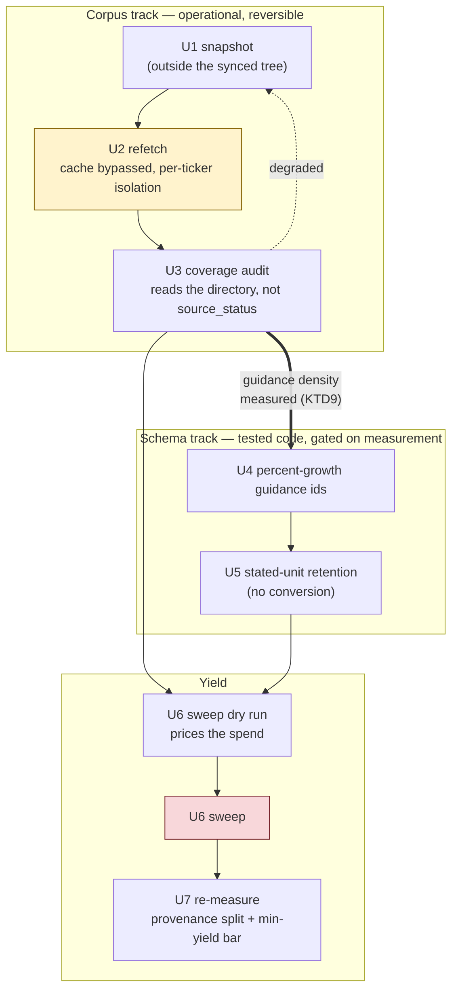

# Forward Signal Activation - Plan

## Goal Capsule

- **Objective:** Make Phase 2's forward signals produce readings on real
  companies. The metrics are built and verified; what is missing is data they
  can read and a schema wide enough to hold the guidance Indian filers actually
  publish.
- **Authority:** Phase 2's plan
  (`docs/plans/2026-08-06-004-feat-phase2-engine-enhancements-plan.md`) governs
  the contracts this work must not break — read its Implementation Record for
  the measured baseline. v05 §13 Non-Goals still binds: no SQGLP scoring
  changes. `CLAUDE.md` governs style.
- **Stop conditions:** Stop and surface if (a) a refetch degrades a ticker's
  data rather than improving it — the snapshot exists so this is recoverable,
  and a silent partial write is the specific hazard (KTD3); (b) clearing the
  fetch cache turns out to affect anything beyond fetch freshness; or (c) the
  extraction sweep's cost estimate exceeds what the dry run predicted by more
  than a small margin, which would mean the sidecar invalidation rule is not
  what U6 assumes.
- **Execution profile:** Two kinds of unit, verified differently. Fetch and
  sweep work (U1, U2, U3, U6) is operational — its proof is the audit report and
  a live run, not unit coverage, because the thing being tested is the network
  and the corpus. Schema work (U4, U5) is behaviour-bearing and tested against
  synthetic fixtures per `tests/conftest.py`, and is **gated on U3's measurement**
  (KTD9) rather than scheduled unconditionally.
- **Tail ownership:** Implementer owns commit hygiene, the before/after
  coverage audit, and the Phase 2 R7 re-proof described in the Verification
  Contract.

---

## Product Contract

### Summary

Refresh the cached corpus so quarterly results and multi-year annual reports
exist for more than a handful of tickers, measure what guidance that corpus
actually contains, and widen the extraction schema only where the measurement
shows something to catch. Ends with a per-sub-metric yield and a stated
threshold for retiring what still produces nothing.

### Problem Frame

Phase 2 shipped complete and verified, and its own Risk table named what
happened next: *"Phase lands with no live signal — every stated check could
pass while the phase produces almost nothing actionable."* Every stated check
did pass. The signals are still almost entirely blank.

The causes are all data and coverage, not defects:

**The corpus predates the data the metrics read.** `quarterly.csv` postdates the
fetch of 17 of the 22 cached tickers, so `quarterly_momentum` reads unavailable
for them — it computes on 5 of the 5 tickers that have the file.
`annual_reports.max_reports: 3` likewise applies only from its landing forward:
15 of 20 BSE-code directories hold a single annual report, and exactly one
ticker has the two usable MD&A years `promises_kept_ratio` requires. A further
13 tickers still carry the legacy price schema with no `adj_close`, which keeps
them out of the backtest's realized-return check.

**The schema cannot express how Indian companies actually guide.** The closed
vocabulary admits absolute INR-crore and percent-margin figures already stated
in that unit. Indian IT and pharma exporters — the sector where forward guidance
is most explicit — guide either in USD or as a percentage growth rate. Neither
is expressible, so four live extraction calls against ZYDUSLIFE correctly
returned nothing.

**The yield bar was therefore untested rather than failed** — ten tickers have a
usable MD&A section and have never been tried. That framing was the starting
assumption for this plan. Measuring the corpus before committing to the work
qualified it sharply, and the next section is that measurement.

### What the corpus actually contains

Scanning every located MD&A and chairman section for forward-looking numeric
statements, then classifying each by whose growth it describes:

| Statement shape | Occurrences | BSE codes |
|---|---|---|
| Percent growth, **market/industry/economy** subject | 24 | 8 |
| Percent growth, **company** subject | 1 | 1 |
| Absolute INR crore, any subject | 0 | 0 |

Three findings follow, and they reorder this plan.

**The schema's existing absolute-INR guidance vocabulary has nothing to bind
to.** Not one forward-looking INR-crore figure appears anywhere in the found
corpus. `promises_kept_ratio` as built could not have produced a value no matter
which tickers had been tried.

**Percent guidance is the shape that exists — but almost all of it is about
markets, not companies.** "The global economy is expected to grow at 2.8%", "the
XPS market by about 10%". Only one statement in the entire corpus has the
company as its subject. Counting market forecasts as promises would fill
promises-kept with macroeconomic predictions no management is accountable for,
which is worse than the blank it replaces (KTD8).

**`promises_kept_ratio` has no path to a value on this corpus, and widening the
schema does not give it one.** It requires company-subject guidance in two
report years for the same ticker. Zero BSE codes have that in even one year
except 500405, which has exactly one statement in one year. This is the finding
that most changes the plan: the schema track is a measured bet, not a fix, and
U4 and U5 are gated on evidence from the refetch rather than assumed worthwhile.

A distinction the earlier framing blurred: five BSE codes hold two or more
annual-report PDFs, but only one holds two years whose MD&A also passes the
content gate. Fifteen codes hold a single year and should gain two more each on
refetch, so the population that can be *attempted* grows substantially — whether
the guidance density inside it does is the open question U7 answers.

The refetch's value does not rest on any of this. `quarterly_momentum` is
deterministic, needs no LLM, and computes on 5 of the 5 tickers that have a
quarterly series today; the refetch should extend it to the other 17. Thirteen
tickers gain the adjusted-price schema the backtest needs. Those gains are
independent of whether the extraction pass ever produces anything.

### Requirements

**Corpus freshness**

- R1. Every real cached ticker can be refetched in one operation, with the fetch
  cache bypassed so the refetch reaches the network rather than replaying a
  cached page.
- R2. The refetch is recoverable. The corpus is gitignored and is the only copy,
  so a snapshot exists before any write and can be restored.
- R3. A failure on one ticker does not stop the rest, and an interrupted run can
  resume without redoing completed tickers.
- R4. Coverage is reported from the corpus on disk, never from the pipeline's
  own `source_status` — per-file conditional writes mean the pipeline cannot
  answer whether a given file was refreshed.

**Schema coverage**

- R5. Guidance stated as a growth rate ("revenue growth of 12% in FY2026") is
  expressible and settles against the financials without any exchange rate.
- R5a. A growth rate whose subject is a market, an industry, or the economy is
  not a promise and never enters the promises-kept denominator, however
  confidently it is stated.
- R6. A figure stated in a foreign currency or a non-target scale is stored with
  its stated unit and stays fully grounded. Any metric needing INR
  comparability reads indeterminate with that reason, rather than the entry
  being discarded.

**Yield**

- R7. Extraction can be run across a chosen set of tickers, with its cost
  estimated before it is spent.
- R8. The found / suspect / fallback split and the minimum-yield bar are
  re-measured after the refetch, so "it produces signal now" is a number.
- R8a. The measurement reports each text-derived sub-metric separately and
  states a retire threshold in advance. Phase 2's bar — any one sub-metric on
  any one ticker — can be cleared by `tam_runway` alone while
  `promises_kept_ratio` stays at zero, which is the outcome the corpus scan
  predicts. A bar that cannot distinguish those two outcomes cannot inform the
  decision it exists to inform.

### Scope Boundaries

- **No SQGLP scoring changes** — weights, thresholds, element membership, and
  gate logic stay untouched (v05 §13).
- **No new data sources.** Everything here reads Screener, BSE, and the price
  feed the pipeline already uses.
- **No changes to the five Phase 2 metrics' formulas.** They are verified. This
  plan changes what reaches them.
- **No FX rate.** Settled — see KTD5.
- **No Phase 3 work** — lane gates, portfolio layer, reinvestment queue.

#### Deferred to Follow-Up Work

- **An exchange rate, if USD coverage later proves worth its cost.** KTD5
  records why it is not paid for now and leaves the door open: U5 stores the
  stated unit, so a later FX decision has the data waiting.
- **Orphaned `.txt` annual-report sidecars.** `extract_text` has no callers; the
  `.txt` files in every `annual_reports/` directory are leftovers from before
  the section-extraction rewrite. Harmless, and deleting them is unrelated to
  this plan's outcome.
- **`tests/test_fetch_financials.py` calls `_do_fetch_with_save`, which does not
  exist.** The test is `@pytest.mark.network` so it is deselected and has been
  bit-rotting silently. Worth fixing or deleting on its own.
- **`compute`'s documented behaviour.** `CLAUDE.md` says "no fetch"; the command
  calls `analyze_quick`, which fetches. A doc or a behaviour change, not both,
  and not here.

---

## Planning Contract

### Key Technical Decisions

- KTD1. **Snapshot before any write, outside the repository tree.** The corpus
  is gitignored (`.gitignore:15`), so there is no revert. It is also 372MB
  inside an iCloud-synced directory, so an in-tree snapshot would churn the
  full amount through sync and might not settle into a stable copy. The
  snapshot goes to a local path outside the synced tree, and restoring it is a
  single documented command.

- KTD2. **Build the cache bypass the refetch needs; do not ask the operator to
  delete files.** `CacheManager.invalidate()` and `clear_all()` exist and have
  zero call sites. Without a bypass the only routes are waiting out the 24-hour
  TTL, hand-deleting `cache/cached_data/`, or editing `cache_ttl_hours` in
  config — the last of which is a persistent change made for a transient
  reason, and the easiest to forget to undo. The refetch command wires the
  existing methods to a flag.

- KTD3. **The coverage audit reads the corpus directory, not `source_status`.**
  This is the finding that shapes the whole verification approach.
  `_save_to_disk` writes each artifact only `if not df.empty`
  (`fetch_financials.py:397`), so a run where Screener's quarters section fails
  to parse leaves the old files in place, refreshes the others, and reports
  nothing wrong. `source_status["financials"]` reflects only the P&L table
  (`suite.py:105-107`). A refetch that did not fix the missing `quarterly.csv`
  is therefore indistinguishable from one that did, from inside the pipeline.
  The audit counts files on disk before and after.

- KTD4. **Percent-growth guidance is a new metric id, not a conversion.**
  "Revenue growth of 12% in FY2026" settles against consecutive annual rows in
  the frame `promises_kept_ratio` already reads — no exchange rate, no new
  source, and the value grounds in its own sentence because a percentage
  carries its unit in the numeral. This unlocks the commonest Indian IT and
  pharma guidance form for the cost of two vocabulary entries.

- KTD5. **A foreign-currency figure is stored with its stated unit and never
  converted** *(session-settled: user-directed — chosen over adding an FX rate
  to the macro block, and over continuing to discard the entry: the macro block
  feeds both regime hashes, and unlike inflation or the G-Sec yield an exchange
  rate moves constantly, so every revision would reset every ticker's momentum
  baseline.)* Storing it is strictly better than discarding it — the entry stays
  grounded and auditable, the coverage gap becomes visible in the data rather
  than showing up as an absent signal, and a later FX decision finds the figures
  already recorded. Metrics needing INR comparability read indeterminate with
  that reason. Governs R6.

- KTD6. **The extraction sweep is opt-in and priced before it runs.** Adding
  annual-report years changes each ticker's submission, whose `source_digest`
  is keyed per year — so the refetch invalidates existing extraction sidecars
  and forces a re-spend on the next LLM run whether or not a sweep is asked
  for. The sweep therefore takes an explicit ticker list and offers a dry run
  that reports the submission size and estimated cost without calling the API.

- KTD8. **A percent guidance entry records whose growth it describes, and only
  the company's own counts as a promise.** The corpus scan in the Problem Frame
  found market and economy growth rates outnumbering company-subject ones about
  four to one, in the same sections, in the same sentence shape. A percentage is
  the one figure where subject and quantity cannot be told apart by type,
  grounding, or unit — "expected to grow by 20%" is a promise or a macro
  forecast depending only on what the sentence is about. So the entry carries
  its subject as a required field from a closed set, the extractor is asked for
  it explicitly, and promises-kept counts only company-subject entries. This is
  the same shape of guard as Phase 2's content gate: a claim that is well-formed,
  well-grounded, and about the wrong thing.

  Market-subject entries are kept rather than dropped, but be honest about what
  that buys: no current metric reads them. `tam_runway` needs a market *size*,
  not a market *growth rate*, so a stored market-growth statement feeds nothing
  today. Keeping it is cheap, makes the corpus's actual content visible in the
  data rather than in a one-off scan, and follows KTD5's rule that a grounded
  reading is worth storing even when nothing can yet use it. It is not a
  benefit to count toward this plan's yield.

- KTD7. **Phase 2's R7 non-regression test is code-versus-code on fixed data.**
  (Phase 2's R7 is the no-score-may-move rule; this plan's own R7 is the
  extraction-sweep requirement. Every reference to the non-regression rule in
  this document names it "Phase 2's R7" so the two never collide.) After a
  refetch, scores will change — that is new information, not a regression, and
  Phase 2's absolutism must not be misread into forbidding it. The proof
  compares two code revisions against *the same* corpus snapshot. Scores moving
  because the data moved is recorded separately, as a corpus-change report.

- KTD9. **The schema track is gated on the refetch's measured guidance density,
  not scheduled ahead of it.** The corpus scan found one company-subject
  guidance statement in the entire found corpus and zero tickers with the two
  years `promises_kept_ratio` needs. Building U4 and U5 first would spend
  schema and validator work on a population that may not exist. So U3's audit
  and a re-run of the corpus scan come first, and U4/U5 proceed only if the
  refreshed corpus shows company-subject guidance on at least one ticker — with
  the honest possibility that the answer is to descope them and record why.

  This inverts the obvious order, in which schema work lands before the sweep so
  the sweep runs once against both improvements. That ordering optimises for
  saving one extraction re-spend; this one optimises for not building against an
  absent population. The re-spend is cents (KTD6 prices it); the schema work is
  the larger commitment.

### High-Level Technical Design

Two independent tracks that meet at the yield measurement. The corpus track is
operational and reversible; the schema track is ordinary tested code. Only the
final sweep costs money, and only after a dry run prices it.

Two edges carry the plan's judgement. The **dotted** one is the recovery path:
the audit is what tells you a refetch degraded a ticker, and the snapshot is
what undoes it. The **thick** one is the gate: the audit's guidance-density
measurement decides whether the schema track is built at all, because today's
corpus holds one company-subject guidance statement and `promises_kept_ratio`
needs two years of them on one ticker.

### Assumptions

- A1. The 17 tickers lack `quarterly.csv` because of fetch vintage, not because
  Screener omits the section for them. If a refetched ticker still has no
  `quarterly.csv`, that is a finding the audit surfaces, not a failure of the
  refetch.
- A2. BSE still serves the two-to-three annual report years `max_reports: 3`
  asks for. 15 directories hold one PDF today; the download path is additive,
  so a refetch adds the older years without touching what is there. If a
  refetched code's report count does not grow, that is a finding U3's audit
  surfaces, not a refetch failure.
- A3. `raw_data/ZYDUS` is a dead directory — a failed fetch under a wrong symbol,
  with no metadata and no price data. The real company is `ZYDUSLIFE` and is
  complete. The refetch enumerates the 22 real tickers and skips it.
- A4. The five tickers fetched within the last day (ASTRAL, CDSL, RAIN, VBL,
  ZYDUSLIFE) are inside the 24-hour TTL. Without the KTD2 bypass a refetch run
  soon would silently serve them from cache.

### Risks

| Risk | Why it matters here | Mitigation |
|---|---|---|
| A refetch degrades a ticker rather than improving it | Per-file conditional writes mean a partial parse failure silently mixes fresh and stale files, and there is no git history to diff against | Snapshot first (U1); audit compares before/after per file (U3); restore is one command |
| Screener markup changes break parsing mid-run | The whole corpus is refetched in one operation, so a parser break could touch every ticker | Per-ticker isolation and resume (U2); the audit fails loudly on a corpus-wide regression; snapshot restores |
| Extraction cost is larger than expected | The refetch forces sidecar invalidation, so re-spend happens on the next LLM run whether or not a sweep is requested | Dry run prices the sweep before it runs (KTD6); the sweep takes an explicit ticker list rather than defaulting to the corpus |
| Scores change and are read as a Phase 2 R7 regression | Phase 2's R7 is absolute about scores not moving, and a refetch will move them legitimately | KTD7 splits the two: Phase 2's R7 is re-proved code-vs-code on fixed data; data-driven movement is reported separately |
| The sweep meets filing layouts nothing has ever run against | Every live extraction to date hit one ticker, and 2 of those 4 calls surfaced pipeline defects rather than schema gaps — a truncating char budget and a grounding check broken by PDF line-wrapping. Ten tickers have never been tried, and a new failure mode per new layout is consistent with every offline test still passing | The dry run, then a 2-3 ticker pilot batch before the full sweep (U6), so a new failure mode costs a few cents rather than the whole list |
| A market forecast is counted as a promise | Market-subject growth rates outnumber company-subject ones about four to one in the same sections; counting them would make promises-kept a measure of macroeconomic luck | KTD8's subject field, tested against real corpus sentences of both kinds (U4) |
| The yield is still near zero after all of it | The corpus may simply not contain much numeric guidance — Indian MD&A is often qualitative, and the scan found zero absolute-INR forward statements | U7 reports the yield honestly either way. A measured zero across 10 tickers is a real finding about the extraction pass's value, and is the input to deciding whether to keep it |

---

## Implementation Units

### U1. Corpus snapshot and restore

- **Goal:** Make the refetch reversible before anything writes.
- **Requirements:** R2.
- **Dependencies:** none.
- **Files:** `boundless100x/data_fetcher/corpus_snapshot.py` (new),
  `boundless100x/cli.py`, `tests/test_corpus_snapshot.py` (new)
- **Approach:**
  1. `snapshot(destination)` copies `raw_data/` to a timestamped directory and
     writes a manifest recording each ticker's file list and sizes.
  2. `restore(snapshot_path)` puts it back.
  3. Default destination is outside the repository tree — the repo sits in an
     iCloud-synced directory, and a 372MB in-tree copy would churn sync and may
     not settle into a stable copy. Take the destination from config with a
     local default, and refuse a destination inside the repo with a message
     saying why.
  4. Surface both as CLI subcommands so recovery does not require reading this
     plan.
- **Patterns to follow:** the config-with-default reading in `service.py`'s
  `history_path`; `cli.py`'s existing command shape.
- **Test scenarios:**
  - A snapshot of a small fixture tree reproduces every file byte-identically
    on restore.
  - The manifest records per-ticker file counts, so a later audit can diff
    against it without re-walking the snapshot.
  - A destination inside the repository is refused with a message naming the
    sync hazard.
  - Restoring over an existing corpus replaces it rather than merging — a
    half-restored corpus is worse than either state.
  - A snapshot of an absent corpus fails clearly rather than creating an empty
    one that would later restore as deletion.
- **Verification:** snapshot and restore the real corpus; `du` and file counts
  match on both sides.

### U2. Refetch command

- **Goal:** Refresh every real cached ticker in one operation, reaching the
  network rather than the cache.
- **Requirements:** R1, R3.
- **Dependencies:** U1.
- **Files:** `boundless100x/data_fetcher/refetch.py` (new),
  `boundless100x/data_fetcher/cache/cache_manager.py`,
  `boundless100x/cli.py`, `tests/test_refetch.py` (new)
- **Approach:**
  1. Enumerate tickers from `raw_data/` — alphabetic directories are NSE
     symbols, numeric ones are BSE codes. Require a `metadata.json` so the dead
     `ZYDUS` directory (A3) is excluded, and report what was skipped and why.
  2. Bypass the fetch cache (KTD2) by wiring the existing
     `CacheManager.invalidate`/`clear_all` to a flag. Scope the bypass to the
     fetch cache; the BSE scrip master has its own week-long TTL and does not
     need clearing.
  3. Loop through `DataFetcherSuite.fetch_all` per ticker, catching per-ticker
     exceptions so one failure does not end the run (mirrors `advance()`'s
     isolation rule).
  4. Write a run log recording which tickers completed, so an interrupted run
     resumes by skipping them.
  5. Refuse to start when no snapshot exists, unless explicitly overridden.
- **Execution note:** the thing under test is the network and the corpus, so
  the real proof is a live run plus U3's audit. Keep unit coverage to
  enumeration, isolation, resume, and the bypass wiring — all of which are
  testable offline with the monkeypatched-fetcher pattern already in
  `tests/test_financials_fetch.py`.
- **Patterns to follow:** `lifecycle/advance.py`'s per-ticker try/except and
  its errors list; `tests/test_financials_fetch.py:86-118` for stubbing a
  fetcher with a `tmp_path`-backed `CacheManager`.
- **Test scenarios:**
  - Enumeration returns the real tickers and excludes numeric BSE-code
    directories and the metadata-less dead one, naming each exclusion.
  - A ticker whose fetch raises is recorded as failed and the loop continues to
    the next.
  - A resumed run skips tickers the log records as complete.
  - The cache-bypass flag causes a fetch that would have been served from a
    fresh cache entry to reach the fetcher instead.
  - Without the flag, a fresh cache entry is still served — the bypass is opt-in.
  - Starting with no snapshot present is refused unless overridden.
- **Verification:** a live run over the corpus completes, with a per-ticker
  outcome for all 22 and a wall-clock in the expected 15-35 minute range.

### U3. Coverage audit

- **Goal:** Say what the refetch actually changed, from the corpus rather than
  from the pipeline's own account of itself.
- **Requirements:** R4.
- **Dependencies:** U1, U2.
- **Files:** `boundless100x/data_fetcher/corpus_audit.py` (new),
  `boundless100x/cli.py`, `tests/test_corpus_audit.py` (new)
- **Approach:** report per ticker, comparing against the U1 manifest —
  `quarterly.csv` present or absent, annual-report years held, whether
  `price_volume.csv` carries `adj_close`, and any file that shrank or
  disappeared. Roll up to headline counts: how many tickers gained a quarterly
  series, how many now have two or more MD&A-bearing report years, how many
  moved to the adjusted-price schema. Flag regressions separately from gains —
  a file that got smaller is the partial-write signature KTD3 describes, and it
  is the one thing the report must never bury.
- **Patterns to follow:** the offline-corpus reading in
  `compute_engine/backtest.py`'s `discover_candidates` and `lifecycle/pace.py`'s
  `corpus_spread`, both of which walk `raw_data/` defensively.
- **Test scenarios:**
  - A fixture corpus that gained `quarterly.csv` for two tickers reports
    exactly those two.
  - A ticker whose file shrank is reported as a regression, not a gain.
  - A ticker that lost a file entirely is reported as a regression.
  - An unchanged corpus reports no gains and no regressions rather than an
    empty report.
  - Annual-report year counts come from the PDFs on disk, so a year added
    without a sections sidecar still counts as held.
- **Verification:** run against the snapshot and the refetched corpus; the
  headline counts reconcile with a manual `ls` of two or three tickers.

### U4. Percent-growth guidance

- **Goal:** Make "revenue growth of 12% in FY2026" a checkable promise, and keep
  "the market is expected to grow 5%" out of the promise count.
- **Requirements:** R5, R5a.
- **Dependencies:** U3 — gated, not merely ordered (KTD9). Proceed only if the
  refreshed corpus shows company-subject guidance on at least one ticker. Today
  it shows one statement in the whole corpus, which is not enough to justify
  the work; if the refetch does not move that, descope this unit and U5 and
  record the measurement as the reason.
- **Files:** `boundless100x/forward_growth_schema.py`,
  `boundless100x/compute_engine/metrics/builtin/forward_growth.py`,
  `boundless100x/llm_layer/prompts/forward_growth_extraction.txt`,
  `tests/test_forward_growth_metrics.py`,
  `tests/test_forward_growth_extraction.py`
- **Approach:**
  1. Add `revenue_growth_pct` and `pat_growth_pct` to `GUIDANCE_METRICS`, in
     percent, settled against the year-over-year change between consecutive
     annual rows rather than against a single column.
  2. Extend the settling helper so a growth-rate metric computes its delivered
     value from two rows; absolute metrics keep reading one.
  3. Add a required `subject` field from a closed set — the company itself, or
     the market/industry/economy (KTD8) — and count only company-subject
     entries as promises. Keep the rest; do not discard them.
  4. Say in the prompt that a growth rate is guidance, since the current wording
     implies an absolute target, and that the subject must be reported from the
     sentence rather than assumed.
  5. Bump `SCHEMA_VERSION` — this changes which entries survive.
- **Execution note:** behaviour-bearing and cheap to prove offline. Write the
  settling test first, against a fixture whose consecutive revenue rows make
  the delivered growth rate obvious by inspection.
- **Patterns to follow:** the existing `GUIDANCE_METRICS` entries and
  `_delivered`'s frame/column lookup; `checkpoints._series_value`'s
  year-over-year handling for the two-row shape.
- **Test scenarios:**
  - Guidance of 12% growth against financials that delivered 12.6% counts as
    kept at the standard tolerance.
  - Guidance of 20% against a delivered 3.4% counts as missed.
  - A growth-rate promise whose target year has no prior row to compare against
    is unsettleable, not a miss.
  - A percent figure grounds in its own sentence and is exempt from the INR
    unit check, since the numeral carries its unit.
  - The delivered figure is computed from consecutive rows, so a company with a
    missing intermediate year does not silently settle against a two-year gap.
  - Absolute-value guidance still settles exactly as before.
  - **A market-subject growth rate is stored but never enters the promises-kept
    denominator** — use the corpus's own "Company expects market to grow by
    4-5%" as the fixture, since it is a real sentence that names the company and
    is still not a promise by it.
  - A company-subject growth rate in the same sentence shape ("the SPC business
    of the Company is expected to grow by 20%") does count.
  - An entry whose subject is outside the closed set is discarded with its
    reason logged.
  - A year in which every extracted growth statement was market-subject reads
    indeterminate, not zero-percent-kept.

### U5. Stated-unit retention for foreign-currency figures

- **Goal:** Keep what the filing said instead of discarding it, and say why it
  cannot be used.
- **Requirements:** R6.
- **Dependencies:** U4.
- **Files:** `boundless100x/forward_growth_schema.py`,
  `boundless100x/llm_layer/forward_growth.py`,
  `boundless100x/compute_engine/metrics/builtin/forward_growth.py`,
  `boundless100x/llm_layer/prompts/forward_growth_extraction.txt`,
  `tests/test_forward_growth_extraction.py`,
  `tests/test_forward_growth_metrics.py`
- **Approach:**
  1. Add a required `unit` field to figure-bearing entries, from this closed
     set: `inr_cr`, `inr`, `pct` (the target units), and `usd_mn`, `usd_bn`,
     `inr_lakh`, `inr_mn` (the foreign and mis-scaled ones the corpus actually
     contains). Anything outside it is discarded, as with every other closed
     vocabulary in this schema.
  2. Ground the value against its stated unit rather than rejecting anything
     that is not INR crore — the existing adjacency check becomes a check that
     the stated unit is the one beside the numeral, not that the numeral is in
     INR crore.
  3. Invert the prompt rule: report the figure as stated with its unit, still
     never converting.
  4. **All three** INR-comparable metrics skip non-INR entries and, when that
     leaves nothing, read indeterminate with a reason naming the unit:
     `tam_runway`, `promises_kept_ratio`, and — the easiest to miss —
     `capex_pipeline`, which today reads `entry["amount_inr_cr"]` and sums it
     straight into a rupee total with no unit check at all. Its field name
     asserts the unit that the new `unit` field would make variable, so a
     USD-stated capex commitment would be added as though it were crore and
     silently corrupt the pipeline percentage.
  5. Bump `SCHEMA_VERSION`.
- **Execution note:** the failure mode is a wrong-unit figure being treated as
  usable, so write the discrimination tests before the retention change —
  a USD entry must reach storage *and* be refused by the metric.
- **Patterns to follow:** the three-valued provenance handling in
  `_entries_by_year`, which already distinguishes "not readable" from "read,
  nothing there"; the existing `_number_positions` unit-adjacency check.
- **Test scenarios:**
  - A USD-stated market size is stored with `unit: usd_bn` and its sentence
    grounds.
  - `tam_runway` with only USD-stated entries reads indeterminate, and the
    reason names the currency.
  - `tam_runway` with one INR-crore entry and one USD entry uses the INR one.
  - An entry whose declared unit is not the unit beside the numeral in its own
    sentence is discarded.
  - A unit outside the closed set is discarded with its reason logged.
  - `promises_kept_ratio` does not count a USD-stated promise in its
    denominator — an uncheckable promise is not a missed one.
  - **A USD-stated capex amount is stored but excluded from `capex_pipeline`'s
    sum**, and the metric reads indeterminate when nothing INR-denominated
    remains. Without this the entry is added as though `amount_inr_cr` meant
    what its name says.
  - A capex pipeline mixing one INR-crore and one USD entry sums only the
    former, and its metadata records that an entry was set aside for its unit.
  - The schema bump invalidates existing sidecars rather than serving entries
    validated under the old rule.

### U6. Priced extraction sweep

- **Goal:** Run extraction across a chosen set of tickers, with the cost known
  first.
- **Requirements:** R7.
- **Dependencies:** U2, U4, U5.
- **Files:** `boundless100x/llm_layer/sweep.py` (new),
  `boundless100x/cli.py`, `tests/test_extraction_sweep.py` (new)
- **Approach:**
  1. Take an explicit ticker list, or a flag meaning every ticker with a
     gated-found extractable section. Never default to the whole corpus.
  2. A dry run reports, per ticker, the gated provenance, the submission size in
     characters, and an estimated token cost — without calling the API.
  3. The live run reuses `service._forward_growth_stage`, so gating, validation,
     grounding, and sidecar versioning all stay in one place.
  4. Stop when a cumulative cost ceiling is reached, reporting what was left.
  5. Summarise entries kept and discarded per ticker, with discard reasons
     grouped — that summary is what says whether the pass is worth keeping.
- **Execution note:** the dry run is the unit worth testing hardest; it is what
  stands between a mistyped flag and a corpus-wide spend.
- **Patterns to follow:** `service._forward_growth_stage` for the call path;
  the usage and cost accounting in `orchestrator._summarize_usage`.
- **Test scenarios:**
  - A dry run makes no API call and still reports a per-ticker submission size.
  - A ticker whose sections are all fallback or suspect is reported as skipped
    with that reason, and is not counted in the estimate.
  - The live run stops at the cost ceiling and names the tickers not reached.
  - A per-ticker failure does not end the sweep.
  - The summary groups discard reasons, so a systematic cause is visible rather
    than appearing as scattered single failures.
  - Running without an explicit list and without the all-tickers flag is
    refused.
  - A pilot batch of two or three tickers runs and reports before the full
    sweep is offered.
- **Verification:** the dry run prices a named ticker list without calling the
  API; a pilot batch of two or three tickers then runs live, its actual cost
  lands within a stated tolerance of the estimate, and its discard-reason
  summary is legible enough to tell a schema gap from a pipeline defect. Only
  then does the full sweep run.

### U7. Re-measure and record

- **Goal:** Answer, with numbers, whether the forward signals now produce
  anything.
- **Requirements:** R8, R8a.
- **Dependencies:** U3, U6.
- **Files:** `docs/plans/2026-08-07-005-feat-forward-signal-activation-plan.md`,
  `docs/plans/2026-08-06-004-feat-phase2-engine-enhancements-plan.md`,
  `CLAUDE.md`
- **Approach:**
  1. Re-run the three measurements Phase 2 defined — the
     found / suspect / fallback split per sub-metric, the minimum-yield bar, and
     the momentum honesty check — against the refreshed corpus, and record the
     before/after here.
  2. Re-run the corpus guidance scan from the Problem Frame and report the same
     three-row table, so the change in guidance density is visible rather than
     inferred.
  3. **Report each text-derived sub-metric separately** (R8a). Phase 2's bar is
     satisfied by any one of them on any one ticker, which `tam_runway` alone
     could clear while `promises_kept_ratio` stays at zero — the outcome today's
     evidence predicts.
  4. **State the retire threshold before reading the result**, so it is a
     decision rule rather than a rationalisation: a text-derived sub-metric that
     produces no value on any ticker after the refetch, the sweep, and any
     schema work is a candidate for removal, and U7 records that recommendation
     explicitly rather than leaving a permanently blank column in the report.
  5. Update Phase 2's record to point here rather than leaving its outstanding
     bar reading as permanently unmet, and correct `CLAUDE.md`'s stale corpus
     counts.
- **Test scenarios:** `Test expectation: none -- this unit measures and records;
  the behaviour it reports is covered by U1-U6's own tests.`
- **Verification:** the three measurements plus the guidance scan are recorded
  with before and after figures; each text-derived sub-metric has its own
  reported yield; and every sub-metric still at zero carries either a stated
  reason it should survive or a recommendation to retire it.

---

## Verification Contract

- Full suite green via `venv/bin/python -m pytest tests/` (836 pass today;
  network tests stay deselected).
- **Phase 2's R7 re-proof, code-versus-code on fixed data.** That proof compared two
  code revisions against one corpus. Repeat it against the U1 snapshot — the
  pre-refetch corpus — so the comparison isolates this plan's code from the
  refetch's data. `composite`, every element score, `coverage`, score flags and
  the eligibility verdict must be byte-identical for all 22 tickers.
- **Corpus-change report, kept separate.** Score movement caused by refetched
  data is expected and is recorded on its own, never folded into the Phase 2 R7 result
  (KTD7).
- **Coverage audit shows gains and no regressions.** Any file that shrank or
  vanished is investigated before the snapshot is discarded.
- **Backtest still runs**, with the four forward-growth sub-metrics excluded and
  `rerating_headroom` computing. The 13 tickers gaining `adj_close` should
  reduce the realized-return exclusions — check whether the usable sample grows.
- **Three-bucket provenance split re-reported** per sub-metric across the
  refreshed corpus, read against Phase 2's A1 rates. A `suspect` count near
  zero still means the content gate is not gating.

## Definition of Done

All seven units merged with tests green; the corpus refetched and audited with
regressions investigated; the Phase 2 R7 re-proof performed against the snapshot and
recorded; the corpus-change report recorded separately; the provenance split and
minimum-yield bar re-measured and written into this plan's implementation
record with each text-derived sub-metric reported separately and a retire
recommendation for any that remain at zero; Phase 2's record updated to point
here; `CLAUDE.md`'s corpus counts corrected; and any dead-end code from approaches that did not pan out removed
from the diff.

---

## Implementation Record (2026-08-07)

Landed on `main` with the suite green (934 passed, 2 network tests deselected).
The measurements the Definition of Done asks to be recorded here.

### The KTD9 gate, and how it read

The schema track was gated on the refetch showing company-subject guidance, and
the refetch moved it decisively. Scanning every gated-`found` MD&A and
chairman slice for forward-looking numeric statements, classified by shape and
by whose growth they describe:

| Statement shape | Before | After |
|---|---|---|
| Percent growth, **company** subject | 1 (1 code, **1 report year**) | 5 (1 code, **3 report years**) |
| Percent growth, market/industry/economy | 34 (7 codes) | 70 (9 codes) |
| Percent growth, subject unattributed | 13 (5 codes) | 20 (6 codes) |
| Absolute INR crore, **company** subject | 0 | 0 |
| Absolute INR crore, other subject | 5 | 6 |

The row that decided it is the first. `promises_kept_ratio` needs
company-subject guidance in **two** report years for one ticker; before the
refetch no ticker had that in even one year but 500405 (SPLPETRO), with a
single statement. After it, SPLPETRO carries company-subject growth guidance in
three consecutive report years. That population did not exist and now does.

The second finding held exactly as the Problem Frame predicted, and is the one
that most shapes the recommendations below: **not one forward-looking
company-subject INR-crore figure appears anywhere in the corpus**, before or
after. The schema's original absolute-INR guidance vocabulary still has nothing
to bind to.

The scan is a heuristic instrument and its market/unattributed split is coarser
than a hand read. Its company-subject column is the one that matters and was
verified sentence by sentence; a sentence naming both the company and a market
is classified `market`, which is the conservative direction (KTD8).

### Coverage audit (U3)

| Measure | Before | After |
|---|---|---|
| Tickers with `quarterly.csv` | 5 / 22 | **22 / 22** |
| Tickers with an `adj_close` series | 9 / 22 | **22 / 22** |
| Annual-report years held | 29 | **54** (25 added across 15 codes) |
| Codes with 2+ `found`-MD&A years | 1 | **9** |

A1 and A2 both held: every one of the 17 tickers missing a quarterly series
gained one, so the absence was fetch vintage rather than Screener omitting the
section, and BSE served the older report years `max_reports: 3` asks for.

The audit reported **27 regressions and every one was investigated before the
snapshot was kept**. All 27 are the analysis window rolling forward: `Mar 2014`
leaves the ten-year window, `Mar 2026` enters, and the interim balance-sheet
column (`Sep 2025`) and the `TTM` P&L row are replaced by the now-reported
annual row. No column was lost anywhere and no row count fell except by exactly
those interim rows. Four `price_volume.csv` files shrank by 10–25 bytes with
identical row and column counts — float formatting, not data.

### Phase 2's R7 re-proof — code versus code on fixed data

Run against the **U1 snapshot**, so the comparison isolates this plan's code
from the refetch's data (KTD7). Across all 22 tickers, `composite`, every
element score, the whole `coverage` dict, `scores["flags"]`, the eligibility
verdict, every gate outcome and **every `details` entry** are byte-identical
between the pre-plan tree (`2ab0636`) and this one.

`registry_hash` stayed at `1d9f30d09df3` throughout while `forward_signal_hash`
moved `cc06090cb71a → 061cba100a81`. KTD8's split doing its job again: three
schema revisions and a new metric vocabulary, and not one ticker's momentum
baseline was disturbed.

### Corpus-change report — kept separate (KTD7)

Scores also moved, on data alone, and that is new information rather than a
regression. Same code both sides, snapshot corpus against refetched:

**18 of 22 tickers moved**, driven by the FY2026 annual row arriving. Two
verdicts changed — BLS `not_eligible → eligible`, TBOTEK `not_eligible →
indeterminate`. Largest moves: GRAPHITE 4.41 → 3.30, CONCOR 5.32 → 4.53,
TNPETRO 5.59 → 4.94, SPLPETRO 4.96 → 5.49, BSE 5.80 → 6.29.

### Three-bucket provenance split

29 report-years across 20 BSE codes became **54 across the same 20**.

| Section | `found` | `suspect` | `fallback` | Raw `found` → survived |
|---|---|---|---|---|
| `mdna` | 24 (was 11) | 4 (was 2) | 26 (was 16) | 28 → 24 (**86%**, was 85%) |
| `chairman` | 18 (was 9) | 2 (was 2) | 34 (was 18) | 20 → 18 (**90%**, was 82%) |
| `governance` | 33 (was 22) | 16 (was 4) | 5 (was 3) | 49 → 33 (**67%**, was 85%) |

Read against Phase 2's A1: MD&A detection roughly doubled its absolute reach
while the gate's survival rate held at ~85%, which is the stability that says
the rate is a property of the detector rather than of the sample. `suspect`
counts are non-zero in every section, so the gate is still gating — governance
notably harder than before, which costs nothing because `governance` is gated
for reporting and never submitted.

Per sub-metric, which is the cut that decides what each one can actually read
(`REQUIRED_SECTIONS`, so `tam_runway` counts its ranked `chairman` fallback):

| Sub-metric | Before | After |
|---|---|---|
| `promises_kept_ratio` | 11/29 report-years, 10 codes | **24/54, 11 codes** |
| `capex_pipeline` | 11/29 report-years, 10 codes | **24/54, 11 codes** |
| `tam_runway` | 17/29 report-years, 14 codes | **33/54, 15 codes** |

The before column reproduces Phase 2's recorded figures exactly, which is the
check that this measurement uses the same instrument.

### The extraction sweep

The population that can be *attempted* went from effectively one ticker to
**15** — every ticker with at least one gated-`found` extractable section.

- Dry run priced 15 tickers at **~$0.67** (worst case $1.28), no API call.
- Pilot batch of 3 (SPLPETRO, ZYDUSLIFE, CAMS): **$0.1587** actual against a
  $0.1310 point estimate and a $0.2749 worst case — 21% over the point, inside
  the bound. The point estimate assumed 900 output tokens per call; two pilots
  measured ~1,350, and the constant now says so.
- Full sweep: 11 of 15 tickers extracted for **$0.2869**.

**Four tickers were not extracted, and the reason is external.** IXIGO,
RAILTEL, RAIN and VBL failed with `Your credit balance is too low to access the
Anthropic API`. The pass behaved exactly as designed for an outage: nothing was
cached, so `python -m boundless100x sweep --tickers IXIGO,RAILTEL,RAIN,VBL`
retries them once the account is topped up, and the figures below are therefore
a floor rather than a ceiling.

**The pilot's discards named two schema gaps and no pipeline defect** — which
is what U6's verification asks the discard summary to be able to do. ZYDUSLIFE
states its markets in USD *trillion* and CAMS states industry AUM in *lakh
crore*; with neither word in the vocabulary the extractor reached for the
nearest unit and grounding refused it, correctly. `usd_tn` and `inr_lakh_cr`
were added, `inr_lakh` gained a negative lookahead so "lakh crore" cannot
ground as "lakh", and the re-run turned 5 refused readings into stored ones
(CAMS 0 → 2 kept, ZYDUSLIFE 13 → 17). Discards now carry the sentence they were
reading, because triaging the first sweep meant going back to the PDFs.

Three discards survive across the whole sweep and all three are correct
refusals: two SPLPETRO promises whose sentence names no year ("in current
year"), and one ZYDUSLIFE figure whose numeral is not denominated as claimed.

### What is stored now

**58 grounded entries across 11 tickers**, where Phase 2 had none.

| | Count |
|---|---|
| `guidance` | 32 — **3 company-subject**, 29 market-subject |
| `tam` | 26 |
| `capex` | **0** |
| Stated units | 31 `pct`, 20 `usd_bn`, 5 `usd_tn`, 2 `inr_lakh_cr`, **0 `inr_cr`** |

KTD8 is doing visible work: 29 of 32 guidance statements are market forecasts
that would have inflated promises-kept with macroeconomic predictions no
management is accountable for. KTD5 is too: 27 of 58 entries are figures the
old schema discarded outright and that are now stored, grounded and auditable
with the coverage gap visible in the data.

### Minimum-yield bar, per sub-metric (R8a)

The retire threshold, stated before the result was read: *a text-derived
sub-metric that produces no value on any ticker after the refetch, the sweep
and the schema work is a candidate for removal.*

| Signal | Before | After | Verdict |
|---|---|---|---|
| `rerating_headroom` | 16/22 | **17/22** | clears the bar |
| `quarterly_momentum` | 5/22 | **21/22** | clears the bar |
| `promises_kept_ratio` | 0/22 | 0/22 | **keep** — see below |
| `tam_runway` | 0/22 | 0/22 | **keep, blocked on one decision** |
| `capex_pipeline` | 0/22 | 0/22 | **retire candidate** |

`quarterly_momentum` is the plainest win: it computed on 5 of the 5 tickers
that had a quarterly series and now computes on 21 of 22. The one exception is
SPLPETRO, whose Screener page renders only 5 quarters against the 6 a second
difference needs — a real limit, honestly reported.

**`promises_kept_ratio` — keep.** Its input now exists and its mechanism works
end to end. SPLPETRO carries three company-subject growth promises across two
report years, all correctly typed, grounded, subject-tagged and unit-tagged.
They read *pending* rather than kept-or-missed for a reason outside this
metric: Screener renders SPLPETRO's P&L as `Jun 2006 … Jun 2010` plus a lone
`Mar 2026`, and `_get_annual_rows`'s dominant-period-label rule — which exists
so a non-March filer is not paired against interim rows — drops the only
settleable year. Changing that rule would move scored metrics, which v05 §13
forbids. One filer with an ordinary annual table produces a value; retiring a
metric whose input demonstrably exists would be the wrong call.

The other ten extracted tickers separate cleanly, and none of the reasons is
the same shape: ZYDUSLIFE and IRCON have guidance but all of it market-subject;
IRCTC, EDELWEISS and CONTROLPR have one report year where two are needed; CAMS,
BLS and CONCOR have no usable MD&A year; GRAPHITE and IDEA have a usable MD&A
that carried no guidance at all.

**`tam_runway` — keep, and the blocker is now a single decision.** 26 stated
addressable markets across 6 tickers, every one of them in `usd_bn`, `usd_tn`
or `inr_lakh_cr` and **not one in `inr_cr`**. This is not an absent signal; it
is precisely the FX gap KTD5 deferred, now measured rather than assumed. Two
cheap moves would produce values, and they are separable:

- `inr_lakh_cr` needs **no exchange rate at all** — a lakh crore is 100,000
  crore, a fixed scale that cannot go stale and does not belong in the macro
  block. CAMS's two entries are reachable today.
- `usd_bn` / `usd_tn` need the FX decision the Scope Boundaries defer. U5 did
  its job: the figures are recorded and waiting.

**`capex_pipeline` — retire candidate, and the only one.** Zero capex entries
in 54 report-years across 20 codes and 11 extracted tickers. Not a unit
problem, not a section problem, not a subject problem: the corpus's MD&A
sections do not state capital commitments with a commissioning year in any form
the extractor recognises. It is the one text-derived sub-metric with no visible
path to a value, and it should be removed rather than left as a permanently
blank column — subject to the four un-swept tickers being run first, since they
are the only evidence still outstanding.

### Momentum honesty check

`score_history.jsonl` holds 7 rows, all dated 2026-08-06 and all under
`config_hash 715479102494` — a superseded regime. All 5 tickers report
`insufficient_history` with `latest: None`. **Not one reports a zero delta**,
which is the property that matters: a zero means flat and no delta means
unknown, and they look identical in a table.

### Backtest

Runs, and the Verification Contract's own question found a defect. The four
forward-growth sub-metrics are excluded on all 15 qualifying companies and
`rerating_headroom` on 3 of 15 — both byte-identical to Phase 2's figures.

The contract predicted the 13 tickers gaining `adj_close` would *reduce* the
realized-return exclusions. Checked, and the opposite had happened: usable
realized returns fell from 15 to 10. Cause: the price source publishes the
most recent bar's raw close before its adjusted one, so a series fetched today
ends in a single NaN `adj_close`, and `_realized_return` took the last row
unconditionally. Invisible until now because the affected tickers had no
adjusted series and fell back to the raw close. Fixed — and the real gain is
not the count but the basis: **all 15 now sit on a genuinely adjusted series
where 7 of them previously sat on a raw close**, which reads a 1:5 split as an
80% loss.

### Follow-up this phase surfaced

- **Four tickers still to sweep** (IXIGO, RAILTEL, RAIN, VBL), blocked on API
  credit rather than on anything in the code.
- **Scale-only INR conversion** (`inr_lakh`, `inr_mn`, `inr_lakh_cr` → `inr_cr`).
  Fixed multipliers, no exchange rate, no macro-block entry, no staleness — a
  materially smaller decision than FX and the one that unblocks the INR half of
  `tam_runway`.
- **SPLPETRO's P&L shape.** One ticker whose Screener table mixes June and March
  period ends, so the dominant-label rule discards its only recent annual row.
  Out of scope here because the rule is load-bearing for scored metrics.

### Post-review addendum (2026-08-07)

A simplification pass and an eight-reviewer code review ran over the phase diff
after the measurements above were taken. Two consequences a reader of this
record needs:

**The stored extraction sidecars are invalidated.** The review found three
validator defects — a rupee unit could ground beside a foreign currency marker,
the required period fields were unbounded free text, and a non-string `section`
raised out of the whole pass — and fixing them changed which entries survive.
`SCHEMA_VERSION` went 7 → 8 accordingly, which is what that number is for. The
58 entries counted above were validated under 7 and are a superset of what 8
accepts, so **the yield figures stand as measured but need one re-sweep
(~$0.29 for the 11 extracted tickers) to be reproducible on disk.** That
re-sweep and the four never-swept tickers are the same command.

**Three "green surface" defects were fixed in the operational commands**, none
of which affects the measurements: a refetch whose sources all failed reported
`ok` and marked itself complete; `restore` could delete the corpus and the
snapshot together; and the resume log never expired, so a second `corpus
refetch` silently did nothing. The corpus refetch this record describes
completed before those fixes and its audit was verified by hand, so the numbers
are unaffected — but anyone repeating the operation should do it on the fixed
code.

Phase 2's R7 re-proof was re-run after every change and still holds:
byte-identical across 22 tickers, `registry_hash` unmoved at `1d9f30d09df3`,
`forward_signal_hash` moving to `7e4415c78c48`.

### Final state (2026-08-07, after the full sweep)

The four credit-blocked tickers were swept, then the remaining eleven were
re-swept under schema 8. **All 15 extractable tickers are now covered**, for
$0.44 (against a $0.52 estimate — under). Corpus-wide: **60 grounded entries**,
34 guidance (31 market-subject, 3 company-subject) and 26 TAM.

**The full sweep produced the first `inr_cr` entry this project has ever seen,
and it was a chart.** IXIGO's FY2024 `tam` entry quoted
`"3,808 5,904 8% 6% 7% 12% CAGR (FY23-28) 1,365 2,900 1,660"` — axis labels
flattened by PDF text extraction. It passed every guard honestly: the numeral
is in the submitted text, denominated as claimed, beside a plausible period.
Grounding cannot separate a claim from a scraped axis because on those tests it
*is* one. It then fed `tam_runway` a Rs 3,808 crore addressable market and
produced **the only value that metric returned across the whole corpus** — so
"tam_runway now computes" would have been a chart. A prose requirement now
refuses it (five alphabetic words; the fragment has two, the lowest genuine
quotation has nine, so the threshold sits in an empty gap and rejects exactly
that one entry of 60). `SCHEMA_VERSION` 8 → 9.

This is KTD9's failure — well-formed, well-grounded, about the wrong thing —
one level below the section gate it was written for. Worth recording as the
phase's sharpest lesson: **every guard this plan added was necessary and none
was sufficient, because each one answers a different question, and the corpus
kept finding the question nobody had asked yet.**

**Final per-sub-metric yield, on a fully refetched and fully swept corpus:**

| Signal | Yield | Disposition |
|---|---|---|
| `quarterly_momentum` | **21/22** (was 5/22) | clears the bar |
| `rerating_headroom` | **17/22** (was 16/22) | clears the bar |
| `promises_kept_ratio` | 0/22 | keep — 3 real company promises on SPLPETRO, blocked by one filer's unusable P&L shape |
| `tam_runway` | 0/22 | keep — 26 real market sizes, every one in USD or lakh crore; blocked only by the deferred FX decision |
| `capex_pipeline` | 0/22 | **RETIRED** |

**`capex_pipeline` is retired**, against the threshold this plan stated before
the result was read. Zero capex entries across 54 report-years and 15 swept
tickers — not a unit problem, not a section problem, not a subject problem: the
corpus's MD&A does not state capital commitments with a commissioning year in
any form the extractor recognises. It was the one text-derived sub-metric with
no visible path to a value, and a permanently blank column teaches a reader
nothing. The `capex` extraction *kind* is kept — storing a grounded reading
nothing yet consumes is this schema's standing rule, and the metric is twenty
lines to restore if such statements ever appear.

Phase 2's R7 re-proof after the retirement: scores, coverage, flags, verdicts
and gates byte-identical across 22 tickers; `registry_hash` unmoved at
`1d9f30d09df3`; the only `details` change is `capex_pipeline` disappearing,
which is what retiring a zero-weight metric should look like and nothing more.

**Owner decision, recorded:** the sidecars are left invalidated by the schema-9
bump rather than re-swept a third time. Nothing is lost in live signal — all
remaining text-derived sub-metrics read 0/22 either way — and the yield figures
above stand as measured. One `sweep --all` (~$0.67) repopulates them whenever
the evidence is wanted back on disk.
