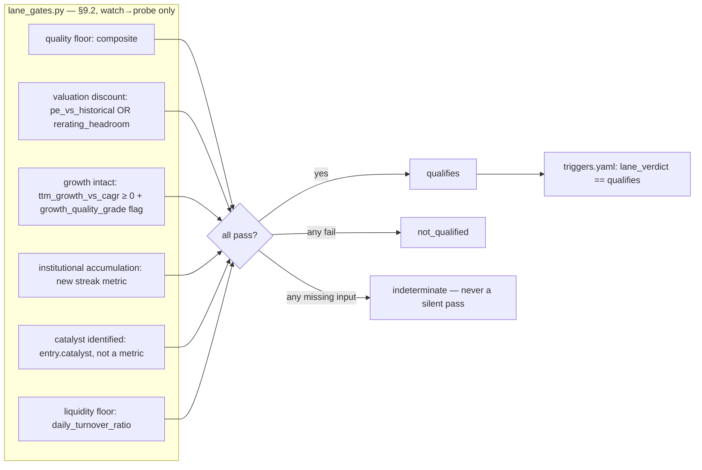

# Phase 3 Fast Lane + Portfolio Layer - Plan

## Goal Capsule

- **Objective:** Add a second lifecycle lane (re-rating / "fast lane") that
  shares the existing state machine but runs its own entry gates and exit
  rules, and wrap both lanes in a lightweight portfolio layer: sleeve
  configuration, a reinvestment queue that proposes where exit proceeds go
  next, and a friction model that shows fast-lane returns net of tax and
  slippage rather than gross.
- **Authority:** v05 §4.4 (lane parameters), §8 (dual-lane portfolio
  structure, friction honesty), §9 (re-rating lane spec), §12 Phase 3, and
  §14 decision points 1–4 govern behavior; §13 Non-Goals binds absolutely —
  no SQGLP weight/element/threshold/gate-logic change in any phase, no new
  data source, no automated execution. `CLAUDE.md` governs style. Where this
  plan conflicts with observed code reality, surface it rather than guessing
  — every prior phase plan corrected the roadmap this way, and the
  corrections were the valuable part.
- **Stop conditions:** Stop and surface if (a) any change moves a composite,
  element score, coverage ratio, or eligibility verdict for an unchanged
  ticker — both new metrics are additive-only, exactly as Phase 2's were;
  (b) a fast-lane transition would move money without going through the same
  propose-and-owner-confirms gate the core lane already uses (§14.4), or any
  code path other than the owner's explicit exit command can produce an
  `exited` state; (c) scoping the four core entry triggers to `lane: [core]`
  turns out to change any **core**-lane entry's behavior — the fast lane
  gains a path, the core lane loses nothing; or (d) a concentration or
  reinvestment feature turns out to need rupee position sizes to mean what
  §8.1 says — the watchlist tracks lifecycle state, not capital, and Phase 3
  keeps it that way (see Scope Boundaries).
- **Execution profile:** Code with unit tests per unit, on synthetic
  fixtures per `tests/conftest.py` and the fixture builders in
  `tests/test_fixture_builders.py` — never `raw_data/`, never live scraping.
- **Tail ownership:** Implementer owns commit hygiene and the end-of-phase
  validation named in the Verification Contract: a fast-lane candidate
  passing all six lane gates end-to-end on a synthetic fixture, and an exit
  transition producing a reinvestment-queue entry with a routing proposal.

---

## Product Contract

### Summary

Three additive layers on top of the Phase 1 lifecycle machine, none of which
touch SQGLP scoring. A **re-rating lane** — `LANES` gains a second value;
`triggers.yaml` gains a complete fast-lane path while the four core entry
rules become core-only (a lane with its own gate set must not also be gated
by the core lane's); and a new declarative `lane_gates.yaml` (mirroring the
existing eligibility-gate and trigger evaluators) encodes §9.2's six entry
gates, four of which reuse metrics that already exist and two of which need
one new zero-weight metric each. A **friction model** — STCG/LTCG and
slippage as config, applied to a position's modeled return so a report
states net-of-friction beside gross, never one without the other. A
**portfolio layer** — sleeve/sizing config, an owner-confirmed exit command
that is the only path to `exited` and records — idempotently, per KTD10 —
the transition, the modeled friction reading and exactly one
reinvestment-queue event, a router that proposes where proceeds go next
with the owner's routing decisions recorded back, and count/sector
concentration guardrails.
Position sizing in rupees is explicitly out of scope (see Scope Boundaries):
the queue and guardrails are qualitative, because the watchlist has never
tracked invested capital and inventing a number for it is worse than not
having one.

### Problem Frame

Phase 1 built one lane — hold 5–10 years, exit only on a fundamentals break —
and the roadmap always intended a second: monetizing valuation re-rating and
institutional discovery on a 6–18 month horizon, funded from the same pool of
capital as the core lane. Without it, a company whose thesis is "this
re-rates in a year, not a decade" has nowhere to go in the system except the
core lane's parameters, which are wrong for it (§4.4). And without a
friction model, a fast lane that trades more often looks better than it is:
short-term capital gains tax and slippage on small-cap names can erase the
entire edge a faster cycle time was supposed to capture (§8.2). This phase
closes both gaps together, because a fast lane without honest friction
accounting is the exact failure mode §8.2 exists to prevent.

### Requirements

- R1. The watchlist supports a second lane, `rerating`, selectable at
  `watchlist add` time. Existing core-lane entries keep **schema
  compatibility and lifecycle behavior** unchanged — no migration, no new
  required schema key that would break an entry that predates this phase —
  while their *reports*, like any tracked entry's, gain the lane/state
  section (KTD9).
- R2. A declarative lane-gate registry (§9.2) with its own evaluator, sharing
  the indeterminate-on-missing-input rule already established by
  `EligibilityEvaluator` and `TriggerEvaluator`: quality floor, valuation
  discount, growth intact, institutional accumulation, catalyst identified
  (recorded, not scored), and liquidity floor. A gate whose inputs are
  missing reads indeterminate, never a silent pass.
- R3. Lane-scoped lifecycle transitions (§4.4, §6.2). The fast lane gets a
  **complete pre-position path of its own** — screen→qualify on a lighter
  quality floor, its own qualify→dropped rule, qualify→watch, and
  watch→probe on the full lane-gate battery (§9.2) — and its own exit rules
  (target reached, 18-month time stop, catalyst spent). Correspondingly,
  the four **core** entry/drop/buy-zone triggers become core-only, because
  a lane with its own declared gate set must not also be gated by the core
  lane's: today `qualification_failed` would drop any re-rating candidate
  that fails the 100x gates before its lane gates were ever consulted, and
  `awaiting_entry_price` would block qualify→watch for one that is not
  core-eligible. The six **fundamentals kill-switches and
  `fundamentals_deteriorated` stay universal** and unchanged — §6.2 is
  explicit that the fast lane never trades through a fundamentals break.
- R3a. **An `exited` state is reachable only through an explicit
  owner-confirmed exit operation**, never a trigger: no metric can observe
  that the owner sold. That operation records the exit_review→exited
  transition, the modeled friction reading, and exactly one
  reinvestment-queue event — validate-first, idempotent, and recoverable
  after a crash between its two file writes (KTD10).
- R4. Catalyst tracking: a fast-lane candidate records a named catalyst with
  an expected window (owner input, not computed) and a status
  (`active`/`spent`) the catalyst-spent exit rule reads.
- R5. A friction model (§8.2): STCG/LTCG and slippage as owner-editable
  config, applied to a position's **modeled** return — probe-confirmation
  date to exit date, market bars as price proxies, no fills and no cost
  basis (see Assumptions) — so the recorded evidence and the CLI carry
  net-of-friction beside gross, never one without the other, and every
  figure is labeled an estimate; the word "realized" appears nowhere a
  reader could mistake it for a statement about actual trades.
- R6. Core-satellite portfolio config (§8.1, §14.1–.2): sleeve-split
  placeholder (70/30), per-lane tranche-sizing placeholders, and per-lane
  count-based concentration guardrails — never rupee percentages, per the
  Scope Boundary below.
- R7. A reinvestment queue (§8.1): every exit appends an event; a routing
  view proposes the highest-priority current candidate across both lanes by
  trigger state, never auto-applied (§14.4); the owner's actual deployment
  is recorded — a `routing` event binding the exit to a candidate
  positioned by an owner-applied transition, never a mere intention — so
  "days since exit, unrouted" measures exit-to-deployed-capital, derived
  from the log rather than guessed;
  and candidates blocked by safety or concentration stay visible with their
  reasons, never rendered as an empty queue.
- R8. **No SQGLP scoring changes** (§13). The two new metrics this phase
  adds carry zero weight and never enter element scoring, the composite, or
  the coverage denominator.
- R9. **No new data sources** (§13). Institutional accumulation reads
  `shareholding.csv`, already fetched; growth-intact reads `quarterly.csv`
  (Phase 0's parser) against the existing `revenue_cagr_5yr`; liquidity
  reuses the already-scored `daily_turnover_ratio`; target-reached reuses
  Phase 2's `rerating_headroom`.
- R10. Transition autonomy is unchanged (§14.4): the money-moving
  transitions `advance` can propose (probe, scale, exit_review) are
  proposed with evidence and confirmed by the owner, exactly like the core
  lane — and `exited` is never proposed at all: it is reachable only
  through the explicit `watchlist exit` command (R3a).

### Scope Boundaries

- **No SQGLP scoring changes** — weights, thresholds, element membership for
  scoring purposes, and gate logic are untouched (v05 §13).
- **No rupee position sizing.** The watchlist has never tracked invested
  capital, tranche amounts, or cost basis, and this phase does not add it.
  Concentration guardrails, sleeve actuals, and the reinvestment queue's
  "idle cash" reading are **count- and state-based**, not percentage-of-
  capital based (owner-confirmed — see Assumptions). Literal `%`-of-sleeve
  enforcement is deferred until a capital-tracking phase exists.
- **No macro-driver correlation heuristic.** §8.1 also asks for "a
  correlation note when two holdings share a macro driver (both
  lender-financed, both export-cyclical)." This phase implements same-sector
  correlation only — a cross-sector macro-driver classifier is not
  computable from data this system fetches and is disproportionate to this
  phase.
- **No trigger-threshold or lane-gate-threshold calibration** — every
  numeric threshold introduced here is a starting point (§14.1–.3); evidence
  comes from the Phase 4 simulator (§12 Phase 5).
- **No Strategy Simulator.** The friction model computes net-of-friction for
  a single recorded exit; the phased-replay backtest that evaluates
  the fast lane's break-even across many cycles is Phase 4 (§10).
- **No automated execution, no broker integration** (§13). The reinvestment
  queue proposes; the owner disposes.
- **No changes to the six existing core-lane kill-switches** — they already
  apply `from: [probe, scale]` with no lane discriminator and continue to
  protect both lanes unchanged (§6.2: "never trade through a fundamentals
  break").

#### Deferred to Follow-Up Work

- **Rupee-denominated position sizing and a true capital-weighted
  concentration check.** Real scope once the owner decides how invested
  amounts should be recorded (manual entry vs. a future data source) —
  explicitly not answered by this phase.
- **Catalyst hit-rate tracking** (did recorded catalysts actually resolve as
  named). Useful evidence for Phase 5 calibration; needs history this phase
  only starts producing.
- **A portfolio-level dashboard** (sleeve occupancy, queue state, all
  positioned names at a glance) beyond the per-company report section and
  CLI views this phase adds. A dedicated view is more naturally a Phase 4/5
  concern once the simulator exists to populate it with something besides
  the current instant.
- **Point-in-time universe for the simulator** (§14.6) — unaffected by this
  phase, already deferred.

---

## Planning Contract

### Key Technical Decisions

- **KTD1 — Lane gates are a third sibling evaluator, not a fold-in.**
  `lifecycle/evaluator.py`'s own docstring calls itself "the eligibility-gate
  evaluator's sibling [that] deliberately mirrors it" — same `COMPARATORS`,
  same three-valued outcome, same per-condition `detail` strings. Lane gates
  follow the same idiom as a third module (`lifecycle/lane_gates.py`) rather
  than widening `eligibility_gates` in `registry.yaml` with a lane
  discriminator, which would conflate two different questions
  (`compute_engine/eligibility.py`'s "could this plausibly 100x?" vs. the
  lifecycle layer's "does this qualify for the fast lane, right now?") the
  design doc treats as distinct (§9 sits entirely in the lifecycle section,
  not the compute-engine section). Its condition-kind dispatch is closer to
  `TriggerEvaluator`'s than to `EligibilityEvaluator`'s, because a lane gate
  needs `score` and `flag_present`/`flag_absent` conditions (`Eligibility
  Evaluator` only supports `metric` conditions today) plus one condition kind
  neither sibling has: `catalyst_status`, reading the watchlist entry
  directly rather than a computed metric.
- **KTD2 — Two new zero-weight metrics; the other four gates reuse what
  exists.** Reading the metric registry before designing new ones found
  four of six gates already answerable: quality floor reuses
  `scores["composite"]`; valuation discount reuses `pe_vs_historical` and
  Phase 2's `rerating_headroom` favourable band; liquidity floor reuses the
  already-scored `daily_turnover_ratio`; and the *quality half* of growth
  intact reuses the existing `growth_quality_grade`
  (`growth_quality_risky` flag absent). Two need new code, both registered
  at `weight: 0.0` following the precedent Phase 2's KTD1 set for
  zero-weight metrics that must never enter the composite:
  - `institutional_accumulation_streak` (`size.yaml`, beside
    `institutional_holding`) — `compute_promoter_trend` (`builtin/size.py`)
    already computes this shape (a value, a change, and a `raw_series`) for
    promoter holding, so FII+DII follows its construction rather than
    inventing a second one. Exact definition in KTD3.
  - `ttm_growth_vs_cagr` (`growth.yaml`) — see KTD3a. §9.2's growth gate is
    "**latest TTM growth ≥ historical CAGR**", which no existing metric
    answers: `quarterly_momentum` is a *second difference* (is growth
    accelerating), and a company shrinking at a steady rate passes a
    not-decelerating test. Flag-absence alone would have shipped a gate that
    does not implement its own stated rule.
- **KTD3 — A streak count, not `persist_years`; and the streak counts
  *rises*, walking backward from the latest quarter.** `persist_years`
  (Phase 1) tests "every value in the window satisfies one fixed threshold"
  — it cannot express "each quarter rose versus the prior one," which is a
  slope condition, not a threshold condition, and `SERIES_SAFE_METRICS` is
  additionally an allowlist of *annual* metrics whose `raw_series` units
  match their own threshold (roiic and pe_vs_historical are the two
  counter-examples documented there). Rather than stretch that mechanism to
  a quarterly slope check it was never built for, the new metric computes
  its own streak internally and exposes it as an ordinary numeric value, so
  the lane gate's condition is a plain
  `{metric: institutional_accumulation_streak, comparator: gte, threshold: 2}`
  — no new evaluator machinery required for this condition.

  The definition is stated exactly, because the obvious phrasings are
  ambiguous in two ways that change the answer:
  - *Ordering.* `shareholding.csv` is stored **chronologically,
    oldest row first** (verified: `compute_promoter_trend` reads
    `iloc[-1]` as latest and `iloc[0]` as earliest, and the cached files run
    Dec 2024 → Jun 2026). The metric therefore reads the series in file
    order and walks **backward from the last row**. An earlier draft of this
    plan called the series "most-recent-first" — that was wrong and would
    have inverted the streak.
  - *Counted unit.* The value is the number of consecutive **rises**
    (period-over-period increases), not the number of observations
    involved. Four strictly increasing quarters therefore yield **3**, since
    three comparisons occur between four points. A rise is
    `combined[i] > combined[i-1]`; the walk stops at the first
    non-increase.
  - *Minimum and gaps.* Fewer than 2 readable rows errors (no comparison
    is possible). Each row's `quarter` label is parsed with the same
    quarter-index helper the quarterly metrics use, and a rise counts
    **only between rows exactly one quarter apart** — the walk terminates
    at a gap, because "FII+DII rose across a hole in the data" is missing
    evidence, not a rise. This is the matched-by-period rule Phase 2's
    `quarterly_momentum` adopted after a positional read fabricated 1.4pp
    of movement, and it is deliberately stricter than
    `compute_promoter_trend`'s positional read: a 20-quarter *trend*
    tolerates a gap, but a consecutive-quarters *gate* is defined by
    adjacency. Unparsable labels error, which reads as gate-indeterminate,
    never a pass.

  With that definition, the gate's `>= 2` threshold means **two consecutive
  rises**, spanning three quarterly observations — which is what §9.2's
  "FII+DII rising for 2+ consecutive quarters" asks for.
- **KTD3a — `ttm_growth_vs_cagr` implements §9.2's growth gate literally.**
  Value is the **gap in percentage points** between trailing-twelve-month
  revenue growth and the demonstrated historical CAGR:
  `ttm_growth_pct − revenue_cagr_5yr`, so a positive value means the gate's
  rule ("latest TTM growth ≥ historical CAGR") holds and the lane-gate
  condition is a plain `{metric: ttm_growth_vs_cagr, comparator: gte,
  threshold: 0}`. TTM growth is the sum of the **latest four quarters**
  against the sum of the **four before those**, read from `quarterly.csv`
  and matched **by period label** via `_helpers.quarter_index` — never by
  row position, the correction Phase 2's `quarterly_momentum` docstring
  records after a single missing interior quarter fabricated 1.4pp of
  movement there. The historical anchor is the existing `revenue_cagr_5yr`
  computed by calling `compute_cagr`, not a reimplementation, so the gate
  and the scored growth element cannot disagree about the same company's
  CAGR (the same rule KTD2 of Phase 2 applied to `rerating_headroom`).
  **Missing-data behavior:** fewer than 8 label-resolvable quarters, or an
  unavailable `revenue_cagr_5yr`, yields `MetricResult(error=...)` — which
  makes the gate read **indeterminate**, never a pass. A non-positive
  prior-year base yields an error too, since a growth percentage off a zero
  or negative base is not meaningful.
- **KTD4 — Catalyst is owner-recorded, optional, and never a required
  schema key.** §9.2 lists the catalyst gate as "recorded, not scored" —
  the system cannot compute whether a catalyst exists. It is stored as
  `entry["catalyst"] = {"description", "expected_by", "status", "recorded_at"}`,
  read with `.get("catalyst")` everywhere and defaulting to absent, and is
  **not** added to `watchlist.REQUIRED_KEYS`. `_validate_entry`'s
  loud-error-on-missing-key rule exists to catch corruption in a schema that
  has never changed underneath live data — Phase 1 could afford "one schema,
  no migration path" because nothing existed yet. Real entries exist now
  (`boundless100x/watchlist.json` is tracked and modified in this
  session's git status), so a new *required* key here would turn every
  pre-Phase-3 core-lane entry into a loud validation error the first time it
  loads. Catalyst is genuinely optional besides — core-lane entries will
  never carry one — so treating it as required was never correct even
  ignoring the migration cost.
- **KTD5 — Three new trigger condition kinds, additive to
  `CONDITION_KINDS`.** `lane_verdict` mirrors the existing `verdict` kind
  exactly (compares a computed three-valued outcome — here `LaneGateEvaluator`'s
  `qualifies`/`not_qualified`/`indeterminate` — against an expected value)
  and is what lets `triggers.yaml` gate a transition on "all lane gates
  pass" without duplicating the gate list into the trigger registry.
  `catalyst_status` reads `entry.get("catalyst", {}).get("status")` the same
  way `checkpoint` conditions already read a non-metric input
  (`checkpoint_results`) passed alongside `metrics`/`scores`/`eligibility` —
  `TriggerEvaluator.evaluate()` gains `lane_gate_result`, `catalyst`, and
  `lane` parameters following that precedent, all optional and defaulting to
  producing an indeterminate outcome when absent (never a silent pass,
  matching every other condition kind in this evaluator); `lane` is
  forwarded to `self.applicable(state, lane)` in place of today's
  `self.applicable(state)`, since KTD6's lane filter has no other way to
  reach `evaluate()`'s caller. `since_state_entry`
  answers the 18-month time stop by reading `state_history` for the most
  recent transition *into* a named state and comparing days elapsed —
  `TriggerEvaluator.evaluate()` gains `state_history` and `as_of`
  parameters for this one purpose — `as_of` is the caller's run date
  (`advance_ticker` already receives one and already hands it to checkpoint
  evaluation; wall-clock is only the default when a caller passes none), so
  replays and tests never depend on the day they happen to run. A company
  with no matching transition in its history (state reached before this
  phase shipped, or never reached) reads indeterminate, not zero days.
- **KTD6 — Triggers gain an optional `lane` key; absence means "every
  lane," and the split between what stays universal and what becomes
  core-only is the load-bearing decision.**
  `TriggerEvaluator.applicable(state, lane)` filters to triggers whose
  `lane` list (when present) contains the queried lane; `advance_ticker`
  passes the entry's own lane into `evaluate()`'s new `lane` parameter
  (KTD5), which forwards it to `applicable(state, lane)` — `applicable`
  alone gaining the parameter is not sufficient, since `evaluate()` is
  `advance_ticker`'s only call site into the evaluator and is what actually
  invokes `applicable` today. Same "absent means universal" idiom
  `from: ["any"]` already uses for origin states, on a second axis.

  **What "absent means universal" is not: a licence to leave the core
  entry rules universal.** §9.2 gives the re-rating lane its own gate set;
  a lane gated *additionally* by the core lane's rules does not have its own
  gate set. Four existing triggers therefore gain `lane: [core]`:

  | Trigger | Why it must be core-only |
  |---|---|
  | `qualification_failed` | Drops on `verdict: not_eligible`, so a fast-lane candidate failing the **100x** gates is dropped before its lane gates are ever consulted — the fast lane explicitly does not require 100x candidacy (§9.1: it monetizes change, not duration) |
  | `qualification_passed` | Requires `verdict: eligible` **and** composite ≥ 5.5; the fast lane's screen→qualify is its own lighter quality floor (§9.2 "never trade junk", not "must be a hundred-bagger") |
  | `awaiting_entry_price` | Requires `verdict: eligible` to reach `watch`, so a non-core-eligible fast-lane candidate could never reach the state its own buy-zone trigger fires from |
  | `valuation_buy_zone` | watch→probe on the **core** valuation rule; leaving it universal would let a fast-lane entry open a position bypassing the six lane gates entirely |

  Everything else stays universal and unchanged — the six fundamentals
  kill-switches and `fundamentals_deteriorated`. That asymmetry is §6.2
  stated as config: the fast lane gets its own way *in*, and no way out of
  a fundamentals break.
- **KTD7 — Friction is a return-percentage transform, not a cash-flow
  ledger, and every figure it produces is a modeled estimate.** §8.2's "6–10 points more
  per cycle" is stated as an annualized-return comparison, not a rupee
  figure, and the watchlist tracks no invested amount for it to apply to
  (KTD-adjacent to the Scope Boundary). `lifecycle/friction.py` computes
  `compute_net_return(gross_return_pct, holding_days, config)`, deriving
  `gross_return_pct` from the ticker's own price series between the date it
  most recently entered `probe` (from `state_history`) and the exit
  transition's date — both lanes' exits get a net-of-friction reading, since
  the tax code applies to any Indian equity sale regardless of which lane
  produced the trade; the "6–10pp" break-even commentary itself stays
  fast-lane-specific framing in the CLI/report text, not a code branch.
  STCG/LTCG selection is by `holding_days` against the configured
  `ltcg_holding_days` (India's current ~365-day rule, held as config per
  §8.2's own instruction not to hardcode the regime). Slippage is a flat
  round-trip deduction (entry + exit) in basis points, applied to gross
  before tax, matching how slippage is actually paid — once on the way in,
  once on the way out. Because every input is a proxy — a `probe`
  confirmation date rather than a fill, a market bar rather than a trade
  price, no cost basis — nothing this module emits may be presented as a
  *realized* return. Every reading carries a `basis` field
  (`"estimate"` for any in-flight reading — a positioned entry's report
  figure as much as an exit proposal — `"recorded"` at a confirmed exit) and
  renders as a modeled net-of-friction estimate in the recorded exit
  report exactly as in a proposal; "recorded" means the dates are fixed,
  not that the figure stopped being a model.
- **KTD8 — Reinvestment queue and concentration guardrails are count- and
  state-based, per the owner-confirmed scope decision.** Without a rupee
  position size, "per-name cap: 10% of sleeve" has no denominator to check
  against. `lifecycle/portfolio.py`'s `check_concentration` therefore reports
  positioned-name counts per lane against a configured max count, and
  same-sector repetition among positioned names (sector read once per
  `advance()` run from each ticker's already-fetched metadata, not persisted
  to the watchlist — mirroring the deployment-pace modulator's "resolve once
  before the ticker loop" pattern rather than adding a new stored field).
  `lifecycle/reinvestment.py`'s queue records exit events (ticker, lane,
  exit date, trigger, and the full modeled friction payload) and a routing
  view proposes the current highest-priority candidate by trigger state (a
  `watch` entry whose lane gates or valuation-buy-zone trigger just fired
  outranks a fresh `qualify`), reporting per-exit "days since exit,
  unrouted" readings — derived from the event log, closed by `routing`
  events — in place of a computed cash-drag percentage.
- **KTD10 — `exited` is reached by an explicit owner command, never a
  trigger, and the exit record is made safe by write ordering and
  idempotence — not by pretending two file writes are a transaction.** The
  current registry produces `exit_review` and nothing produces `exited` —
  verified: zero triggers declare `to: exited`. That is not an oversight to
  patch with another trigger, because **no metric can observe that the
  owner sold**. A trigger firing on price or fundamentals would record a
  sale that may not have happened, which is exactly the automated execution
  §13 forbids. So `watchlist exit <ticker>` is the operation, `confirm_exit`
  the function, and its protocol has three ordered steps:
  1. **Validate before any write.** State must be `exit_review` — anything
     else is a clean refusal that names the actual state and says nothing
     was recorded. Derive
     `exit_id = "{ticker}:{ISO timestamp of the exit_review transition}"`
     from `state_history`, so a retry computes the same id. If the queue
     already holds an event with this `exit_id` (a prior attempt crashed
     after step 2), **adopt that event's exit date and friction payload
     verbatim** instead of recomputing — a retry on a later day must
     complete the original exit, not re-price it, or the two stores would
     disagree about the same sale. Otherwise compute the friction reading
     (U4). A reading that cannot be computed — no `probe`
     transition in history, no usable price bars after dropping estimated
     rows — does **not** abort the exit: the owner's sale is a fact, and
     refusing to record reality over a data gap would leave the books
     wrong, which is worse. It records as `{available: false, reason}`
     instead — the same unknown-with-reason discipline every indeterminate
     signal already follows. Any *unexpected* error at this stage is a
     refusal with nothing mutated.
  2. **Queue event first, keyed by `exit_id`.** `record_exit` refuses a
     duplicate `exit_id`, which makes the append idempotent. The event
     carries the **full structured friction payload** (`gross_return_pct`,
     `holding_days`, `tax_regime`, `net_return_pct`, `basis` — or the
     unavailable-with-reason form), never a bare net figure: reports read
     it back later, and an evidence string cannot be parsed back apart.
  3. **Transition second.** `watchlist.transition(ticker, EXITED,
     trigger_id=<the exit_review trigger from state_history>,
     applied_by=APPLIED_OWNER)`, with the same friction payload stored on
     the transition record via `transition`'s new optional structured
     `details` argument (U6) — the API today takes only a prose evidence
     string, and a payload reports must read back cannot ride prose.

  The ordering *is* the crash-safety argument. Two JSON files cannot be
  written atomically, so the failure window is made recoverable instead: a
  crash between steps 2 and 3 leaves the entry still in `exit_review` with
  a queue event present, and re-running `watchlist exit` recomputes the
  same `exit_id`, finds the existing event, skips the duplicate append, and
  completes the transition — reconciliation is "run the command again," no
  new tooling. The reverse order would be unrecoverable by construction:
  transition first plus a crash leaves an exited position with no queue
  event, and the state check would then refuse the very retry that could
  repair it. A full transactional outbox would buy nothing more for a
  single-user CLI writing two small local files — the deliberate judgment
  here is idempotence-plus-ordering, not infrastructure.

  One hazard remains *inside* a single write: a crash mid-`json.dump`
  leaves truncated JSON that cannot even be loaded to retry. Both stores
  therefore save via write-to-temp-then-`os.replace` in the same directory
  (a shared `atomic_write_json` helper — U1 for the watchlist, imported by
  U6's queue store). The ordering argument covers the window *between* the
  two writes; atomic replace covers a crash *inside* either one.

  And atomic replace protects the **file, not the live object**: today's
  managers mutate `self.data` *before* saving (`transition()` appends to
  `state_history` and flips `state`, then calls `_save`), so a failed save
  leaves memory ahead of disk — and a same-process retry could then
  persist an `exited` transition whose queue event was never durable, the
  exact disagreement this protocol exists to prevent. Both stores
  therefore commit **copy-on-write**: a mutator stages its change on a
  deep copy, writes the staged copy via `atomic_write_json`, and replaces
  `self.data` only after the write succeeds. A failed save raises with
  memory still equal to disk, so the caller aborts before any dependent
  write.
- **KTD11 — Routing safety is a deterministic payload built during
  `advance`, not `action_policy.resolve_for_result`.** The natural-looking
  reuse does not work and would have failed silently: `resolve_for_result`
  returns `None` whenever `llm_analysis` is missing or Pass 2 was skipped,
  and `advance_ticker` analyses with `use_llm=False` by construction — so
  every candidate would read "no cap known" and the safety check would pass
  everything, which is worse than not having it. `advance_outcomes` also
  carries no coverage fields for a router to inspect.

  Instead `advance_ticker` returns a `routing_safety` dict built from
  inputs it genuinely has. The evidence half reuses
  `action_policy._coverage_constraints` (pure over `scores`). The verdict
  half is **lane-dependent and fail-closed** — and it cannot simply hand
  the lane-gate result to `_eligibility_constraints`, because that helper
  speaks the 100x vocabulary (`not_eligible`, `indeterminate`) while a
  lane-gate result answers `not_qualified`: given a vocabulary it does not
  recognize it emits **no constraint at all**, a fail-*open* that would
  route capital into a candidate that just failed its own lane gates. So
  each lane has its own check, and each clears only on its exact positive
  verdict:

  | Lane | Safety bar | Rationale |
  |---|---|---|
  | `core` | 100x verdict must be `eligible`; `low_data_coverage` blocks | The core lane's whole thesis is hundred-bagger candidacy |
  | `rerating` | **Lane-gate verdict** must be `qualifies`; `low_data_coverage` blocks | Applying the 100x verdict here would reimpose the exact gate set §9.2 exists to replace, and would make the fast lane unable to receive capital from its own exits |

  Thin evidence blocks routing in both lanes — a score resting on
  incomplete data is not a basis for deploying capital whatever the lane —
  while *which* eligibility question is asked follows the lane. Anything
  other than the exact positive verdict — `not_qualified`, `not_eligible`,
  `indeterminate`, a missing result, or an unrecognized value — blocks
  with its reason: unknown never routes. This keeps the guard's spirit
  (deterministic code caps what a surface may present as actionable)
  without borrowing a function whose vocabulary does not hold on this
  path.
- **KTD9 — Report and CLI additions render only when lane context exists,
  so an unmodified core-lane, non-watchlisted analysis is visually
  unchanged.** Mirrors Phase 2's KTD1 discipline (a zero-weight metric must
  never leak into a scored element's display) applied to presentation
  rather than scoring: `ReportGenerator.generate()` accepts an optional
  `lane_context` dict (populated by the CLI/service only when the ticker is
  on the watchlist), and both templates gate the new section behind its
  presence. Precisely: a ticker analyzed **outside the watchlist** renders
  byte-identical to today; a **tracked entry — either lane —** gains the
  lane section (lane, state, and whatever lane-specific detail exists:
  gates and catalyst for the fast lane, friction once positioned or
  exited); and nothing outside that section changes for anyone.
  "Unchanged" is a claim about untracked reports and about the rest of
  the report — never a claim that a tracked core entry shows no lane
  section.

### Session-settled decisions

- **Lane gates live in a separate module, mirroring the existing
  eligibility/trigger evaluators** (session-settled: user-directed — chosen
  over folding lane conditions into `registry.yaml`'s `eligibility_gates`:
  keeps the conjunctive 100x-candidacy question and the lifecycle's
  fast-lane-entry question distinct, matching how §9 is scoped separately
  from the compute-engine gates in the design doc). See KTD1.
- **Reinvestment queue gets its own module and JSON store**
  (session-settled: user-directed — chosen over folding a queue section
  into `watchlist.json`: keeps the queue's schema evolution independent of
  the watchlist's, mirroring how `score_history.jsonl` is a sibling store to
  `watchlist.json` rather than a section inside it). See U6.
- **Friction and lane-status reporting extends the HTML/Markdown report
  templates, not CLI output alone** (session-settled: user-directed —
  chosen over CLI-only reporting: the per-company report is where an owner
  reviews a thesis, so lane status and net-of-friction figures belong beside
  the rest of the thesis evidence, not only in the terminal). See U7.
- **Position sizing and rupee-denominated concentration checks are
  explicitly deferred** (session-settled: user-approved — the watchlist has
  never tracked invested capital, and inventing a percentage without a
  denominator would be less honest than a qualitative count/sector proxy;
  literal caps wait for a future capital-tracking phase). See Scope
  Boundaries and KTD8.

### Assumptions

- A "quarter" for the institutional-accumulation streak is a row in
  `shareholding.csv`, read in **file order (chronological, oldest first)**,
  with each compared pair verified label-consecutive via the quarter-index
  helper — a rise never counts across a gap (KTD3). Both new metrics are
  therefore period-matched, `ttm_growth_vs_cagr` by the same rule on
  `quarterly.csv` — the convention Phase 2 recorded for quarterly series,
  chosen here over `compute_promoter_trend`'s positional read because that
  serves a 20-quarter trend, not a consecutive-quarters gate.
- The fast lane's screen→qualify quality floor and the lane-gate
  battery's own quality-floor condition may reuse the same
  `score: composite` condition kind at two different thresholds (a lighter
  bar to become a *candidate*, the full bar to actually *enter*) — this is
  the same asymmetry the core lane already has between `qualification_passed`
  and `valuation_buy_zone`.
- `result.data["price"]` (already loaded for every scored ticker, since
  several existing metrics consume `data["price"]`) is sufficient to derive
  a gross price-change return between two dates without a new fetch — confirmed
  by reading `compute_turnover_ratio` and the price-percentile metrics,
  which already index into this frame by date.
- Sector, for the same-sector concentration check, is read from
  `result.data["metadata"].get("sector")` per the breadcrumb-extraction
  convention `CLAUDE.md` documents; a ticker fetched before that fix (no
  `metadata.sector`) is excluded from the sector check for that run and
  logged, never silently treated as its own sector-of-one.
- The friction model's `entry_date` is the `state_history` timestamp of the
  most recent `probe` transition — an owner-confirmed proposal date, not a
  broker fill. Since this system tracks no real trades (no automated
  execution, no broker integration), this is the closest available proxy
  for when capital actually moved; an owner who buys materially later than
  they confirmed `probe` gets a friction reading (and, near the
  `ltcg_holding_days` boundary, potentially a tax-regime read) computed
  against the confirmation date rather than the real fill. The CLI/report
  friction display carries this as a stated approximation, not an exact
  realized figure.

### Starting-point defaults

Every threshold this phase introduces, in one place, so no implementer has
to invent a production value mid-unit. All are owner-editable config marked
as **starting points awaiting Phase 4/5 simulator evidence** — the same
status `triggers.yaml`'s thresholds have carried since Phase 1.

| Key | Default | Where | Basis |
|---|---|---|---|
| Fast-lane candidate floor (`fast_lane_qualification_passed`, composite) | ≥ 5.0 | `triggers.yaml` | Lighter than the core lane's 5.5 candidate bar; §9.2 "never trade junk" |
| `quality_floor` gate (composite) | ≥ 5.5 | `lane_gates.yaml` | Entry holds the full core-equivalent bar even where candidacy is lighter (Assumptions) |
| `valuation_discount` gate | `pe_vs_historical` ≤ 50, or `rerating_headroom_favourable` present | `lane_gates.yaml` | §9.2 names the 40–50th percentile; the flag is Phase 2's ≥ +25% band |
| `growth_intact` gate | `ttm_growth_vs_cagr` ≥ 0 and `growth_quality_risky` absent | `lane_gates.yaml` | §9.2's rule verbatim (KTD3a) |
| `institutional_accumulation` gate | streak ≥ 2 | `lane_gates.yaml` | §9.2 "rising for 2+ consecutive quarters" (KTD3) |
| `liquidity_floor` gate (`daily_turnover_ratio`) | ≥ 0.02% | `lane_gates.yaml` | Lower edge of the metric's existing `range_optimal` band in `size.yaml` |
| `fast_lane_time_stop` | ≥ 545 days | `triggers.yaml` | §9.1's 18 months |
| `friction.stcg_pct` / `friction.ltcg_pct` | 20.0 / 12.5 | `config.yaml` | §8.2's stated current Indian regime — config values, not literals |
| `friction.ltcg_holding_days` | 365 | `config.yaml` | Current equity holding-period rule |
| `friction.slippage_bps` | 100 (round trip) | `config.yaml` | Small-cap impact-cost placeholder (§8.2) |
| `portfolio.sleeve_split` | core 0.70 / rerating 0.30 | `config.yaml` | §14.1 placeholder |
| `portfolio.tranche_size_pct` | core 0.33 / rerating 0.50 | `config.yaml` | §4.4 / §14.2 placeholders |
| `portfolio.max_positioned_per_lane` | core 8 / rerating 5 | `config.yaml` | Count proxies for §4.4's 10–15% and 5% per-name caps (KTD8) |
| `portfolio.max_positioned_per_sector` | 3 | `config.yaml` | §8.1's 25–30% sector cap as a count proxy |

### Risks

| Risk | Mitigation |
|---|---|
| Lane-scoped triggers silently never fire because `applicable()`'s lane filter is wrong in one direction (e.g. a `lane: [rerating]` trigger leaking onto core-lane entries, or a universal trigger stops firing once lane filtering ships) | U3's test scenarios cover both directions explicitly: a lane-scoped trigger inert on the other lane, and every pre-existing (no-`lane`-key) trigger still firing on both lanes after this change — a regression here reads exactly like Phase 1's "kill-switch that never fires," so it is tested the same way that was |
| `institutional_accumulation_streak` reports a false streak across a data gap in `shareholding.csv` (a missing quarter reads as a rise from an earlier, lower baseline) | Rises count only between label-consecutive quarters (KTD3): the walk terminates at a gap, so missing evidence ends the streak rather than feeding it, and unparsable labels error into gate-indeterminate |
| Friction's `gross_return_pct` derivation reads the wrong price bar because `adj_close` trails `adj_close_is_estimated` rows or the raw close by one bar (documented `CLAUDE.md` pitfall) | `compute_net_return`'s caller drops rows with an empty/estimated adjusted close before selecting the entry/exit price, per the existing convention other adj_close consumers already follow |
| A fast-lane candidate's report renders a lane section with stale gate detail if `lane_context` is built from a snapshot older than the report's own analysis | `lane_context` is always built from the same `result` the report is rendering, in the same call, never read back from a stored snapshot — the two can never disagree because they come from one evaluation |
| Scoping four existing triggers to `lane: [core]` accidentally changes core-lane behavior — the one lane that must be untouched, and the one with live watchlist entries | U3's first test scenario is the core-lane no-change proof, run against every pre-existing trigger; Stop condition (c) makes any core-lane behavior change a halt rather than a judgement call |
| `confirm_exit` partially completes — a crash between its two JSON writes leaves the stores disagreeing | KTD10's write protocol: validate everything first, queue event first keyed by a deterministic `exit_id` whose duplicate append is refused, transition second — the crash window leaves the entry in `exit_review` with the event present, and re-running the command completes the transition without a duplicate; the reverse order would be unrecoverable, which is exactly why the order is specified rather than left to the implementer |

### High-Level Technical Design

Lane scoping is the load-bearing detail: **core** and **fast** each own a
complete pre-position path, while the fundamentals kill-switches are shared.

```mermaid
stateDiagram-v2
    [*] --> screen
    screen --> qualify: core ONLY — 100x eligible + composite ≥ 5.5 (now lane-scoped)
    screen --> qualify: fast ONLY — composite ≥ lane quality floor (new)
    screen --> dropped: core ONLY — 100x not_eligible (now lane-scoped)
    qualify --> dropped: fast ONLY — composite below lane floor (new)
    qualify --> watch: core ONLY — 100x eligible (now lane-scoped)
    qualify --> watch: fast ONLY — quality floor holds (new)
    qualify --> dropped: fundamentals deteriorated (SHARED, unchanged)
    watch --> dropped: fundamentals deteriorated (SHARED, unchanged)
    watch --> probe: core ONLY — valuation buy zone (now lane-scoped)
    watch --> probe: fast ONLY — lane_verdict qualifies, all 6 gates (new)
    probe --> scale: checkpoints confirmed (SHARED, unchanged)
    probe --> exit_review: fundamentals kill-switches (SHARED, unchanged)
    scale --> exit_review: fundamentals kill-switches (SHARED, unchanged)
    probe --> exit_review: fast ONLY — target / time stop / catalyst spent (new)
    scale --> exit_review: fast ONLY — target / time stop / catalyst spent (new)
    exit_review --> exited: `watchlist exit` — owner command, NOT a trigger (new)
    exited --> [*]: friction recorded + one queue event, same call (new)
```



---

## Implementation Units

### Phase A: Lane Mechanics

### U1. Fast lane on the watchlist

- **Goal:** Make `rerating` a real lane an owner can add a company into, and
  give the fast lane somewhere to record the one input the system cannot
  compute for itself — a catalyst.
- **Requirements:** R1, R4.
- **Dependencies:** none.
- **Files:** `boundless100x/watchlist.py`, `boundless100x/cli.py`,
  `tests/test_watchlist_lifecycle.py`
- **Approach:**
  1. Add `RERATING_LANE = "rerating"` and extend `LANES` to
     `(CORE_LANE, RERATING_LANE)` in `watchlist.py`, replacing the
     `# The re-rating lane arrives in Phase 3.` comment this module already
     carries.
  2. Two watchlist operations with distinct contracts, storing
     `entry["catalyst"] = {"description", "expected_by", "status",
     "recorded_at"}`, read everywhere via `.get("catalyst")` — **not**
     added to `REQUIRED_KEYS` (KTD4); an entry without one validates
     exactly as it does today:
     - `record_catalyst(ticker, description, expected_by)` creates or
       replaces the catalyst as `active` with a fresh `recorded_at`. Both
       fields are required — §9.2 defines the gate input as a "named
       catalyst with expected window," so a catalyst missing either is not
       one — and a missing field raises `WatchlistError`, storing nothing.
     - `mark_catalyst_spent(ticker)` flips an existing catalyst to
       `spent`; on an entry with no catalyst it raises `WatchlistError`,
       because there is nothing to spend.
  3. `cli.py`'s `watchlist_add` gains a `--lane` option (default `core`,
     validated against `LANES`, matching the existing ticker-uppercasing
     convention). `watchlist catalyst <ticker>` has two mutually exclusive
     modes: with `--description` and `--expected-by` it calls
     `record_catalyst` (both required together — a missing one is a usage
     error naming the missing option); with `--spent` alone it calls
     `mark_catalyst_spent`. Combining `--spent` with either other option
     is a usage error, so a flip can never silently rewrite which catalyst
     it refers to.
  4. `WatchlistManager._save` switches to write-temp-then-`os.replace`
     (same directory, so the replace is atomic on one filesystem) via a
     small `atomic_write_json` helper beside the manager, which U6's queue
     store imports too — KTD10's per-file durability half: a crash
     mid-write must leave the previous good file, never truncated JSON.
     Persistence also becomes **copy-on-write** (KTD10): mutators stage
     their change on a deep copy of `self.data`, write the staged copy,
     and swap it in only after the write succeeds — today they mutate
     first and save second, which leaves memory ahead of disk on a failed
     save and would let a same-process retry act on state that was never
     durable. Each commit also bumps a top-level monotonic `revision`
     counter — the freshness input U6's routing snapshot captures, so
     staleness is detected by revisions rather than clock comparison.
- **Patterns to follow:** `WatchlistManager.set_checkpoints` /
  `set_kill_switch_status` for the shape of a small persisted-field setter;
  `watchlist_add`'s existing option handling in `cli.py`.
- **Test scenarios:**
  - `add(ticker, lane="rerating")` creates an entry with `lane == "rerating"`.
  - `add(ticker)` with no lane argument still defaults to `"core"` —
    unchanged behavior.
  - `add(ticker, lane="bogus")` raises `WatchlistError`.
  - Loading a fixture entry that predates this phase (no `catalyst` key)
    validates without error and `entry.get("catalyst")` returns `None`.
  - `record_catalyst` with both fields creates an `active` catalyst and
    persists; calling it again replaces it with a fresh `recorded_at`.
  - `record_catalyst` missing either `description` or `expected_by` raises
    `WatchlistError` and stores nothing.
  - `mark_catalyst_spent` flips an active catalyst to `spent`; on an entry
    with no catalyst it raises `WatchlistError`.
  - `watchlist catalyst TICKER --spent` flips a previously active catalyst
    (integration-level, via `CliRunner` or equivalent already used
    elsewhere in `tests/`); `--spent --description ...` is rejected as a
    usage error; `--description` without `--expected-by` errors naming the
    missing option.
  - Interrupting `_save` mid-write (a dump that raises partway) leaves the
    previous file intact and loadable — the temp file, not the store,
    absorbs the crash.
  - A save that fails leaves `self.data` equal to the reloaded file
    (copy-on-write): after the failed mutator call, the live object shows
    no trace of the change — no phantom state survives in memory.
- **Verification:** direct `WatchlistManager._validate_entry("TICK",
  entry)` calls (it is a static method; the constructor takes a path, not
  data) accept both a pre-Phase-3 fixture entry and a fresh
  `rerating`-lane entry with a catalyst; `watchlist add TICKER --lane
  rerating` round-trips through `watchlist show`.

### U2. Lane gates module (§9.2)

- **Goal:** A declarative, indeterminate-on-missing gate set the fast lane
  must clear to enter a position — built almost entirely from metrics that
  already exist.
- **Requirements:** R2, R8, R9.
- **Dependencies:** U1 (catalyst field).
- **Files:** `boundless100x/lifecycle/lane_gates.yaml` (new),
  `boundless100x/lifecycle/lane_gates.py` (new),
  `boundless100x/compute_engine/metrics/builtin/size.py`,
  `boundless100x/compute_engine/metrics/elements/size.yaml`,
  `boundless100x/compute_engine/metrics/builtin/growth.py`,
  `boundless100x/compute_engine/metrics/elements/growth.yaml`,
  `tests/test_lane_gates.py` (new),
  `tests/test_institutional_accumulation.py` (new),
  `tests/test_ttm_growth_vs_cagr.py` (new)
- **Approach:**
  1. `compute_institutional_accumulation_trend` in `builtin/size.py`,
     mirroring `compute_promoter_trend`'s construction over `fii_pct +
     dii_pct` combined. Value is the count of consecutive **rises** walking
     **backward from the last (latest) row** of the chronologically-ordered
     frame, each compared pair verified label-consecutive via the
     quarter-index helper (a gap terminates the walk — KTD3);
     `raw_series` the combined percentage series in file order; flag
     `institutional_accumulation_rising` when the count ≥ 2. Exact
     semantics, including why four rising quarters yield 3, are settled in
     KTD3 — implement that definition, not the prose paraphrase.
  2. Register it in `size.yaml` as `institutional_accumulation_streak` at
     `weight: 0.0`, beside `institutional_holding` (KTD2).
  2a. `compute_ttm_growth_vs_cagr` in `builtin/growth.py`, registered in
     `growth.yaml` at `weight: 0.0`. TTM revenue (latest 4 quarters) versus
     the prior 4, matched **by period label** via `_helpers.quarter_index`,
     minus `compute_cagr(data, {"field": "revenue", "years": 5})`. Returns
     the gap in pp; errors on <8 label-resolvable quarters, an unavailable
     CAGR, or a non-positive base. Full contract in KTD3a.
  3. `lane_gates.py`: `LaneGateEvaluator`, condition-kind dispatch for
     `metric` / `score` / `flag_present` / `flag_absent` (reusing
     `COMPARATORS` from `eligibility.py`) plus `catalyst_status` (reads the
     watchlist entry, not `metrics`) — see KTD1. `evaluate(metrics, scores,
     catalyst=None)` returns the same eligible/not_eligible/indeterminate-
     shaped verdict as `EligibilityEvaluator`, renamed to
     `qualifies`/`not_qualified`/`indeterminate` for this context.
  4. `lane_gates.yaml` declares the six gates: `quality_floor` (`score`),
     `valuation_discount` (`pe_vs_historical` OR `rerating_headroom`
     favourable flag, `mode: any`), `growth_intact` (**`ttm_growth_vs_cagr`
     ≥ 0** — §9.2's actual rule — AND `growth_quality_grade`'s
     `growth_quality_risky` flag absent, per §9.2's second clause "growth
     quality not FinLev-driven"), `institutional_accumulation`
     (`institutional_accumulation_streak` ≥ 2, i.e. two consecutive rises
     per KTD3), `catalyst_identified` (`catalyst_status: active`),
     `liquidity_floor` (`daily_turnover_ratio`). All thresholds are config
     values with a comment marking them starting points (§14.1–.3 pattern).
  5. `effective_gates()`-style fallback and startup validation, mirroring
     `eligibility.py`'s `effective_gates` and `evaluator.py`'s
     `validate_triggers` — an unknown metric id or comparator in
     `lane_gates.yaml` is a startup error, not a silent indeterminate.
- **Technical design** *(directional)*:
  ```
  LaneGateEvaluator.evaluate(metrics, scores, catalyst) -> {
    qualifies: bool | None,
    verdict: "qualifies" | "not_qualified" | "indeterminate",
    gates: {gate_id: {passed, reason, conditions: [...]}},
    failed: [gate_id], indeterminate: [gate_id]
  }
  ```
- **Patterns to follow:** `EligibilityEvaluator.evaluate`/`_evaluate_gate`
  for the overall gate→verdict aggregation shape;
  `TriggerEvaluator._evaluate_condition`'s per-kind dispatch for the
  richer condition set; `compute_promoter_trend` for the new metric.
- **Test scenarios:**
  - All six gates pass on a fixture built to clear every threshold →
    `verdict == "qualifies"`.
  - Each gate individually failing (one at a time) flips the verdict to
    `not_qualified` and names that gate in `failed`.
  - A gate whose source metric errored (e.g. no shareholding data for
    institutional accumulation) reads `indeterminate`, not failed.
  - `catalyst_status` with no catalyst recorded on the entry reads `False`
    (a real "not yet identified," not an unknown) — distinct from
    `catalyst=None` passed to `evaluate()` entirely (no watchlist context at
    all), which reads `indeterminate`.
  - `institutional_accumulation_streak`: a 4-quarter fixture with strictly
    rising FII+DII yields **3** (three rises between four observations, per
    KTD3), so a `>= 2` gate passes; a fixture whose *latest* quarter fell
    yields 0 regardless of how many rises precede it; an earlier fall with
    two rises after it yields 2; fewer than 2 readable rows errors.
  - `institutional_accumulation_streak` reads the frame in file order:
    a fixture whose rows ascend chronologically (matching the real
    `shareholding.csv`, oldest first) yields a rising streak, and the same
    fixture reversed yields 0 — the test that would have caught the
    inverted-ordering error.
  - A fixture with rising values but a missing quarter between the two
    latest rows yields 0 (the walk terminates at the gap immediately);
    the same gap deeper in the series caps the streak at the rises after
    it; an unparsable `quarter` label errors — a gap or bad label is never
    counted as a rise.
  - `ttm_growth_vs_cagr`: TTM revenue growth above `revenue_cagr_5yr`
    yields a positive gap (gate passes); below it, negative (gate fails) —
    including the case §9.2's rule exists for, a company **shrinking at a
    steady rate**, which passes a not-decelerating test but must fail this
    one. Quarters are paired by period label, so an interior missing
    quarter yields an error rather than a fabricated figure. Fewer than 8
    resolvable quarters, an unavailable CAGR, or a non-positive base each
    error, making the gate indeterminate rather than passing.
  - **Non-regression:** registering **both** new metrics leaves
    `composite`, every element score, and `coverage["composite"]` identical
    on a cached fixture (mirrors Phase 2's R7 proof).
  - Unknown metric id or malformed condition in `lane_gates.yaml` raises at
    `LaneGateEvaluator.__init__`, not silently at evaluation time.
- **Verification:** a synthetic fast-lane-eligible fixture clears
  `LaneGateEvaluator.evaluate(...).qualifies is True`; both new metrics
  appear in `scores["details"]` at `"weight": 0`.

### U3. Lane-aware triggers and fast-lane transitions

- **Goal:** Wire the lane gates and a new catalyst/time-stop vocabulary into
  the state machine, without disturbing any existing core-lane trigger.
- **Requirements:** R3, R10.
- **Dependencies:** U1, U2.
- **Files:** `boundless100x/lifecycle/evaluator.py`,
  `boundless100x/lifecycle/triggers.yaml`, `boundless100x/lifecycle/advance.py`,
  `tests/test_lifecycle_evaluator.py`, `tests/test_lifecycle_advance.py`,
  `tests/test_kill_switches.py`
- **Approach:**
  1. `evaluator.py`: add `lane_verdict`, `catalyst_status`, and
     `since_state_entry` to `CONDITION_KINDS` and their dispatch branches
     (KTD5). `evaluate()` gains optional `lane_gate_result`, `catalyst`,
     `state_history`, and `as_of` parameters, each defaulting to producing
     an indeterminate outcome for conditions that need them when absent
     (`as_of` alone defaults to today, matching the checkpoint precedent).
     `applicable(state, lane)` filters on an optional `lane` key on each
     trigger spec — absent means "every lane" (KTD6). `validate_triggers`
     gains matching checks for the three new condition kinds (comparator
     validity for `since_state_entry`, an allowed-value check for
     `catalyst_status` and `lane_verdict` mirroring the existing `verdict`
     check).
  2. `triggers.yaml`, in two halves (KTD6).

     **(a) Scope the four core entry rules to `lane: [core]`** —
     `qualification_passed`, `qualification_failed`, `awaiting_entry_price`,
     `valuation_buy_zone`. Without this the fast lane has no usable path at
     all: `qualification_failed` drops any candidate the *100x* gates
     reject, and `awaiting_entry_price` gates qualify→watch on the same
     verdict, so a re-rating candidate could be dropped or stranded before
     its own gates were ever consulted. Leave the six fundamentals
     kill-switches and `fundamentals_deteriorated` universal — unchanged,
     and deliberately so (§6.2).

     **(b) Add the fast lane's own complete path**, all
     `lane: [rerating]`:
     - `fast_lane_qualification_passed` — screen→qualify, `score:
       composite` ≥ the lane quality floor (§9.2 "never trade junk"; no
       100x verdict condition, since that is the gate set this lane
       replaces).
     - `fast_lane_qualification_failed` — [screen, qualify]→dropped,
       composite below that floor. The lane needs its own drop rule now
       that the core one no longer applies to it, or a fast-lane candidate
       that fails the quality floor would sit in `screen` forever.
     - `fast_lane_awaiting_entry` — qualify→watch on the quality floor
       holding, the fast-lane counterpart of `awaiting_entry_price`.
     - `fast_lane_buy_zone` — watch→probe, `lane_verdict: qualifies` (the
       full six-gate battery).
     - `fast_lane_target_reached` — probe/scale→exit_review,
       `rerating_headroom_stretched` flag present.
     - `fast_lane_time_stop` — probe/scale→exit_review, `since_state_entry:
       probe` ≥ the configured day count.
     - `fast_lane_catalyst_spent` — probe/scale→exit_review,
       `catalyst_status: spent`.
  3. `advance.py`'s `advance_ticker`: build `lane_gate_result` via
     `LaneGateEvaluator` only when `entry["lane"] == "rerating"` (cheap:
     core-lane advances pay nothing new), pass `entry.get("catalyst", {})`
     (not bare `entry.get("catalyst")` — defaulting to `{}` keeps "no
     catalyst recorded" distinct from "no watchlist context at all," which
     `evaluate()`'s own indeterminate-on-`None` default depends on) and
     `entry["state_history"]` into `evaluator.evaluate(...)`, pass
     `entry["lane"]` into its new `lane` parameter, and thread the run's
     `as_of` through (already an `advance_ticker` parameter, already given
     to `evaluate_all` for checkpoints — the time-stop must read the same
     clock).
  3a. `advance_ticker` also returns a `routing_safety` dict (KTD11) —
     built from `result.eligibility`, `result.scores`, the lane, and (for
     re-rating entries) the `lane_gate_result` already computed in step 3.
     `action_policy._coverage_constraints` (pure over `scores`) supplies
     the evidence half; `_eligibility_constraints` supplies the core
     lane's verdict half; the re-rating verdict half is a new fail-closed
     check — only an exact `qualifies` clears, and `not_qualified`,
     `indeterminate`, a missing result, or any unrecognized value blocks
     with its reason (KTD11's vocabulary trap). U6's router consumes it;
     nothing else does.
  4. `advance.py`'s `_rank`/`_PRECEDENCE`: among candidates proposing the
     same destination state, a core kill-switch trigger (the six declared
     in `triggers.yaml` with no `lane` key, `to: exit_review`) always
     outranks a lane-specific exit trigger
     (`fast_lane_target_reached`/`fast_lane_time_stop`/
     `fast_lane_catalyst_spent`) — `_PRECEDENCE` alone cannot express this,
     since every `exit_review`-bound trigger, core or fast-lane, ranks
     identically by destination and would otherwise tie-break on
     `triggers.yaml` declaration order, which can surface a lane-specific
     reason as the shown evidence when a genuine fundamentals kill-switch
     also fired.
- **Technical design** *(directional)*:
  ```
  since_state_entry condition:
    last_entry = most recent state_history record where to == target_state
    if none: indeterminate ("never reached {target_state}")
    days = as_of - last_entry.at
    passed = compare(days, threshold)
  ```
- **Patterns to follow:** `_evaluate_checkpoint`'s non-metric-input shape for
  `catalyst_status`; `_evaluate_verdict` for `lane_verdict`;
  `_evaluate_series`'s "insufficient data → indeterminate, never assumed
  zero" discipline for `since_state_entry`.
- **Test scenarios:**
  - Every trigger already in `triggers.yaml` today still fires identically
    for a **core-lane** entry after lane filtering ships — the regression
    the Risks table calls out.
  - The four newly core-scoped triggers are **absent** from
    `applicable(state, lane="rerating")` at each of their declared origin
    states, and the seven universal ones (six kill-switches plus
    `fundamentals_deteriorated`) are **present** for both lanes — the two
    halves of KTD6's split, tested separately because leaking in either
    direction is a distinct bug.
  - **The P0 this scoping fixes, tested directly:** a fast-lane entry whose
    100x verdict is `not_eligible` is *not* dropped, and reaches `watch`
    on its own quality floor — under the pre-fix registry it would have
    been dropped by `qualification_failed` before its lane gates ran.
  - A fast-lane entry in `watch` with all six lane gates passing proposes
    `probe` via `fast_lane_buy_zone`, and a core-lane entry in `watch`
    never does (it has no `lane_verdict` path at all).
  - A fast-lane candidate below the lane quality floor is dropped by
    `fast_lane_qualification_failed` rather than stranded in `screen`.
  - `lane_verdict: qualifies` fires `fast_lane_buy_zone` when
    `lane_gate_result.verdict == "qualifies"`, does not fire when
    `not_qualified`, and reads indeterminate when `lane_gate_result` is
    `None`.
  - `catalyst_status: spent` fires only when the entry's catalyst status is
    exactly `"spent"`; a missing catalyst reads `False` (not indeterminate,
    matching U2's gate-level rule) since "no catalyst recorded" is a known
    fact, not a data gap.
  - `since_state_entry`: a company with a `probe` transition 550 days ago
    fires the time stop at an 18-month (≈545-day) threshold; one at 100 days
    does not; a company that has never entered `probe` (state history has no
    matching record) reads indeterminate.
  - `since_state_entry` is evaluated against the passed `as_of`, not
    wall-clock: the same fixture fires or not depending solely on the
    `as_of` handed in, so a replay produces the same answer on any day.
  - A fast-lane position hitting both a core kill-switch and
    `fast_lane_target_reached` in the same `advance()` run resolves to the
    kill-switch, and the kill-switch's evidence — not the fast-lane
    trigger's — is what the proposal shows, per the extended tie-break rule.
- **Verification:** `validate_triggers(load_triggers())` passes with the new
  entries; a synthetic fast-lane fixture walked through
  screen→qualify→watch→probe produces the expected proposal at each step
  with lane-appropriate evidence text.

### Phase B: Portfolio Layer

### U4. Friction model (§8.2)

- **Goal:** Express a position's modeled return net of tax and slippage
  beside its gross figure, wherever an exit is proposed or recorded.
- **Requirements:** R5.
- **Dependencies:** U3 (exit transitions to attach the reading to).
- **Files:** `boundless100x/lifecycle/friction.py` (new),
  `boundless100x/config.yaml`, `boundless100x/lifecycle/advance.py`,
  `boundless100x/cli.py`, `tests/test_friction.py` (new)
- **Approach:**
  1. `config.yaml` gains a `friction:` block: `stcg_pct`, `ltcg_pct`,
     `ltcg_holding_days` (default 365), `slippage_bps` — commented as
     India's current regime, config not literals, per §8.2's own
     instruction.
  2. `friction.py`: `compute_position_return(price_df, entry_date,
     exit_date)` derives `gross_return_pct` and `holding_days` from the
     price series, dropping rows with an empty or `adj_close_is_estimated`
     adjusted close before selecting the entry/exit bars (per the documented
     `CLAUDE.md` pitfall). Bar selection is specified, because lifecycle
     timestamps rarely land on trading days: timestamps normalize to
     dates; the entry bar is the **first usable bar on or after** the
     entry date (a confirmed buy cannot predate its confirmation), the
     exit bar the **last usable bar on or before** the exit date —
     weekends and holidays thus resolve to the nearest tradable bar in the
     conservative direction, and an empty range (entry date beyond the
     series, or no usable bars between the dates) yields
     unavailable-with-reason, never a nearest-neighbour guess.
     `compute_net_return(gross_return_pct,
     holding_days, config)` applies slippage (flat round-trip bps deduction)
     then STCG or LTCG by `holding_days` vs. `ltcg_holding_days`, returning
     `{gross_return_pct, holding_days, tax_regime, net_return_pct}`.
  3. `advance_ticker` (in `advance.py`): when a proposal's `to` is
     `exit_review`, compute the entry date from the most recent `probe`
     transition in `state_history` and attach the friction reading to the
     proposal (`proposal["friction"] = {...}`) using the ticker's
     `result.data["price"]`, marked `basis: "estimate"` — the exit date is
     still moving at proposal time. `exited` is **not** handled here: it is
     never an `advance()` proposal target (KTD10), and its recorded
     reading is written by the exit command in U6.
  4. `cli.py`'s `watchlist_advance` table shows net-of-friction beside gross
     for any proposal carrying a `friction` reading, with a one-line note
     that the holding period is measured from the `probe` confirmation
     date, not a broker fill (Assumptions).
- **Patterns to follow:** the existing `adj_close`/`adj_close_is_estimated`
  handling already present in valuation metrics that index price by date;
  `pace.py`'s config-parameter style for the new `friction:` block.
- **Test scenarios:**
  - A position held under `ltcg_holding_days` is taxed at `stcg_pct`; one
    held at or beyond it is taxed at `ltcg_pct`.
  - Slippage always reduces `net_return_pct` below what tax alone would
    produce.
  - `net_return_pct < gross_return_pct` whenever `gross_return_pct` is
    positive; a loss-making exit is not taxed (net equals gross minus only
    slippage) — realistic capital-gains behavior, not a hardcoded floor.
  - `compute_position_return` skips rows with an estimated adjusted close
    when selecting the entry/exit price.
  - Bar selection: an entry date on a Saturday uses Monday's bar; an exit
    date on a Sunday uses Friday's; an entry date past the last available
    bar yields unavailable-with-reason, not the nearest earlier bar.
  - A proposal transitioning to `exit_review` for a company with no
    recorded `probe` transition (never actually entered a position) does
    not attach a friction reading rather than raising.
  - A proposal-time reading carries `basis: "estimate"`; the reading the
    exit command writes (U6) carries `basis: "recorded"`, so a reader can
    tell an in-flight figure from a fixed-date one — both labeled modeled
    estimates, never realized returns (KTD7).
- **Verification:** a synthetic fast-lane fixture proposing an exit at a
  known price delta and holding period reproduces a hand-computed net
  return exactly.

### U5. Portfolio config and concentration guardrails (§8.1, §14.1)

- **Goal:** Owner-editable sleeve/sizing config and a count/sector-based
  concentration reading — qualitative by the owner-confirmed scope decision
  (Scope Boundaries, KTD8), since the watchlist tracks no rupee amounts.
- **Requirements:** R6.
- **Dependencies:** U1 (lane field to group by).
- **Files:** `boundless100x/lifecycle/portfolio.py` (new),
  `boundless100x/config.yaml`, `boundless100x/lifecycle/advance.py`,
  `boundless100x/cli.py`, `tests/test_portfolio_concentration.py` (new)
- **Approach:**
  1. `config.yaml` gains a `portfolio:` block: `sleeve_split` (placeholder
     `{core: 0.7, rerating: 0.3}`, documented as awaiting Phase 5 evidence
     per §14.1), `tranche_size_pct` (placeholder per-lane sizing,
     `{core: 0.33, rerating: 0.5}` per §4.4's tranche-size figures, same
     "starting point awaiting Phase 5 evidence" framing as `sleeve_split` —
     R6's third named config component), `max_positioned_per_lane` (a
     count, not a %, per KTD8), `max_positioned_per_sector`.
  2. `portfolio.py`: `check_concentration(entries_with_sector, config)`
     where `entries_with_sector` is a list the caller builds during
     `advance()`'s ticker loop (ticker, lane, state, sector) — no new
     watchlist-persisted field (KTD8). Returns positioned-count per lane
     against the configured max, same-sector groups of size ≥ 2 among
     positioned names, and which of those breach the configured caps.
  3. `advance_ticker` (in `advance.py`) returns `sector:
     result.data.get("metadata", {}).get("sector")` alongside its existing
     return keys (`ticker`, `state`, `composite`, `verdict`, `proposal`,
     `indeterminate`, `checkpoints`, `checkpoint_outcomes`) — the only path
     `advance()`'s own loop has to a per-ticker `result`, since `result`
     itself is local to `advance_ticker` and never reaches the caller
     today. `advance()` **seeds `entries_with_sector` from every live
     watchlist entry** (ticker, lane, state — read from the watchlist
     itself, so a positioned ticker whose analysis errored still counts
     toward its lane's total: a failed fetch must not make a position
     disappear from a cap check), then overlays `sector` from each
     successful outcome. An entry with no sector reading is excluded from
     sector *grouping* only, never from the positioned counts.
     `check_concentration` is called once after the loop (mirroring
     `pace.py`'s once-per-run resolution) and the result attached to the
     top-level `advance()` return dict beside `pace`.
  4. `cli.py`'s `watchlist_advance` prints a short concentration summary
     line, same placement convention as the existing pace line.
- **Patterns to follow:** `pace.py`'s "resolve once, before/after the ticker
  loop" structure; `advance()`'s existing `pace` key in its return dict as
  the template for a new `concentration` key.
- **Test scenarios:**
  - Positioned-count per lane correctly excludes `screen`/`qualify`/`watch`
    entries (only `probe`/`scale` count, matching `states.POSITIONED`).
  - A lane exceeding `max_positioned_per_lane` is reported as a breach; one
    at or under is not.
  - Two or more positioned names sharing a sector are grouped and reported;
    a single name in a sector is not flagged.
  - A ticker with no `metadata.sector` (pre-breadcrumb-fix fetch) is
    excluded from the sector check and logged, never treated as its own
    sector.
  - A positioned ticker whose analysis errored still counts toward its
    lane's positioned total (counts are seeded from the watchlist, not
    from successful outcomes) — only its sector grouping is skipped.
  - Test expectation for the config block itself: none — pure declarative
    config, exercised through `check_concentration`'s tests above.
- **Verification:** a synthetic watchlist with 3 positioned fast-lane names
  (cap configured at 2) reports the breach; a 2-name single-sector fixture
  reports the same-sector correlation note.

### U6. Reinvestment queue (§8.1)

- **Goal:** Give `exited` its only reachable path — an owner-confirmed exit
  command — and from the events it records, propose where proceeds go next
  across both lanes, without ever auto-applying the routing.
- **Requirements:** R3a, R7, R10.
- **Dependencies:** U3 (exit events to record), U4 (net-of-friction figure
  to record alongside the exit), U5 (concentration guardrails the router
  consults).
- **Files:** `boundless100x/lifecycle/reinvestment.py` (new),
  `boundless100x/lifecycle/exit.py` (new),
  `boundless100x/lifecycle/reinvestment_queue.json` (new, tracked file,
  matching `watchlist.json`'s precedent — a sibling durable store per the
  session-settled decision, not generated/gitignored state),
  `boundless100x/watchlist.py` (the `transition` API gains an optional
  structured `details` argument), `boundless100x/cli.py`,
  `boundless100x/lifecycle/advance.py`,
  `tests/test_reinvestment_queue.py` (new),
  `tests/test_confirm_exit.py` (new)
- **Approach:**
  1. `reinvestment.py`: `ReinvestmentQueue`, same load/validate/save shape as
     `WatchlistManager` (own JSON store, per the session-settled decision).
     The store holds an append-only `events` log (mirroring
     `watchlist.py`'s own append-only `state_history` philosophy) plus a
     replaceable `latest_proposal` snapshot. Two event kinds:
     `record_exit(ticker, lane, trigger_id, friction, at, exit_id)`
     appends an exit event carrying the **full structured friction
     payload** (KTD10 — gross, holding days, tax regime, net, basis, or
     unavailable-with-reason), refusing a duplicate `exit_id`; a `routing`
     event references the `exit_id` it deploys, so marking an exit routed
     is an append, never a mutation of the exit event. `propose_routing(watchlist,
     advance_outcomes, concentration)` ranks current non-positioned
     candidates by trigger-state priority (a `watch` entry whose buy-zone
     trigger just fired outranks a `qualify` with nothing pending), skips
     any candidate whose lane would breach a concentration cap from U5,
     and additionally skips any candidate whose `routing_safety` payload
     (KTD11, built during `advance_ticker`) is not clear for **its own
     lane** — core candidates need an `eligible` 100x verdict, re-rating
     candidates need a `qualifies` lane-gate verdict, and thin evidence
     (`low_data_coverage`) blocks either. This deliberately does **not**
     call `action_policy.resolve_for_result`, which returns `None` on this
     path because `advance` analyses with `use_llm=False` — it would have
     passed every candidate silently. §14 decision point 4 ties reinvestment
     routing to "the same safety posture as the existing action-policy
     guard"; KTD11 keeps the posture (deterministic code caps what a
     surface presents as actionable) with inputs that exist here.
     Returns the top surviving candidate, the candidates it skipped **with
     their blocking reasons** (safety, concentration — a `blocked` field
     the CLI must render, so "everything was blocked" never reads like
     "nothing exists"), and each unrouted exit's idle reading (days from
     the exit event to now, closed by its `routing` event).
     `propose_routing` runs at the end of `advance()` — the one moment
     current trigger state exists. `advance()` gains an optional `queue`
     parameter for this: the CLI passes the production
     `ReinvestmentQueue`, tests pass instances on temp paths, and a `None`
     queue means routing is **unavailable** — `advance()` returns
     `routing: {available: false, reason: "no queue supplied"}` and
     persists nothing, because idle readings and route state live in the
     queue's event log and cannot be computed without it. A missing queue
     must never cost the advance run, and must not fake a partial routing
     view either.
     The `latest_proposal` snapshot is a **whole-run** view
     (`{as_of, generated_at, status, watchlist_revision, queue_revision,
     proposal, blocked, idle, errors}`), written **only by a full run** —
     a `--quarterly` run advances a stale subset and never overwrites the
     canonical snapshot, or a lower-ranked candidate could be promoted
     simply because the better one was not re-scored that day. A full run
     writes `status: current` when every ticker evaluated, or
     `status: partial` naming the errored tickers. Freshness is tracked
     by **revision counters, not clocks**: both stores keep a top-level
     monotonic `revision` bumped on every copy-on-write commit, the
     snapshot captures both at generation, and any later mutation — an
     add or remove, a catalyst edit, an exit, a route — advances a
     revision and renders the snapshot `Stale`. (`generated_at`
     wall-clock is stored for display only; it is never compared against
     `last_score_snapshot.at`, and `as_of` may be a historical business
     date — an earlier draft compared those clocks, which both misses
     every non-scoring mutation and breaks on backdated runs.) A proposal
     also requires **proceeds**: with zero completed unrouted exits the
     view carries "No exit proceeds awaiting routing" in place of a
     candidate — capital that does not exist cannot be routed toward one.
     The write happens once, at the end, via the same atomic replace as
     every store write — a crashed run leaves the previous complete
     snapshot intact. Proposals are deliberately per-run, not per-exit:
     every unrouted exit renders beside the run's single best candidate. `watchlist queue` is
     a **pure read** of that snapshot and the event log: it never calls
     `advance()` or `service.analyze()`, because a display command must
     not re-score the corpus or mutate lifecycle state, and its output
     labels the snapshot with its as-of date so staleness is visible
     rather than hidden. Staleness can mislead only the reading, never an
     action — `queue route` validates against live watchlist state, not
     the snapshot.
  2. **`lifecycle/exit.py`: `confirm_exit(watchlist, queue, ticker, service,
     as_of)` — the only path to `exited` (KTD10, R3a).** Implements KTD10's
     validate-then-write protocol exactly: state check, `exit_id`
     derivation, and friction computation all before any durable write
     (entry date from the last `probe` transition, exit date `as_of` —
     **unless the queue already holds this `exit_id`, in which case its
     date and payload are adopted verbatim instead of recomputing**, KTD10
     step 1; friction that cannot be computed records as
     unavailable-with-reason rather than blocking — the sale is a fact
     either way); then the idempotent queue append (a no-op in the
     adopted case); then `watchlist.transition(ticker, EXITED,
     trigger_id=<the exit_review trigger from the entry's own
     state_history>, evidence=<the recorded reason plus the modeled net
     figure when the reading is available, else its unavailability
     reason>, details=<the same friction payload>,
     applied_by=APPLIED_OWNER)`. Not wired into `advance()` at all —
     `advance()` proposes `exit_review`, never `exited`.
  3. `cli.py`, three surfaces:
     - `watchlist exit <ticker>` invoking `confirm_exit` (it moves money,
       so it is an explicit command, never a flag on `advance`). Success
       output states the transition (`exit_review → exited`), the date,
       the trigger cited, the friction reading — gross, net, tax regime,
       basis, or unavailable-with-reason — and the queue event's
       `exit_id`. Refusal names the entry's actual state and says
       explicitly that nothing was recorded.
     - `watchlist queue` — the pure read from step 1: the stored routing
       snapshot rendered with an explicit state, resolved in precedence
       order — `Unavailable` (no snapshot yet), `Partial` (a full run
       with errored tickers, named), `Stale` (either store's `revision`
       has advanced past the one the snapshot captured), then `Current`
       — each with its `generated_at` age. **Only `Current` renders the
       proposal.** `Partial` and `Stale` keep their diagnostics (blocked
       list, idle readings, errored tickers) and render "run `watchlist
       advance` to refresh" where the proposal would be — a candidate
       named by incomplete or superseded inputs is a recommendation the
       inputs no longer back. Also rendered: blocked candidates with
       their reasons; recent exit events; each unrouted exit's idle days;
       and, with zero completed unrouted exits, "No exit proceeds
       awaiting routing" in place of a proposal. An all-blocked run and a
       genuinely empty queue render differently. An exit event whose ticker still sits in
       `exit_review` (the KTD10 crash window) renders as **"Exit
       recording incomplete — run `watchlist exit <ticker>` to complete
       it"** and is excluded from routing until reconciled: proceeds from
       an unfinished exit record are not routable.
     - `watchlist queue route <exit_id> <candidate>` — records the
       owner's **deployment**, not an intention, as a `routing` event
       against the exit it deploys. Validation runs in order, each
       refusal naming its cause. First: with zero completed unrouted
       exits it reports "No exit proceeds awaiting routing" and stops,
       before judging any argument. Then it refuses an unknown or
       already-routed `exit_id`; an `exit_id` whose ticker lacks a
       completed `exited` transition in the **live watchlist** (an exit
       event stranded in the KTD10 crash window is not routable proceeds
       — the same exclusion the display applies, enforced here so the
       direct command cannot bypass it); and a candidate that does not
       hold an owner-applied `probe`/`scale` transition dated on or
       after the exit event — the idle reading measures
       exit-to-deployed-capital, and a plan that never executed must not
       close it. The event stores two timestamps: `deployed_at`, taken
       from the deployment transition (when capital actually moved), and
       `recorded_at`, the command's own time — the idle reading closes at
       `deployed_at`, so recording a deployment late does not inflate the
       window it closes. When the candidate holds **more than one**
       eligible deployment transition (a probe and a later scale, say),
       the command refuses and lists their timestamps; the owner selects
       one with `--transition-at <timestamp>`. Implicit selection is
       allowed only when exactly one eligible transition exists —
       `deployed_at` is a recorded fact, and a guess between two dates
       fabricates it. The candidate need not match the snapshot's
       proposal: the proposal advises, the owner may deploy elsewhere,
       and the routing event records what actually happened. This closes
       the advisory loop: without it the queue could never distinguish
       "proposal ignored" from "proposal acted on," and the idle-days
       reading would be unmaintainable.
- **Patterns to follow:** `watchlist.py`'s `_load`/`_save`/`_validate_entry`
  structure and append-only `state_history` for the queue's own append-only
  log; `advance.py`'s `_rank`/`_PRECEDENCE` for candidate ranking by trigger
  state.
- **Test scenarios:**
  - `confirm_exit` on an entry in `exit_review` records the
    `exit_review → exited` transition and exactly one queue event, both
    carrying the same full friction payload (gross, holding days, tax
    regime, net, basis) — asserted together, because the agreement is the
    contract.
  - `confirm_exit` on an entry in any other state (`scale`, `watch`,
    `exited`) refuses, names the actual state, and records nothing — no
    transition, no queue event.
  - **Crash recovery:** simulate the failure window by writing the queue
    event and not the transition; re-running `confirm_exit` **on a later
    date** computes the same `exit_id`, adopts the existing event's exit
    date and payload rather than re-pricing, skips the duplicate append,
    and completes the transition — one event, one transition, and
    identical payloads in both stores, after two runs.
  - Interrupting either store's save mid-write (a dump that raises
    partway) leaves the previous file intact and loadable — the shared
    `atomic_write_json` absorbs the crash in the temp file.
  - A failed queue save leaves the in-memory event list equal to the
    reloaded file (copy-on-write) — no phantom event survives in the
    live object for a same-process retry to build on.
  - An exit event whose ticker is still in `exit_review` renders the
    "Exit recording incomplete" notice with the recovery command, and
    that exit is excluded from routing until `watchlist exit` completes
    it.
  - A `routing` event stores `deployed_at` from the validated transition
    and `recorded_at` from the command; a route recorded days after the
    probe closes the idle reading at `deployed_at`, not `recorded_at`.
  - A `--quarterly` run leaves the canonical snapshot untouched; a full
    run with one errored ticker writes `status: partial` naming it; and
    `advance(queue=None)` returns routing unavailable-with-reason and
    persists nothing.
  - Snapshot state precedence, all four fixtures: no snapshot →
    `Unavailable`; errored tickers → `Partial` even when revisions have
    also advanced; revisions advanced → `Stale`; otherwise `Current`.
    Only the `Current` fixture renders a proposal — `Partial` and `Stale`
    render their diagnostics and the refresh instruction in its place.
  - Any post-snapshot mutation flips the state to `Stale`: a catalyst
    edit, a `watchlist add`, a recorded route — not only a re-score
    (revisions, not clock comparison, drive freshness).
  - `queue route` with zero completed unrouted exits reports "No exit
    proceeds awaiting routing" before validating its arguments.
  - `queue route` against an exit event whose ticker is still in
    `exit_review` is refused by the command itself — the display's
    exclusion cannot be bypassed by routing directly.
  - A candidate holding two eligible deployment transitions is refused
    with both timestamps listed; `--transition-at` selecting one succeeds
    with `deployed_at` equal to the selected transition; with exactly one
    eligible transition the selector is optional.
  - Calling `confirm_exit` on a completed exit refuses (state is `exited`)
    and appends nothing.
  - An exit whose friction cannot be computed (no `probe` in history, or
    no usable price bars) still records, with
    `friction: {available: false, reason}` on both the transition and the
    queue event — a data gap must not stop reality from being recorded.
  - **`exited` is unreachable by any other path:** running a full
    `advance()` over a fixture in every state proposes `exit_review` at
    most, never `exited` — the invariant KTD10 rests on.
  - `propose_routing` prefers a `watch` entry with a just-fired buy-zone
    trigger over a fresh `qualify` with no pending trigger.
  - A candidate that would push its lane over `max_positioned_per_lane`
    (from U5) is skipped in favor of the next-ranked candidate.
  - A candidate whose `routing_safety` is not clear is skipped in favor of
    the next-ranked candidate, even though trigger-state priority alone
    would have ranked it first — tested per lane: a **core** candidate with
    a `not_eligible` 100x verdict is skipped, while a **re-rating**
    candidate with the same `not_eligible` verdict but a `qualifies`
    lane-gate verdict is **routed** (the lane-asymmetry KTD11 exists for —
    the fast lane must be able to receive capital from its own exits).
  - `low_data_coverage` blocks routing in both lanes.
  - Fail-closed vocabulary: a re-rating candidate whose lane-gate verdict
    is missing, `indeterminate`, or an unrecognized value is blocked with
    that reason — the `not_qualified` ≠ `not_eligible` vocabulary gap
    KTD11 names cannot fail open.
  - `queue route` on an unrouted `exit_id` whose candidate holds an
    owner-applied `probe` transition dated after the exit appends a
    `routing` event and that exit's idle reading closes; on an unknown or
    already-routed id, or a candidate not positioned since the exit, it
    refuses and appends nothing — deployment closes the timer, intent
    never does.
  - A run whose only candidate is blocked by safety renders it as
    blocked-with-reason — distinguishable from a genuinely empty queue,
    which says so.
  - No qualifying candidate and no exits yet → routing reports nothing to
    propose, not an error.
  - `propose_routing` never calls `watchlist.transition` itself — the
    proposal is inert data, matching R10; a caller (CLI) decides what to do
    with it.
- **Verification:** a synthetic two-lane fixture with one exit and one
  outstanding buy-zone candidate in the other lane produces a routing
  proposal naming that candidate with its evidence; routing it via
  `queue route` closes the exit's idle reading.

### U7. Report and CLI surfacing

- **Goal:** Make lane status, gate detail, and net-of-friction figures
  visible on the per-company report and in the terminal, without changing
  anything about a report for a company with no lane context.
- **Requirements:** R5 (display half), R2 (display half).
- **Dependencies:** U1, U2, U4, U6.
- **Files:** `boundless100x/lifecycle/lane_view.py` (new),
  `boundless100x/lifecycle/advance.py` (`advance_ticker` hands its
  `lane_gate_result` to `build_lane_context`),
  `boundless100x/output/report_generator.py`,
  `boundless100x/output/templates/sqglp_report.html.j2`,
  `boundless100x/output/templates/sqglp_report.md.j2`, `boundless100x/cli.py`,
  `tests/test_report_generator.py`
- **Approach:**
  1. `lifecycle/lane_view.py` (new): `build_lane_context(entry, result,
     as_of, lane_gate_result=None)` — a **pure** assembler both surfaces
     share, so a report never needs `advance`'s return value to render
     friction. It yields lane, state, catalyst (with an `overdue` flag
     when `expected_by` has passed while status is still `active`),
     lane-gate detail for a re-rating entry (evaluating
     `LaneGateEvaluator` unless the caller passes a result it already
     computed), and the friction reading appropriate to the state: a
     `basis: "estimate"` reading for a positioned or `exit_review` entry
     (last `probe` date → `as_of`), the recorded payload from the
     `exited` transition's `details` once exited, absent otherwise.
     `advance_ticker` passes its own `lane_gate_result`; the CLI's
     `analyze` path calls it fresh.
  2. `ReportGenerator.generate()` accepts an optional `lane_context` dict
     — `None` by default, so every existing call site (and every
     non-watchlisted `analyze` call) is unaffected (KTD9).
  3. A new `_build_lane_status(lane_context)` builder, following
     `_build_forward_signals`'s existing shape (returns `None` when there is
     nothing to show, a dict otherwise).
  4. Both templates gate a new "Lane & Friction" section behind
     ``, following the existing `` / `` convention already used
     for optional, non-scoring sections — gate pass/fail list styled like
     the existing eligibility-gate list, net-vs-gross figures styled like
     the existing DCF/valuation number blocks. For a **re-rating**
     `lane_context` the section header carries §8.2's break-even
     statement — the roadmap's rough **6–10 points more per cycle**
     figure, stated as an estimate, with the configured assumptions
     listed beside it (STCG/LTCG rates, round-trip slippage) rather than
     folded into arithmetic: a tax-rate spread is a rate applied to
     gains, not a number of return points, so no computed hurdle is
     rendered until the Phase 4 simulator derives one from owner cost
     assumptions — so "accelerated" is never confused with "busier"
     (§8.2); a core report never renders it. A friction reading of
     `{available: false, reason}` renders as **"Modeled friction
     unavailable"** with its reason and no numeric gross/net fields in
     either template — an unavailable figure must never render as zero.
     The
     catalyst renders with its description, expected window and status,
     and an `active` catalyst past its window shows an **overdue warning —
     display only**, no transition proposed or taken (§13: the system
     advises, and the time stop remains the only exit trigger the clock
     feeds).
  5. `cli.py`'s `analyze` command calls `build_lane_context` and passes it
     when the ticker is on the watchlist (reusing the existing
     `_record_checkpoints_if_tracked` gate as the template for "is this
     ticker tracked" detection).
- **Patterns to follow:** `_build_forward_signals` and its template gating
  exactly, `_build_eligibility_badge` for the gate pass/fail list rendering.
- **Test scenarios:**
  - `generate(result)` with no `lane_context` renders byte-identical HTML/MD
    output to before this unit, for a fixture that predates it
    (non-regression, matching Phase 2's R7 discipline for a display change).
  - `generate(result, lane_context={...fast lane, gates failed...})` renders
    the new section with the failed gate visible and no misleading "eligible"
    styling.
  - A core-lane `lane_context` with no friction reading yet (no exit
    proposed) renders lane/state only, no friction subsection.
  - A `lane_context` carrying a friction reading renders gross and net
    figures together, never net alone (R5's "never one without the
    other"), labeled a modeled estimate with its `basis` (KTD7) — the word
    "realized" appears nowhere in the section.
  - The re-rating fixture renders the break-even header line — the 6–10pp
    roadmap estimate with the configured tax and slippage assumptions
    listed, no computed hurdle — and the core-lane fixture does not.
  - A `lane_context` whose friction reads `{available: false, reason}`
    renders "Modeled friction unavailable" with the reason, and no
    numeric gross/net fields appear in either template.
  - An `active` catalyst past its `expected_by` renders the overdue
    warning and causes no state change; a `spent` catalyst does not
    render it.
  - `build_lane_context` on an `exited` fixture returns the recorded
    payload from the transition's `details`, not a recomputed estimate.
- **Verification:** a rendered HTML fixture with `lane_context` set contains
  the six gate labels and their pass/fail state; the same fixture without
  `lane_context` matches the pre-change golden output.

---

## Verification Contract

- Full suite green via `venv/bin/python -m pytest tests/` (network tests
  remain deselected).
- **Non-regression proof, mirroring Phase 2's R7.** Score a cached ticker
  before and after this phase and diff `scores.json` — `composite`, every
  element score, and `coverage["composite"]` are byte-identical, with
  `details` gaining exactly **two** new entries
  (`institutional_accumulation_streak`, `ttm_growth_vs_cagr`) at
  `"weight": 0, "score": null`. `eligibility.json` is unchanged.
- **Lane-filtering regression, both directions.** Every trigger present in
  `triggers.yaml` before this phase still fires identically for a
  **core-lane** fixture; the four newly core-scoped triggers do not fire for
  a **fast-lane** fixture; the seven universal ones still do for both. The
  specific failure mode the Risks table names for U3.
- **End-to-end fast-lane walk (the phase's own validation target, v05
  §12).** A synthetic fixture built to clear all six lane gates walks
  screen→qualify→watch→probe with lane-appropriate evidence at each step,
  matching v05 §12's stated Phase 3 validation: "a fast-lane candidate
  passes all lane gates end-to-end." **Run it on a fixture whose 100x
  verdict is `not_eligible`** — that is the case the pre-fix registry would
  have dropped at `qualification_failed`, and passing it is what proves the
  lane genuinely has its own gate set rather than an additional one.
- **Exit path reachable and recoverable.** `watchlist exit` on that fixture
  after a kill-switch moves it to `exit_review` produces the
  `exit_review → exited` transition and exactly one queue event, both
  carrying the same full modeled friction payload; the simulated crash
  between the two writes is repaired by re-running the command without a
  duplicate event, the retry adopting the original event's payload even
  when run on a later date; and no other code path in the phase can
  produce an `exited` state.
- **Reinvestment routing produces a documented next action.** The same
  §12 validation's second half: `propose_routing` against a second,
  pending candidate returns a named proposal with evidence — never a
  silent no-op when a candidate exists — and its lane-appropriate safety
  check is exercised in both directions per U6's scenarios.
- **Friction honesty check.** A fixture with a known price delta and holding
  period reproduces a hand-computed net return exactly, and the CLI/report
  never renders a net figure without its paired gross figure alongside it.

## Definition of Done

- All seven units merged with tests green.
- The non-regression proof and the lane-filtering regression both recorded
  with their actual before/after values, not just "passed."
- The end-to-end fast-lane walk and the reinvestment routing proof recorded
  as the phase's own stated validation (v05 §12).
- `docs/plans/` gains an Implementation Record section (added post-merge,
  following the Phase 0–2 plans' convention) noting any correction this
  phase forced against the roadmap text, exactly as every prior phase's
  record has.

---

## Implementation Record (2026-08-07)

All seven units merged on `main` across ten commits, suite green at **1583
passed, 2 deselected** (baseline before the phase: 1034). Results the
Definition of Done asks to be recorded here.

### Non-regression proof — the central additive claim

Scored ASTRAL before and after the phase from the same cached corpus:

| Reading | Before | After |
|---|---|---|
| `composite` | 5.04 | **5.04** |
| every element score | — | **identical** |
| `coverage` | 0.98 | **identical** |
| `flags` | `[]` | **identical** |
| eligibility verdict | `not_eligible` | **identical** |
| `details` entries | 55 | **57** (+2) |
| `registry_hash` | `1d9f30d09df3` | **`1d9f30d09df3`** |

Both new metrics land at `"weight": 0, "score": None`. The scoring hash is
unchanged and only `forward_signal_hash` moved (`ca4db73efa77` →
`0bed5b432f1b`), so no ticker's momentum baseline resets — the KTD8 two-hash
split doing precisely the job Phase 2 built it for.

### Lane-filtering regression, both directions

Shipped registry after the phase: **4 core-only** (`qualification_passed`,
`qualification_failed`, `awaiting_entry_price`, `valuation_buy_zone`),
**7 fast-only**, **7 universal** (six fundamentals kill-switches plus
`fundamentals_deteriorated`). `validate_triggers` clean against the real
engine.

Core-lane behaviour was proved unchanged rather than asserted: a 240-scenario
grid over states × metric fixtures × verdicts × composites, captured before
and after, is byte-identical. **The first draft was not** — applying the exit
tie-break at every destination flipped which trigger got the credit for a
`dropped` proposal at `qualify`, with the whole suite green. The tie-break is
now confined to `exit_review`, where the ambiguity it exists to resolve
actually lives.

### End-to-end fast-lane walk (v05 §12's stated validation)

Run on a fixture whose 100x verdict is **`not_eligible`** — the case the
pre-fix registry would have dropped before its lane gates ever ran:

```
screen  -> qualify  via fast_lane_qualification_passed
qualify -> watch    via fast_lane_awaiting_entry
watch   -> probe    via fast_lane_buy_zone   (all six §9.2 gates)
```

Not dropped, reached `probe` on its own gate set, every step citing a
fast-lane trigger.

### Exit path and reinvestment routing

- `exited` is unreachable by any other path: a full `advance()` over a fixture
  in **all 8 states** proposes `exit_review` at most, never `exited`.
- `watchlist exit` records the transition and exactly one queue event carrying
  the same friction payload.
- Crash recovery: with the queue event written and the transition interrupted,
  re-running **120 days later** adopts the stored date and payload rather than
  re-pricing, appends nothing, and completes the transition — one event, one
  transition, identical payloads in both stores.
- Routing proposes a named candidate with evidence; `advance(queue=None)`
  reads unavailable-with-reason and persists nothing.
- Friction honesty: 100 → 150 is 50.0% gross, less 1.00pp round-trip slippage
  is 49.0%, held past the 365-day line LTCG at 12.5% leaves **42.875%** —
  reproduced from hand-computed arithmetic, not from the implementation's own
  output.

### Corrections this phase forced

The roadmap and this plan were both corrected by contact with the code:

- **§9.2's growth gate had no metric that implemented it.** The plan's first
  draft satisfied "growth intact" with flag-absence on `quarterly_momentum`,
  which is a *second difference* — a company shrinking at a steady rate passes
  a not-decelerating test. `ttm_growth_vs_cagr` states the roadmap's actual
  rule ("latest TTM growth ≥ historical CAGR") and is anchored on the existing
  `revenue_cagr_5yr` rather than a second definition of the same CAGR.
- **A lane with its own gate set must not also be gated by the core lane's.**
  Four core triggers became `lane: [core]`; without that,
  `qualification_failed` dropped any re-rating candidate the *100x* gates
  rejected before its own gates were consulted. The kill-switches stay
  universal, deliberately (§6.2).
- **`exited` had no producer at all**, and could not have one: no metric can
  observe that the owner sold. It became an explicit command, and the
  two-store write is made *recoverable* rather than pretended atomic —
  validate first, queue event first keyed by a deterministic `exit_id`,
  transition second. The reverse order is unrecoverable by construction.
- **`persist_years` could not express a quarterly slope check**, and
  `SERIES_SAFE_METRICS` is an allowlist of annual metrics whose `raw_series`
  matches its own threshold units. The streak metric counts rises internally
  instead — and counts a rise only between label-consecutive quarters, which
  is stricter than the `compute_promoter_trend` precedent it otherwise
  mirrors: a twenty-quarter trend survives a gap, a consecutive-quarters gate
  is defined by adjacency.
- **§8.2's break-even cannot be computed from a tax-rate spread.** A rate
  applied to gains is not a number of return points. The report states the
  roadmap's rough 6–10pp figure as an estimate with the configured
  assumptions beside it, and computes no hurdle until the Phase 4 simulator
  can derive one.
- **§8.1's percentage caps have no denominator here.** The watchlist tracks no
  invested capital, so concentration is count- and sector-based, and the
  config says plainly that the counts are proxies.

### Defects this phase found in shipped code

- **Rich was eating bracketed evidence.** `[` opens a markup tag, so a
  bracketed clause in the advance table's evidence column truncated the cell
  silently. Phase 2's `[deployment pace: ...]` note had been invisible there
  since it shipped.
- **The pace note claimed a tightening that never applied.** It was attached
  by destination state, which was right when one trigger targeted `probe` and
  wrong the moment a second did — a fast-lane buy has no threshold to tighten,
  yet was getting the clause written into its append-only history.
- **`LaneGateEvaluator` never validated its own registry in production** — it
  was built per-ticker with no `known_metric_ids`, so renaming a metric would
  have left the fast lane permanently indeterminate with a green suite.
- **`confirm_exit` ran the whole pipeline to read one price column**, which
  appended a row to the git-tracked score history every time a sale was
  confirmed.
- **Test isolation covered the score history but not the watchlist or the
  queue.** The failing test proved it by creating a real queue file in the
  repo.
- Plus: an uncapped lane routed freely where every other layer fails closed;
  `validate_triggers` accepted `to: exited`; a corrupt routing store aborted
  the whole advance run; concurrent writers could silently discard each
  other's events with the revision counter looking consistent; and
  `atomic_write_json` synced the file but not the rename the exit protocol's
  ordering argument depends on.

### Follow-up work this phase surfaced

- **Removing a watchlist entry orphans its unrouted exit proceeds.**
  `exit_is_complete` answers a per-*exit* question by reading per-*ticker*
  state, so `watchlist remove` on an exited-but-unrouted name makes its
  proceeds permanently unroutable while the queue reports "no proceeds
  awaiting routing". Flagged by three reviewers; the fix needs a decision
  about whether completeness should be stamped onto the event.
- **Concentration caps gate the advisory router but not `advance --apply`**,
  so a cap can only be reported as already breached, never prevented.
- **Unknown sectors read as sector headroom** in the router, and a sector cap
  below 2 cannot fire at all (`check_concentration` reports groups of 2+).
- **`cli.py` crossed 1,000 lines** (953 → ~1,700). The lifecycle/queue command
  surface wants its own module.
- **A snapshot is written before evaluation**, so a ticker whose advance
  raises afterwards still reads as freshly scored for 90 days and
  `--quarterly` will skip it.
- `reinvestment_queue.json` carries no `schema_version`, unlike
  `score_history.jsonl`.
