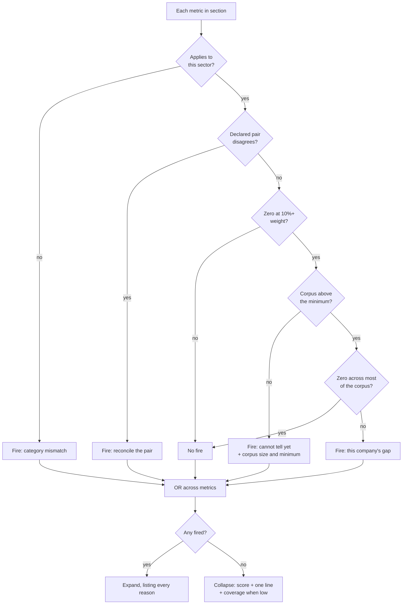
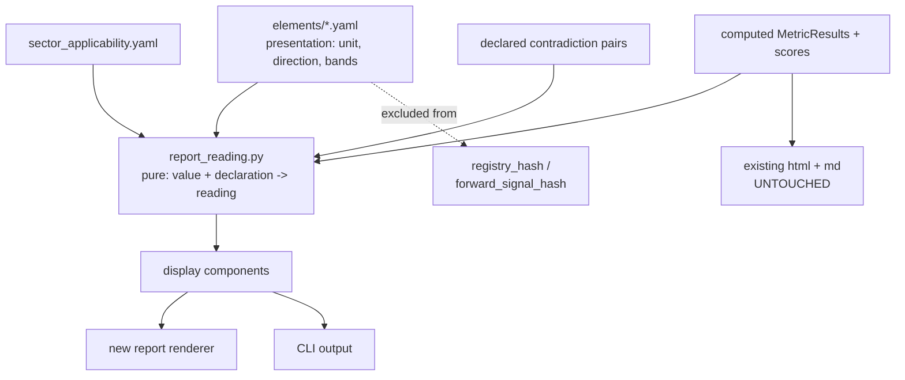

# Report Clarity — Interpretation, Density, One Design Language

## Goal Capsule

- **Objective:** A generated report that leads with what it found rather than what it computed — every number carrying its own unit and direction, every section sized by whether it has something to say, and the company's story told in the reading flow with the model's vocabulary available underneath it.
- **Product authority:** This contract owns the *presentation* of an analysis. It does not own what is computed, per R17.
- **Authority hierarchy:** An R wins on reader-visible behaviour. A KTD wins on mechanism within its cited R's constraints. A unit overrides neither.
- **Execution profile:** Additive. The current report keeps rendering from untouched templates (R16), and the regime hashes are pinned by test before any declaration is written (U1).
- **Stop conditions:** Stop and ask if implementation finds that presentation declarations cannot be excluded from both regime hashes, or that the sector-applicability table cannot be populated for the three lender tickers in the cached corpus. Both are load-bearing for the whole design.
- **Open blockers:** None. The corpus-relative threshold is settled at a simple majority (KTD5) and the small-corpus behaviour at R8.

**Product Contract preservation:** changed — R6 narrowed to declared pairs (KTD4), R18 added, the "told so once and near the top" success criterion dropped, and KD4 extended to record the already-settled rejection of roll-up that criterion had contradicted. All four were surfaced and confirmed before this enrichment. Every other R, KD, F and AE keeps its original ID and meaning.

---

## Product Contract

### Summary

Replace the scoring worksheet with a research note. Each metric declares its unit, direction of goodness and interpretation bands once, and a closed set of display components renders those declarations identically in HTML, Markdown and the CLI. Sections stay collapsed to a score and a one-line reading until a trigger earns them space, and the current report keeps being generated alongside the new one until the new shape is trusted.

### Problem Frame

The report shows its working. Every metric that computed gets a row, at uniform depth, in a table whose `Value` column holds `25.7` (a percentage), `0.09` (a ratio), `2.0` (a count of years) and `0.84` (a variance coefficient) with nothing to distinguish them, beside two adjacent percentage columns that mean entirely different things — a normalised score and a weight. A reader who does not already hold the model in their head cannot read a single row correctly.

The vocabulary layer in `boundless100x/output/report_vocabulary.py` was built for exactly this and is carefully written, but it translates *labels*, not *meaning*. Renaming `dupont_asset_turnover` to "DuPont: Asset Turnover" does not tell a reader what asset turnover measures, why 0.09 is low, or why it carries 5% weight. Several paths route around the layer entirely: an unregistered flag falls through to `f.replace("_", " ").title()` while an unregistered metric is silently dropped from the drill-down, the CLI keeps its own element-label map that spells the same elements differently, one action badge renders lower-case snake-derived text, and raw Python exception strings from `service.py` reach the reader's Warnings section verbatim.

The cost is concrete and it is a decision cost. In `boundless100x/output/reports/PFC_20260808/`, Power Finance Corporation — a lender — is scored on asset turnover (0.09), equity multiplier (9.4) and free cash flow yield (−5.7%), all at 0%, for doing exactly what a lender does. Three of the five visible rows in its Quality — Business section are measuring the wrong thing, the section reads as a quality failure, and nothing on the page says so. Worse, those five rows are only 32% of that element's declared weight — the rest errored and vanished silently, so a 4.7/10 rests on a third of the evidence with no mark of it.

Meanwhile the two sentences that would have explained the company — it is a lender, and the model is measuring it as a manufacturer — appear nowhere, while twelve rows of cash-flow history get the same visual weight as the composite score.

### Key Decisions

- KD1. **Interpretation leads; framework teaching sits one level down.** The company-specific reading is what the reader meets in the flow; the explanation of what a metric *is* stays available but never inline. (session-settled: user-directed — chosen over teaching the framework first and over interpretation with no teaching at all: the reader needs the company's story in the reading flow and the model's vocabulary reachable without it crowding the page.) Governs R1, R3.
- KD2. **Rules produce the interpretation; a model may only add to it.** (session-settled: user-directed — chosen over model-generated interpretation: reports are generated on paths where no model runs, so a model-sourced leading line would leave `analyze --no-llm` and `watchlist advance` reports opening on a blank.) Governs R2.
- KD3. **A section's size follows what it has to say.** (session-settled: user-directed — chosen over uniform fixed depth and over a uniform surface with everything behind disclosure: length becomes information a reader can skim by.) Governs R5, R6.
- KD4. **A fired quality flag does not earn expansion, and a repeated finding is not rolled up.** Flags stay in the section's Signals line, and four sections discovering the same structural mismatch say so four times. (session-settled: user-directed — the three chosen triggers were selected and flags were not; roll-up was offered as an alternative to an uncapped report and rejected.) Governs R6, R9.
- KD5. **No cap on how many sections expand — the length is the verdict.** (session-settled: user-directed — chosen over a report-wide top-N budget and over one expansion per section: the contrast is meant to live across companies rather than within one.) Governs R9.
- KD6. **The metric declares its presentation; components render it.** (session-settled: user-directed — chosen over declaring without refactoring and over standardising components without declarations: a uniform row showing `0.84` with no unit is consistent and still unreadable.) **Conflict found in planning:** the literal reading — an ordinary sibling key in `elements/*.yaml` — moves `registry_hash`, which R17 forbids. Resolved by KTD1, which keeps the declaration in the same file while excluding it from the hashed payload. Governs R11, R13.
- KD7. **The current report keeps being generated.** The new report is an additional output, not a rewrite of the existing templates. (session-settled: user-directed.) Governs R16.
- KD8. **Presentation only.** (session-settled: user-approved — proposed with the consequence stated and assented to: a presentation change that moved a score would fragment the append-only score history across regime hashes.) Governs R17.

### Requirements

**What the reader is told**

- R1. Every metric renders with a reading that states what its value means for this company, not only what the number is.
- R2. The reading is produced by declared rules. A model may add a further company-specific line where one is available, but never supplies the reading itself.
- R3. An explanation of what a metric measures and what good looks like is reachable for every metric, and never appears inline in the reading flow.
- R4. A reading that cannot be produced renders as unknown together with its reason, never as a blank, an absent line, or a bare number.

**How much is shown**

- R5. A section renders collapsed by default: its score, one line of reading, and nothing else.
- R6. A section expands when at least one trigger fires on at least one of its metrics — the metric does not apply to this company's sector, the metric belongs to a declared contradiction pair whose two readings disagree, or the metric scores zero while carrying at least 10% of its element's weight. Triggers are evaluated per metric and combined with OR at the section level.
- R7. An expanded section names every trigger that fired and why, in the reader's words rather than the model's.
- R8. The zero-score trigger is corpus-relative: a metric that scores zero across a majority of the analysed corpus does not expand for any individual company, because it is describing the model rather than the company. Below a minimum corpus size the metric still expands, and its reading states that there are not yet enough scored reports to tell. Sector mismatch is decided first and is not subject to this suppression.
- R9. No cap limits how many sections expand in one report, and a finding reached independently by several sections is stated in each of them.
- R10. Multi-year tables — cash-flow history, shareholding history, the ten-year snapshot — render in the appendix rather than in a section body.
- R18. A collapsed section whose scored coverage falls below 0.85 states that coverage in its one-line reading. A metric that errored scores `None` and is excluded before the zero-score path, so without this an element resting on a third of its declared weight reads exactly like one resting on all of it.

**One design language**

- R11. Each metric declares its unit, its direction of goodness, and its interpretation bands alongside its existing scoring configuration.
- R12. No number reaches a reader without its unit and its direction.
- R13. A closed set of display components renders every part of the new report; no section renders content outside that set.
- R14. HTML, Markdown and the CLI render the same content from the same declarations. A section present in one surface is present in all three.
- R15. No raw metric id, enum value, lifecycle key, or exception string reaches a reader.

**Transition**

- R16. The current report continues to be generated on every run, under a distinct name, unchanged in content.
- R17. No score, weight, gate, threshold or metric definition changes, and `registry_hash` and `forward_signal_hash` are byte-identical before and after.

### Key Flows

- F1. A section decides whether to expand
  - **Trigger:** Report generation reaches an element section.
  - **Steps:** For each metric in the section, test sector applicability first; then the declared-pair contradiction; then the zero-score test, discarding a hit the corpus-relative rule suppresses. OR the per-metric outcomes. Render collapsed when nothing fired, or expanded with every fired reason when something did.
  - **Outcome:** A section whose length is proportional to what it has to say, carrying the reasons for its own size.
  - **Covered by:** R5, R6, R7, R8, R9, R18

### Acceptance Examples

- AE1. **Covers R6, R7.** Given PFC, a company in the Finance sector, when its Quality — Business section is rendered, then the section expands and states that asset turnover, equity multiplier and free cash flow describe manufacturers rather than lenders — before the table that scores all three at zero.
- AE2. **Covers R8.** Given `dcf_margin_of_safety` scores zero in five of the seven currently analysed companies, when any one of those companies is rendered, then that metric does not expand its section on the zero-score trigger.
- AE3. **Covers R2.** Given `analyze PFC --no-llm`, when the report is generated, then every section still carries its reading, and no section opens on a blank where a reading would be.
- AE4. **Covers R4, R12.** Given a metric whose interpretation bands are undeclared, when its row renders, then it shows the value with its unit and the reason no reading is available — never a bare number and never an empty cell.
- AE5. **Covers R5, R9.** Given a company that fires no trigger in any section, when its report is generated, then every section is collapsed and the report is materially shorter than PFC's.
- AE6. **Covers R16, R17.** Given any single `analyze` run, when it completes, then both the current report and the new report exist in the output directory, the current report is byte-identical to its pre-change golden file after timestamp normalisation, and both regime hashes are unchanged.
- AE7. **Covers R18.** Given PFC's Quality — Business element, whose five scored metrics carry 32% of its declared weight, when the section renders collapsed, then its one-line reading states that 32% of declared weight was scored.
- AE8. **Covers R8.** Given a corpus below the minimum size, when a metric scores zero at 15% weight, then the section expands and its reading states how many scored reports exist and how many are needed before the test can run.

### Success Criteria

- A reader who does not hold the SQGLP model in their head can read any number in the report correctly, without recomputing it or consulting the code.
- A well-fitting company's report is visibly shorter than a poorly-fitting one, and the difference is legible without reading either.
- The two reports generated by one run never disagree on a number.

### Scope Boundaries

**Deferred for later**

- Retiring the current report. It keeps being generated until the new one is trusted; the decision to remove it is a later one.
- Any redesign of the seven Plotly figures in `boundless100x/output/report_charts.py`.
- Reconciling `sqglp_report.md.j2`'s missing Pass 3 sections with the HTML template. R14 binds the new report; the legacy pair is frozen by R16.

**Outside this work's identity**

- Moving the numbers off the reading surface into prose-only. Considered and declined: this system is built on being checkable, and trusting an interpretation layer you can no longer audit trades that away.
- A report-wide budget capping how many sections expand, per KD5.
- A fired quality flag as an expansion trigger, and a top-of-report roll-up of a repeated finding, per KD4.
- Any change to what is computed, per R17.

### Dependencies / Assumptions

- The sector-mismatch trigger depends on `metadata.sector`. All 26 currently cached tickers carry it; a ticker fetched before the breadcrumb fix would not.
- The corpus-relative test in R8 depends on there being a corpus. Seven companies currently have scored reports on disk.
- The reader is the system's owner. Nothing here assumes a third-party audience.
- The sector-by-metric applicability table does not exist. `boundless100x/data_fetcher/sector_context.yaml` classifies sectors into tailwind buckets and carries no metric applicability.

---

## Planning Contract

### Key Technical Decisions

- KTD1. **Presentation declarations live under a `presentation:` key in `elements/*.yaml`, and `engine.py`'s hash filter is widened to exclude that key by name.** `_metric_definitions` (`boundless100x/compute_engine/engine.py:113-129`) hashes every key not starting with `_`, so an ordinary `presentation:` key moves `registry_hash` on a scored metric and `forward_signal_hash` on a zero-weight one — verified empirically against the shipped registry. Widening the filter costs one line and is a no-op until the first declaration exists, so the shipped hashes are provably unchanged at the moment the filter lands. Rejected: reusing the `_`-prefix escape hatch, whose own docstring frames it as "provenance, not semantics" and which would disguise a semantic field; and a sibling module keyed by metric id, which works (it is what `FORWARD_SIGNALS` does) but moves the declaration away from the scoring config that KD6 chose to keep it beside. (session-settled: user-approved — chosen over relocating the declaration to a sibling module: KD6's "alongside the scoring config" is preserved rather than reinterpreted.) Governs R11, R17.
- KTD2. **The reading layer is a pure function of declarations plus computed values, in its own module.** It imports from `compute_engine` and is imported by the report and CLI surfaces; it never calls a model and never reaches the network. This is what makes R2 hold on `--no-llm` paths by construction rather than by discipline. Governs R2, R4.
- KTD3. **The new report ships as a fourth format token, not a template rewrite.** `ReportGenerator.generate(result, formats=[...])` already gates three independent format blocks writing into one shared directory (`boundless100x/output/report_generator.py:168-251`), and `lane_context`'s "None by default, so every existing call site is untouched" is the established additive precedent in the same file. The existing `if "html"`/`if "md"` blocks are not modified. Note that `boundless100x/cli.py:174-179` passes `formats=` explicitly from its `--formats` option, so the CLI default string must change for the new report to appear. Governs R16.
- KTD4. **Contradiction is a curated list of declared metric pairs, not a detector.** Two of the three motivating examples turned out not to be contradictions: `growth_quality_grade` is a scored categorical measuring the *composition* of growth while the element score measures its *magnitude* — different axes, and a sentiment-diff detector would manufacture a false positive on every company; and the P/E percentile discrepancy is a computation bug, fixed in U5. A declared pair carries both metric ids and the condition under which they disagree. Coverage is bounded to pairs someone writes down, which is the honest cost of not shipping a detector that is wrong more often than right. (session-settled: user-approved — chosen over an automatic sentiment-diff detector and over dropping the trigger entirely.) Governs R6.
- KTD5. **The corpus-relative threshold is a simple majority, and forward signals are excluded from the contradiction pool.** Measured across the seven scored reports: suppression at >50% and at >60% both suppress exactly `dcf_margin_of_safety` and leave the per-company distribution intact (JIOFIN 8 down to ZYDUSLIFE 1), while >75% suppresses nothing and the test does no work. Forward signals stay out of the pool because expansion is prominence, and coupling a zero-weight signal to prominence is the coupling the forward-signals design exists to keep separate. Governs R6, R8.
- KTD6. **Sector applicability is declared per sector-bucket, not per company.** The table keys on the same sector strings `boundless100x/compute_engine/sector.py` already classifies, so a new company in a known sector inherits its applicability rules with no new entry. A sector with no entry yields indeterminate rather than "applies", per R4. Governs R6.

### High-Level Technical Design

The declaration is the single source of truth; three surfaces read it through one reading layer.

The dotted edge is R17: the declaration reaches the reading layer and never reaches the hash. The `OLD` path is R16 — the existing renderers keep consuming the same computed values they always did, through code this plan does not modify.

### Assumptions

- Seven scored reports is below the minimum corpus size for R8's test to be meaningful; the minimum is set in implementation and stated in the reading, not hardcoded into a requirement.
- R18 reuses the scorer's existing bar rather than introducing a second one. `low_coverage_threshold = 0.85` is already defined at `boundless100x/compute_engine/scorer.py:15` but applied only to the composite (`scorer.py:129`, raising `low_data_coverage`); per-element coverage is already computed and carried in `coverage["elements"]` with nothing reading it. R18 reads what is already there — PFC sits at 0.32 for Quality — Business and 0.476 for Longevity — so this needs no scorer change and moves no score.

### Sequencing

U1 and U2 come first and are independent of each other: U1 makes the declaration channel hash-safe, U2 freezes the current report so every later unit can prove it did not disturb it. U3–U5 are then parallelisable. U6 depends on U3 and U4. U8 depends on U6 and U7. U9 depends on U6 alone, U11 on U6 and U9, and only U10 depends on U8 — so the component set and the CLI can proceed in parallel with the expansion decision.

---

## Implementation Units

| U-ID | Unit | Key files | Depends on |
|---|---|---|---|
| U1 | Hash-safe presentation channel | `compute_engine/engine.py` | — |
| U2 | Golden-file freeze of the current report | `tests/golden/` | — |
| U3 | Declare presentation for every metric | `compute_engine/metrics/elements/*.yaml` | U1 |
| U4 | Sector applicability table | `compute_engine/sector_applicability.yaml` | — |
| U5 | Fix the P/E band computation | `output/report_generator.py` | U2 |
| U6 | The reading layer | `output/report_reading.py` | U3, U4 |
| U7 | Declared contradiction pairs | `output/contradiction_pairs.yaml` | U3 |
| U8 | The expansion decision | `output/report_expansion.py` | U6, U7 |
| U9 | The closed component set | `output/report_components.py` | U6 |
| U10 | The new report renderer | `output/templates/`, `output/report_generator.py`, `cli.py` | U8, U9 |
| U11 | CLI renders from the declarations | `cli.py`, `cli_lifecycle.py` | U6, U9 |

### U1. Hash-safe presentation channel

- **Goal:** A `presentation:` key can be added to any metric in `elements/*.yaml` without moving either regime hash.
- **Requirements:** R11, R17
- **Dependencies:** none
- **Files:** `boundless100x/compute_engine/engine.py`, `tests/test_registry_hash.py`
- **Approach:**
  1. Widen `_metric_definitions`'s key filter to exclude `presentation` alongside the existing `_`-prefix rule, per KTD1.
  2. Update the method's docstring, which currently frames exclusion as provenance-only, to name the second reason: score-inert presentation data.
- **Execution note:** Proof-first. Write the hash-invariance test before touching `engine.py` and watch it fail — the failure is the whole point of the unit, and a test written afterwards cannot prove the filter is what fixed it.
- **Patterns to follow:** `tests/test_registry_hash.py`'s `TestProvenanceIsNotSemantics`, which already proves the `_`-prefix exclusion.
- **Test scenarios:**
  - Adding `presentation:` to a scored metric leaves `registry_hash` byte-identical.
  - Adding `presentation:` to a zero-weight metric leaves `forward_signal_hash` byte-identical.
  - The shipped registry's two hashes are unchanged by the filter widening alone, before any declaration exists.
  - Adding an ordinary non-excluded key to a scored metric still moves `registry_hash` — the filter did not become permissive.
- **Verification:** `venv/bin/python -m pytest tests/test_registry_hash.py` passes, and the two hash values recorded in the test match the values on `main` before this unit.

### U2. Golden-file freeze of the current report

- **Goal:** The existing HTML and Markdown reports are pinned so any later unit that disturbs them fails loudly.
- **Requirements:** R16
- **Dependencies:** none
- **Files:** `tests/golden/`, `tests/test_report_generator.py`
- **Approach:** Render both current formats from a fixture result, normalise timestamps and any run-specific ids, and store as golden files. Assert equality on every subsequent run.
- **Execution note:** This unit must land before U5 and U10, which are the two units that touch `report_generator.py`. Its value is entirely in existing beforehand.
- **Patterns to follow:** `tests/golden/pre_lane_section_report.md` and the `normalise()` helper in `tests/test_report_lane_status.py`, which already solve timestamp normalisation for exactly this purpose.
- **Test scenarios:**
  - The current Markdown report matches its golden file after normalisation.
  - The current HTML report matches its golden file after normalisation.
  - A deliberate one-character edit to either template fails the corresponding test.
- **Verification:** Both golden tests pass on an unmodified tree, and fail when a template is edited.

### U3. Declare presentation for every metric

- **Goal:** Every metric in the registry carries a unit, a direction of goodness, and interpretation bands.
- **Requirements:** R11, R12
- **Dependencies:** U1
- **Files:** `boundless100x/compute_engine/metrics/elements/*.yaml`, `boundless100x/compute_engine/metrics/validator.py`, `tests/test_registry_validation.py`
- **Approach:**
  1. Add a `presentation:` block per metric carrying `unit`, `direction`, `bands` and a low label.
  2. Mirror the field names already used by `FORWARD_SIGNALS` in `boundless100x/output/report_vocabulary.py:294-339` so the four zero-weight metrics can later collapse onto one shape rather than two.
  3. Add a validator rule so a metric missing the block is a startup error, matching how the engine already rejects duplicate metric ids.
- **Patterns to follow:** `report_vocabulary.py`'s `FORWARD_SIGNALS` for the declaration shape; `tests/test_report_forward_signals.py` for deriving the expected metric set from the registry by introspection rather than hardcoding ids.
- **Test scenarios:**
  - Every metric id the engine discovers has a `presentation` block — derived from the registry, not a hardcoded list.
  - A metric with a declared band resolves a known value to the expected band label.
  - A metric missing the block fails registry validation at construction.
  - Both regime hashes are unchanged after all declarations are added.
- **Verification:** `venv/bin/python -m pytest tests/test_registry_validation.py tests/test_registry_hash.py` passes and the derived-set test covers all 51+ metrics.

### U4. Sector applicability table

- **Goal:** A declaration of which metrics do not apply to which sector buckets.
- **Requirements:** R6
- **Dependencies:** none
- **Files:** `boundless100x/compute_engine/sector_applicability.yaml`, `boundless100x/compute_engine/sector.py`, `tests/test_sector_context.py`
- **Approach:** Key the table on the same sector strings `sector.py` already classifies, per KTD6. Populate at minimum the lender case that motivated this work — asset turnover, equity multiplier, FCF yield, FCF+ years and DCF margin of safety against Finance — and leave every unlisted sector indeterminate rather than applicable.
- **Patterns to follow:** `boundless100x/data_fetcher/sector_context.yaml` and its loader in `boundless100x/compute_engine/sector.py:27-45` for the file shape and load path.
- **Test scenarios:**
  - A Finance-sector company reports asset turnover as not applicable.
  - An Industrial Products company reports the same metric as applicable.
  - A sector absent from the table yields indeterminate, not applicable.
  - A metric id in the table that the registry does not define is a startup error.
- **Verification:** `venv/bin/python -m pytest tests/test_sector_context.py` passes, and the three cached lender tickers resolve their five inapplicable metrics.

### U5. Fix the P/E band computation

- **Goal:** The historical P/E range shown to a reader is computed from the same series as the percentile it is quoted beside.
- **Requirements:** R16 (its one sanctioned exception)
- **Dependencies:** U2
- **Files:** `boundless100x/output/report_generator.py`, `tests/test_pe_percentile.py`
- **Approach:** `_build_pe_band_summary` derives `pe_min`/`pe_max` as `current_price / historical_eps`, the anti-pattern `compute_pe_percentile`'s own docstring warns against, while the percentile uses `historical_price / historical_eps` and stores it in `raw_series`. Source the range from that `raw_series` instead of recomputing. Presentation-layer only; the scored value does not move.
- **Patterns to follow:** `boundless100x/compute_engine/metrics/builtin/valuation.py:182-232`, which carries both the warning and the correct series.
- **Test scenarios:**
  - PFC's rendered P/E percentile falls inside its rendered range — the current output places 5.3x at the 70th percentile of a range starting at 5.4x.
  - A company whose current P/E is genuinely the historical minimum renders at the 0th percentile.
  - The scored `pe_vs_historical` value is unchanged.
  - The golden files from U2 change in exactly the P/E band line and nowhere else.
- **Verification:** `venv/bin/python -m pytest tests/test_pe_percentile.py` passes, and the U2 golden files are re-baselined with a diff confined to the band line.

### U6. The reading layer

- **Goal:** A pure function turning a metric's declaration plus its computed value into a reader-facing reading, or into unknown-with-reason.
- **Requirements:** R1, R2, R4, R12, R18
- **Dependencies:** U3, U4
- **Files:** `boundless100x/output/report_reading.py`, `tests/test_report_reading.py`
- **Approach:**
  1. Resolve a value to its band using the declaration, following the first-threshold-wins walk `_forward_band` already implements (`boundless100x/output/report_generator.py:468-476`).
  2. Return unknown-with-reason for an absent value, an absent declaration, or an indeterminate sector lookup — never a bare number, per R4.
  3. Produce the element-coverage clause R18 requires when scored coverage is below the threshold.
  4. Import nothing from `llm_layer`, per KTD2.
- **Execution note:** Behaviour-bearing and pure — write the unknown-with-reason cases first, since they are the ones the rest of the codebase's rules turn on.
- **Patterns to follow:** `_forward_band` for band resolution; `boundless100x/compute_engine/scorer.py` for how coverage is already computed per element.
- **Test scenarios:**
  - A value inside a declared band returns that band's label and the declared direction.
  - A value with no declaration returns unknown naming the missing declaration.
  - A metric that errored returns unknown naming the error, not a zero.
  - A sector absent from the applicability table returns indeterminate, not applicable.
  - An element below the coverage threshold produces the coverage clause; one above it does not.
  - A module-level test asserts `report_reading.py` imports nothing from `boundless100x.llm_layer`.
- **Verification:** `venv/bin/python -m pytest tests/test_report_reading.py` passes and the import-boundary test holds.

### U7. Declared contradiction pairs

- **Goal:** A declaration of which metric pairs can disagree, and the condition under which they do.
- **Requirements:** R6
- **Dependencies:** U3
- **Files:** `boundless100x/output/contradiction_pairs.yaml`, `tests/test_report_expansion.py`
- **Approach:** Each entry names two metric ids and the condition that constitutes disagreement, per KTD4. Forward signals are ineligible, per KTD5. Start with the one surviving genuine instance — a favourable valuation reading beside a failed 100x eligibility verdict — rather than padding the list to justify the trigger.
- **Test scenarios:**
  - A declared pair in its disagreeing state fires the trigger.
  - The same pair in agreement does not fire.
  - A pair naming a metric the registry does not define is a startup error.
  - A pair naming a zero-weight metric is rejected at load.
  - `growth_quality_grade` beside its element score does not fire — the false positive KTD4 exists to prevent.
- **Verification:** `venv/bin/python -m pytest tests/test_report_expansion.py` passes, including the explicit non-firing case.

### U8. The expansion decision

- **Goal:** A section-level decision on whether to expand, and the list of reasons why.
- **Requirements:** R5, R6, R7, R8, R9
- **Dependencies:** U6, U7
- **Files:** `boundless100x/output/report_expansion.py`, `tests/test_report_expansion.py`
- **Approach:**
  1. Evaluate the three triggers per metric in the order F1's diagram shows, then OR across the section's metrics.
  2. Compute the corpus-relative suppression from the scored-report history, applying it only to the zero-score trigger, per R8.
  3. Return every fired reason rather than the first, per R7.
- **Patterns to follow:** `boundless100x/compute_engine/eligibility.py`'s three-valued evaluator, which already models pass / fail / indeterminate with per-condition detail strings.
- **Test scenarios:**
  - PFC's Quality — Business section expands and names the sector mismatch (AE1).
  - `dcf_margin_of_safety` does not fire the zero-score trigger against the current seven-report corpus (AE2).
  - A sector-inapplicable metric that is also corpus-wide zero still expands, because sector mismatch is decided first (R8).
  - Two triggers firing on different metrics in one section produce two reasons, not one.
  - A corpus below the minimum expands and produces the not-yet-comparable reading (AE8).
  - A company firing no trigger produces an all-collapsed result (AE5).
- **Verification:** `venv/bin/python -m pytest tests/test_report_expansion.py` passes and the AE1/AE2/AE5/AE8 cases are named as such.

### U9. The closed component set

- **Goal:** A fixed vocabulary of display components that every part of the new report renders through.
- **Requirements:** R13, R14, R15
- **Dependencies:** U6
- **Files:** `boundless100x/output/report_components.py`, `tests/test_report_components.py`
- **Approach:**
  1. Define the component set — finding, metric row, reading, disclosure, unknown-with-reason, caveat — as data each surface renders, not as markup.
  2. Route every label through `boundless100x/output/report_vocabulary.py` so no raw id, enum or exception string can reach a component, per R15.
- **Patterns to follow:** `report_vocabulary.py`'s `ELEMENT_CONFIG` and `FLAG_ELEMENT_MAP` for the data-only vocabulary convention; the `render_element_section` macro in `sqglp_report.html.j2:359-412` for the one existing intra-format component.
- **Test scenarios:**
  - Every component renders from data with no embedded markup.
  - An unregistered flag produces the unknown component, not an auto-humanised label.
  - An exception string passed as content is rejected rather than rendered.
  - A component set member missing from any surface's renderer is a test failure.
- **Verification:** `venv/bin/python -m pytest tests/test_report_components.py` passes.

### U10. The new report renderer

- **Goal:** A new report format rendering the reading layer and the expansion decision through the component set, generated alongside the existing two.
- **Requirements:** R5, R10, R13, R14, R16
- **Dependencies:** U8, U9
- **Files:** `boundless100x/output/templates/`, `boundless100x/output/report_generator.py`, `boundless100x/cli.py`, `tests/test_report_generator.py`
- **Approach:**
  1. Add a fourth format token and a `_render_clarity` method following the existing `_render_html`/`_render_markdown` shape, writing into the same report directory, per KTD3.
  2. Leave the `if "html"` and `if "md"` blocks untouched.
  3. Add the token to `cli.py`'s `--formats` default, since that call site passes the list explicitly.
  4. Render multi-year tables into the appendix, per R10.
- **Patterns to follow:** the `lane_context` parameter in `report_generator.py:168-180`, whose docstring states the additive contract this unit follows.
- **Test scenarios:**
  - One `generate` call produces the existing two reports plus the new one.
  - The U2 golden files still match — the existing reports did not change (AE6).
  - The new report's numbers match the existing report's for the same fixture.
  - A `--no-llm` run produces a new report with every reading present (AE3).
  - Multi-year tables appear in the appendix and not in a section body.
  - A metric with no declaration renders unknown-with-reason (AE4).
  - A low-coverage element states its coverage in the collapsed reading (AE7).
- **Verification:** `venv/bin/python -m pytest tests/test_report_generator.py` passes with the golden tests green, and a manual `analyze PFC --no-llm` produces three reports whose shared figures agree.

### U11. CLI renders from the declarations

- **Goal:** The CLI's console output reads from the same vocabulary and declarations as the report.
- **Requirements:** R12, R14, R15
- **Dependencies:** U6, U9
- **Files:** `boundless100x/cli.py`, `boundless100x/cli_lifecycle.py`, `tests/test_cli_scores_display.py`
- **Approach:**
  1. Replace the hardcoded `element_names` map in `_print_scores` with `report_vocabulary.ELEMENT_CONFIG`, which spells the same elements differently today.
  2. Render metric values through the reading layer so units and directions appear on the console.
  3. Replace the raw lane and lifecycle state keys in `cli_lifecycle.py` with their `LANE_LABELS` equivalents, and the bare metric ids in the `unscored:` line with display names.
- **Patterns to follow:** the `printed()` helper in `tests/test_action_guard_integration.py`, the only existing pattern for asserting on Rich console output.
- **Test scenarios:**
  - Element labels on the console match the report's exactly.
  - A metric value on the console carries its unit.
  - The `unscored:` line shows display names, not raw metric ids.
  - `watchlist show` renders lane and state as prose, not raw keys.
- **Verification:** `venv/bin/python -m pytest tests/test_cli_scores_display.py` passes — a new file, since no test covers these functions today.

---

## Verification Contract

| Gate | Command | Applies to | Done signal |
|---|---|---|---|
| Full suite | `venv/bin/python -m pytest tests/` | every unit | All pass; count is above the pre-change baseline |
| Regime hashes | `venv/bin/python -m pytest tests/test_registry_hash.py` | U1, U3 | Both hashes byte-identical to their pre-change values |
| Legacy report frozen | `venv/bin/python -m pytest tests/test_report_generator.py -k golden` | U2, U5, U10 | Golden files match after normalisation |
| Expansion behaviour | `venv/bin/python -m pytest tests/test_report_expansion.py` | U7, U8 | AE1, AE2, AE5, AE8 named and passing |
| Reading purity | `venv/bin/python -m pytest tests/test_report_reading.py` | U6 | Import-boundary test holds |
| End-to-end | `venv/bin/python -m boundless100x analyze PFC --no-llm` | U10 | Three reports written; shared figures agree |

The opt-in network suite (`venv/bin/python -m pytest tests/ -m network`) is unaffected by this work and need not run.

---

## Definition of Done

**Global**

- Both regime hashes are byte-identical to their values before this work, verified by test rather than by inspection.
- The existing HTML and Markdown reports are byte-identical after timestamp normalisation, except for U5's single-line P/E band correction with its re-baselined golden.
- Every requirement R1–R18 is either implemented and cited by a unit, or listed in Scope Boundaries.
- No score, weight, gate or metric definition changed.
- Dead-end and experimental code from approaches that did not pan out is removed from the diff.

**Per unit**

- U1: hash filter widened, four hash tests green, docstring names both exclusion reasons.
- U2: golden files exist and fail on a deliberate template edit.
- U3: every registry metric carries a declaration, derived-set test green.
- U4: three cached lender tickers resolve their inapplicable metrics; unknown sector reads indeterminate.
- U5: PFC's percentile falls inside its range; scored value unchanged.
- U6: unknown-with-reason on every absence path; no `llm_layer` import.
- U7: the `growth_quality_grade` false positive does not fire.
- U8: AE1, AE2, AE5 and AE8 pass by name; sector mismatch outranks corpus suppression.
- U9: no raw id, enum or exception reaches a component.
- U10: three reports from one run; golden tests still green; `--no-llm` carries every reading.
- U11: console labels match the report's; a new CLI display test file exists.

---

## Sources / Research

- `boundless100x/output/reports/PFC_20260808/` — the worked example. Composite 5.32, Not a 100x Candidate, a lender scored on manufacturer metrics, and a Quality — Business element resting on 32% of its declared weight.
- `boundless100x/compute_engine/engine.py:113-129` — `_metric_definitions`, the hash payload builder. Verified empirically: a plain `presentation:` key moves `registry_hash` on a scored metric and `forward_signal_hash` on a zero-weight one; an excluded key moves neither. This is the constraint KTD1 exists for.
- `boundless100x/output/report_vocabulary.py:294-339` — `FORWARD_SIGNALS`, the working precedent for a declaration carrying name, format, direction, meaning, bands and a low label. R11 generalises it from four metrics to all of them.
- `boundless100x/output/report_generator.py:468-476` — `_forward_band`, the band-resolution walk U6 reuses.
- `boundless100x/output/report_generator.py:168-251` — `generate`, its `formats` gating and the `lane_context` additive precedent KTD3 follows.
- `boundless100x/compute_engine/metrics/builtin/valuation.py:182-232` — `compute_pe_percentile`, whose docstring names the exact anti-pattern `_build_pe_band_summary` commits. The source of U5.
- `tests/golden/pre_lane_section_report.md` and `tests/test_report_lane_status.py` — the existing golden-file and normalisation pattern U2 copies.
- `tests/test_report_forward_signals.py` — derives its expected set from the registry by introspection rather than hardcoding ids. The pattern U3's coverage test follows.
- Corpus measurement across the seven scored reports: suppression at >50% and >60% both suppress exactly `dcf_margin_of_safety` and preserve the per-company spread (JIOFIN 8 to ZYDUSLIFE 1); >75% suppresses nothing. The basis for KTD5.
- Sector spread across the 26 cached tickers: 3 lenders, 4 capital-markets businesses, and a handful of other structural misfits — roughly one company in four should produce a long report.
